# Laporan Praktikum #10 - POLIMORFISME
  

**JOBSHEET 10 - POLIMORFISME**

**1. Kompetensi** 

Setelah melakukan percobaan pada jobsheet ini, diharapkan mahasiswa mampu: 

a. Memahami konsep dan bentuk dasar polimorfisme 

b. Memahami konsep virtual method invication 

c. Menerapkan polimorfisme pada pembuatan heterogeneous collection 

d. Menerapkan polimorfisme pada parameter/argument method 

e. Menerapkan object casting untuk meng-ubah bentuk objek 
 
**2. Pendahuluan**

Polimorfisme merupakan kemampuan suatu objek untuk memiliki banyak bentuk. Penggunaan polimorfisme yang paling umum dalam OOP terjadi ketika ada referensi super class yang digunakan untuk merujuk ke objek dari sub class. Dengan kata lain, ketika ada suatu objek yang dideklarasikan dari super class, maka objek tersebut bisa diinstansiasi sebagai objek dari sub class. Dari uraian tersebut bisa dilihat bahwa konsep polimorfisme bisa diterapkan pada class-class yang memiliki relasi inheritance (relasi generalisasi atau IS-A). Selain pada class-class yang memiliki relasi inheritance, polimorfisme juga bisa diterapkan pada interface. Ketika ada objek yang dideklarasikan dari suatu interface, maka ia bisa digunakan untuk mereferensi ke objek dari class-class yang implements ke interface tersebut. Untuk mengilustrasikan uraian di atas, diberikan contoh sebagai berikut ini. Terdapat interface **Vegetarian,** dan super class **Animal.** Kemudian dibuat class **Deer** yang merupakan sub-class dari **Animal** dan implements ke **Vegetarian.** Sedangkan class **Lion** sub-class dari **Animal,** dan tidak implements ke **Vegetarian.**

```java
public interface Vegetarian{}  

public class Animal{}  

public class Deer extends Animal implements Vegetarian{} 

public class Lion extends Animal {}
```


Dari deklarai class di atas, contoh deklarasi objek di bawah ini akan menunjukan mana yang valid dan yang tidak valid berdasarkan konsep polimorfisme.

```java
Deer d = new Deer(); 
Lion l = new Lion();
``` 


Dari contoh di atas, **a** (bertipe **Animal**) bisa digunakan untuk mereferensi ke objek d (merupakan objek dari **Deer**), karena class **Deer** merupakan turunan dari **Animal.** Demikian juga **a2** (bertipe **Animal**), juga bisa digunakan untuk mereferensi ke objek **l** (merupakan objek dari **Lion**), karena class **Lion** merupakan turunan dari **Animal**. Objek **v** (dideklarasikan dari interface **Vegetarian**) bisa juga digunakan untuk mereferensi ke objek **d** (objek dari class **Deer**), hal ini bisa dilakukan karena class **Deer** implements ke interface **Vegetarian.** Sedangkan objek v2 (didekarasikan dari interface **Vegetarian**) **tidak bisa** digunakan untuk mereferensi objek **l** (objek dari class **Lion**), karena class **Lion tidak implements** ke interface **Vegetarian.** Ilustrasi tersebut bisa menunjuan konsep dan bentuk dasar dari polimorfisme

**Virtual method Invocation**  

Virtual method invocation terjadi ketika ada pemanggilan overriding method dari suatu objek polimorfisme. Disebut virtual karena antara method yang dikenali oleh compiler dan method yang dijalankan oleh JVM berbeda. 

```java
public class Animal{  
    
public void walk(){ 
        
 System.out.println(“The animal is walking around the jungle”); 
        
    } 
        
 } 
  public class Deer extends Animal { 
     
   @override 
      
  public void walk(){ 
          
 System.out.println(“The deer is walking around the jungle”);
          
    }  
 } 
 ```

Ketika ada suatu objek polimorfisme a, misalkan:

```java
Deer d = new Deer();  
Animal a = d;
``` 

Kemudian dipanggil method overriding darinya, maka saat itu terjadi pemanggilan method virtual, seperti:  

```java
a.walk(); 
```

Saat compile time, compiler akan mengenali method **walk()**  yang akan dipanggil adalah method **walk()**  yang ada di class **Animal,**  karena objek **a** bertipe **Animal.** Tetapi saat dijalankan (run time), maka yang dijalankan oleh JVM justru method **walk()** yang ada di class **Deer.** Akan berbeda halnya jika pemanggilan method walk() dilakukan dari objek **d** (bukan objek polimorfisme), seperti   

```java
d.walk();
``` 

maka method **walk()** yang dikenali saat compile time oleh compiler dan yang dijalankan saat runtime oleh JVM adalah sama-sama method **walk()** yang ada di class **Deer** (karena objek d dideklarasikan dari class **Deer**). 
 
**Heterogeneous Collection** 

Dengan adanya konsep polimorfisme, maka variabel array bisa dibuat heterogen. Artinya di dalam array tersebut bisa berisi berbagai macam objek yang berbeda. Contoh:  

```java
Animal arr[] = new Animal[2];  

arr[0] = new Deer();  

arr[1] = new Lion();
 ```

Dari contoh tersebut data pertama dari array arr berisi objek **Deer,** dan data kedua dari **arr** berisi objek **Lion.** Hal ini bisa dilakukan karena array **arr** dideklarasikan dari class **Animal** (superclass dari **Deer** dan **Lion**). 

**Polymorphic Argument** 
 
Polimorfisme juga bisa diterapkan pada argument suatu method. Tujuannya agar method tersebut bisa menerima nilai argument dari berbagai bentuk objek. Misalkan dibuat class baru sebagai berikut: 

```java
public class Human{  
     
    public void drive(Animal anim){ 
         
    anim.walk(); 

    } 

}
```

Perhatikan method drive(), ia memiliki argument berupa Animal. Karena Animal memiliki subclass Lion dan Deer, maka method drive() tersebut akan bisa menerima argument berupa objek dari Deer maupun objek dari Lion.


```java
Deer d = new Deer();  
  
Lion l = new Lion();  
  
Human hum = new Human();  
  
hum.drive(d);  
  
hum.drive(l); 
```
 
**Operator instanceof** 

Operator instanceof bisa digunakan untuk mengecek apakah suatu objek merupakan hasil instansiasi dari suatu class tertentu. Hasil dari instanceof berupa nilai boolean. Misalkan dibuat objek d dan l.  

```java
Deer d = new Deer();  

Lion l = new Lion();  

Animal a1 = d;  

Animal a2 = l; 
 ```

Jika kemudian digunakan operator instanceof, misalkan  

        a1 instanceof Deer  -> akan menghasilkan true  

        a2 instanceof Lion -> akan menghasilkan false  
 
**Object Casting** 

Casting objek digunakan untuk mengubah tipe dari suatu objek. Jika ada suatu objek dari subclass kemudian tipenya diubah ke superclass, maka hal ini termasuk ke upcasting. Contoh:  


```java
 Deer d = new Deer();  

 Animal a1 = d; // proses ini bisa disebut juga upcasting 
```

Downcast  terjadi jika ada suatu objek superclass, kemudian diubah menjadi objek dari subclass. Contoh: 


```java
 Deer d = new Deer();  

 Animal a1 = d; // proses ini bisa disebut juga upcasting  

 Deer d = (Deer) a1; //proses downcasting 
```

Proses downcasting sering disebut juga sebagai explicit casting, karena bentuk tujuan dari casting harus dituliskan dalam tanda kurung, di depan objek yang akan di-casting 

**3. Studi Kasus**

Untuk percobaan pada joobsheet ini akan digunakan class diagram di bawah ini: 


Dalam suatu perusahaan, pemilik pada tiap bulannya harus membayar gaji pegawai tetap dan rekening listrik. Selain pegawai tetap perusahaan juga memiliki pegawai magang, dimana pegawai ini tidak mendapatkan gaji.  

**4. Percobaan 1 – Bentuk dasar polimorfisme** 

**4.1. Langkah Percobaan** 

1. Buat class **Employee** 


  

  [ini link ke kode program Employee1841720146Bagus](../../src/10_Polimorfisme/Percobaan1/Employee1841720146Bagus.java)


2. Buat interface **Payable** 


 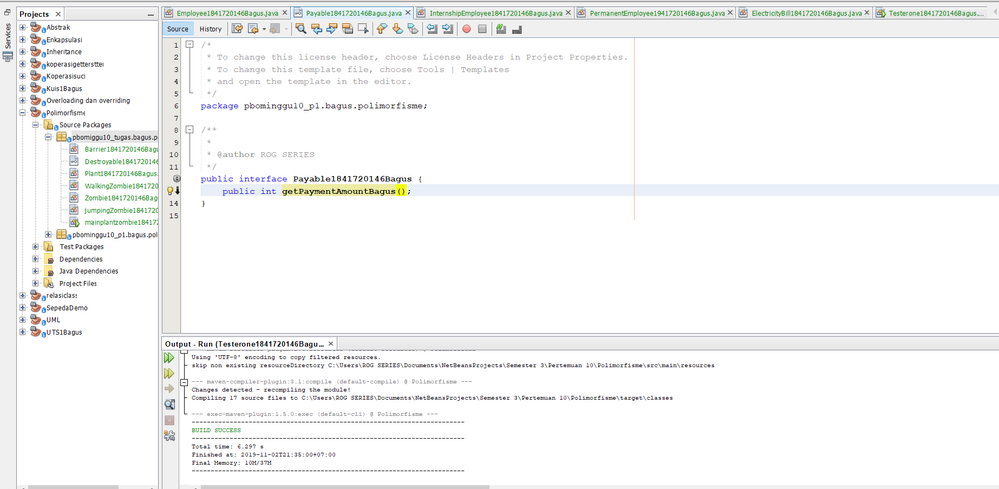

  [ini link ke kode program Payable1841720146Bagus](../../src/10_Polimorfisme/Percobaan1/Payable1841720146Bagus.java)


3. Buat class **InternshipEmployee**, subclass dari **Employee** 


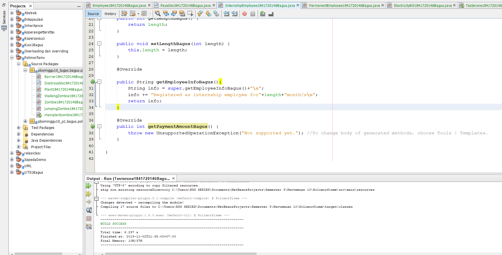

  [ini link ke kode program InternshipEmployee1841720146Bagus](../../src/10_Polimorfisme/Percobaan1/InternshipEmployee1841720146Bagus.java)


4. Buat class **PermanentEmployee**, subclass dari **Employee** dan implements ke **Payable** 


  [ini link ke kode program PermanentEmployee1941720146Bagus](../../src/10_Polimorfisme/Percobaan1/PermanentEmployee1941720146Bagus.java)

5. Buat class **ElectricityBill** yang implements ke interface **Payable** 


  [ini link ke kode program ElectricityBill1841720146Bagus](../../src/10_Polimorfisme/Percobaan1/ElectricityBill1841720146Bagus.java)

6. Buat class **Tester1** 


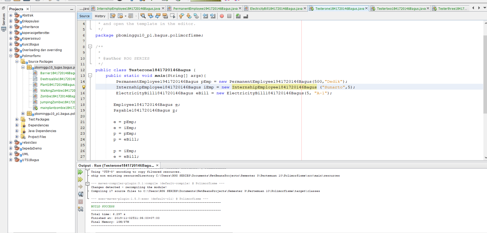

  [ini link ke kode program Testerone1841720146Bagus](../../src/10_Polimorfisme/Percobaan1/Testerone1841720146Bagus.java)


**4.2. Pertanyaan** 

1. Class apa sajakah yang merupakan turunan dari class **Employee**? 

2. Class apa sajakah yang implements ke interface **Payable**? 

3. Perhatikan class **Tester1**, baris ke-10 dan 11. Mengapa **e**, bisa diisi dengan objek **pEmp** (merupakan objek dari class **PermanentEmployee**) dan objek **iEmp** (merupakan objek dari class **InternshipEmploye**) ?  

4. Perhatikan class **Tester1**, baris ke-12 dan 13. Mengapa **p**, bisa diisi dengan objek **pEmp** (merupakan objek dari class **PermanentEmployee**) dan objek **eBill** (merupakan objek dari class **ElectricityBill**) ? 

5. Coba tambahkan sintaks: 

```java
  p = iEmp;      

  e = eBill; 
 ```
pada baris 14 dan 15 (baris terakhir dalam method **main**) ! Apa yang menyebabkan error? 

6. Ambil kesimpulan tentang konsep/bentuk dasar polimorfisme!

**Hasil / Jawaban Pertanyaan Percobaan 1**

1. Class InternshipEmployee dan class PermanentEmployee 

2. Class PermanentEmployee dan class ElectricityBill

3. karena class Employee merupakan superclass dari class PermanentEmployee dan InternshipEmployee. e merupakan objek yang dideklarasikan pada superclass. Jadi objek tersebut pun bisa diinstansiasi sebagai objek dari subclass, yaitu pEmp dan iEmp.

4. karena pada class PermanentEmployee dan ElectricityBill merupakan implements ke interface Payable. Jadi objek p yang dideklarasikan pada interface Payable bisa diisi dengan objek pEmp dan objek eBill. Karena mereka memiliki relasi yaitu Realization

5. 

a. Objek p adalah objek dari interface Payable, objek tersebut diisi dengan objek iEmp (Objek dari class InternshipEmployee ). Maka akan terjadi error, karena antara Payable dengan class InternshipEmployee tidak memiliki relasi apapun, baik relasi inheritance maupun interface.

b. Objek e adalah objek dari class Employee, objek tersebut diisi dengan objek eBill (Objek dari class ElectricityBill). Maka akan terjadi error, karena class Employee dan ElectricityBill juga tidak memiliki relasi apapun, , baik relasi inheritance maupun interface. 

6.  Jadi kesimpulannya, penerapan konsep polymorphism dalam pemrograman Java tidak terlepas dari konsep inheritance (turunan). Dalam konsep inheritance, ketika objek dari sub class dikonstruksi, objek dari super class juga ikut dikonstruksi. Jadi, instance dari sub class merupakan instance dari super class juga. 
Selain pada class-class yang memiliki relasi inheritance, polimorfisme juga bisa diterapkan pada interface. Ketika ada objek yang dideklarasikan dari suatu interface, maka ia bisa digunakan untuk mereferensi ke objek dari classclass yang implements ke interface tersebut. 


**5. Percobaan 2 – Virtual method invocation**  

**5.1. Langkah Percobaan** 

1. Pada percobaan ini masih akan digunakan class-class dan interface yang digunakan pada percobaan sebelumnya. 

2. Buat class baru dengan nama **Tester2.**  


3. Jalankan class **Tester2**, dan akan didapatkan hasil sebagai berikut: 


**Hasil Percobaan 2**

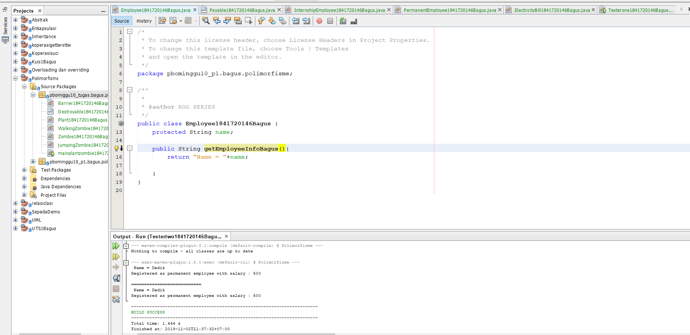

  [ini link ke kode program Employee1841720146Bagus](../../src/10_Polimorfisme/Percobaan2/Employee1841720146Bagus.java)


  [ini link ke kode program Payable1841720146Bagus](../../src/10_Polimorfisme/Percobaan2/Payable1841720146Bagus.java)

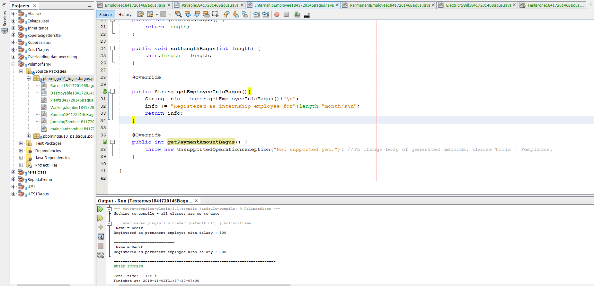

  [ini link ke kode program InternshipEmployee1841720146Bagus](../../src/10_Polimorfisme/Percobaan2/InternshipEmployee1841720146Bagus.java)

  

  [ini link ke kode program PermanentEmployee1941720146Bagus](../../src/10_Polimorfisme/Percobaan2/PermanentEmployee1941720146Bagus.java)


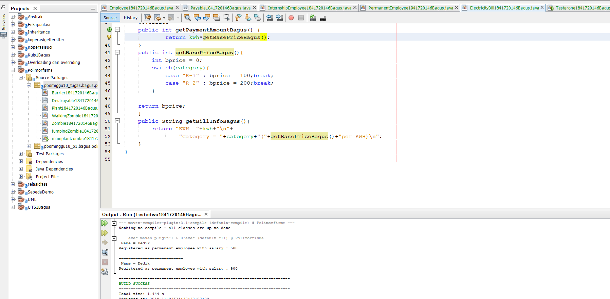

  [ini link ke kode program ElectricityBill1841720146Bagus](../../src/10_Polimorfisme/Percobaan2/ElectricityBill1841720146Bagus.java)

  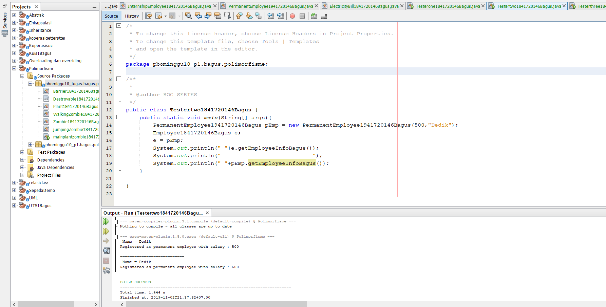

  [ini link ke kode program Testertwo1841720146Bagus](../../src/10_Polimorfisme/Percobaan2/Testertwo1841720146Bagus.java)


**5.2. Pertanyaan** 

1. Perhatikan class **Tester2** di atas, mengapa pemanggilan **e.getEmployeeInfo()** pada baris 8 dan **pEmp.getEmployeeInfo()** pada baris 10 menghasilkan hasil sama?  

2. Mengapa pemanggilan method **e.getEmployeeInfo()** disebut sebagai pemanggilan method virtual (virtual method invication), sedangkan **pEmp.getEmployeeInfo()** tidak? 

3. Jadi apakah yang dimaksud dari virtual method invocation? Mengapa disebut virtual?   

**Hasil / Jawaban Pertanyaan Percobaan 2**

1. karena sudah terdapat polimorfisme yaitu dari objek e (Bertipe Employee), menggunakan referensi ke objek pEmp ( Objek dari class PermanentEmployee). Di dalam nya terdapat method getEmployeeInfo yang merupakan method hasil Overriding. Jadi ketika di panggi dengan menggunakan objek e maupun pEmp, akan menghasilkan hasil yang sama

2. karena pada saat compile time, compiler akan mengenali method getEmployeeInfo() yang akan dipanggil adalah method getEmployeeInfo() yang ada di class Employee, karena objek e bertipe Employee. Tetapi saat dijalankan (run time), maka yang dijalankan oleh JVM justru method getEmployeeInfo() yang ada di class PermanentEmployee. Karena itulah e.getEmployeeInfo() disebut sebagai pemanggilan method virtual (virtual method invication) 

3. Jadi Virtual method invocation terjadi ketika ada pemanggilan overriding method dari suatu objek polimorfisme. Disebut virtual karena antara method yang dikenali oleh compiler dan method yang dijalankan oleh JVM berbeda.


**6. Percobaan 3 – Heterogenous Collection** 

**6.1. Langkah Percobaan** 

1. Pada percobaan ke-3 ini, masih akan digunakan class-class dan interface pada percobaan sebelumnya. 

2. Buat class baru **Tester3.** 


**Hasil Percobaan 3**

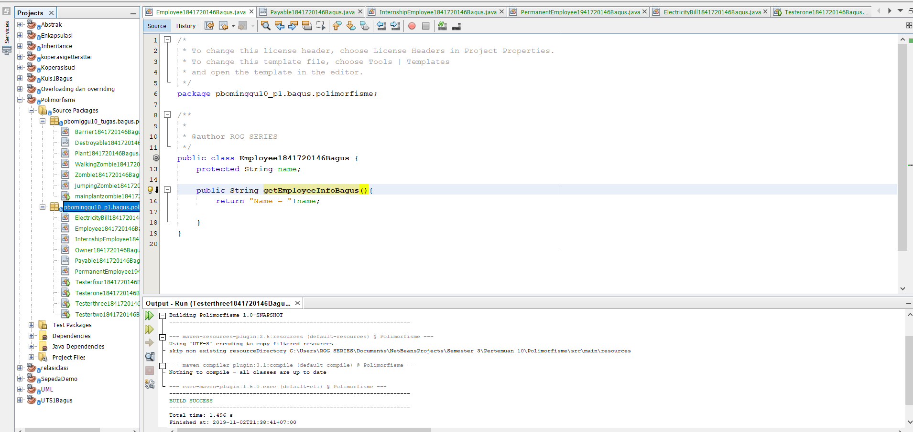

  [ini link ke kode program Employee1841720146Bagus](../../src/10_Polimorfisme/Percobaan3/Employee1841720146Bagus.java)


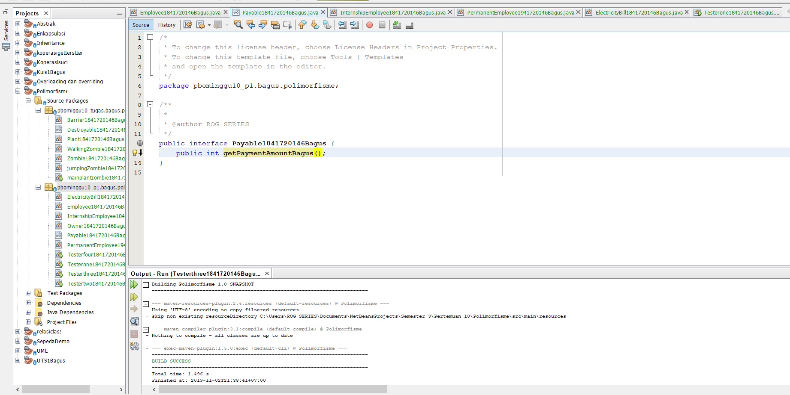

  [ini link ke kode program Payable1841720146Bagus](../../src/10_Polimorfisme/Percobaan3/Payable1841720146Bagus.java)

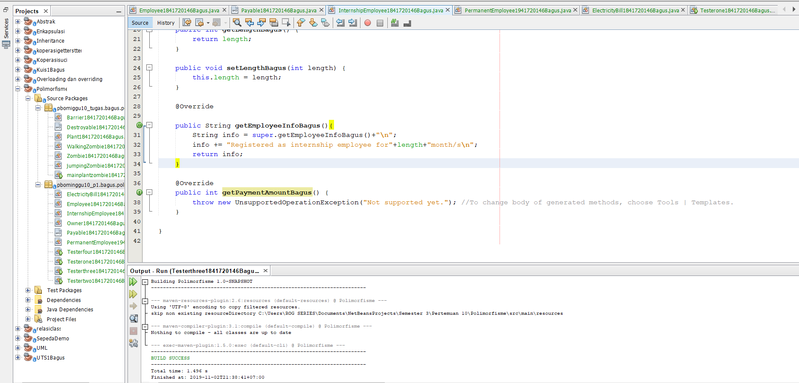

  [ini link ke kode program InternshipEmployee1841720146Bagus](../../src/10_Polimorfisme/Percobaan3/InternshipEmployee1841720146Bagus.java)

  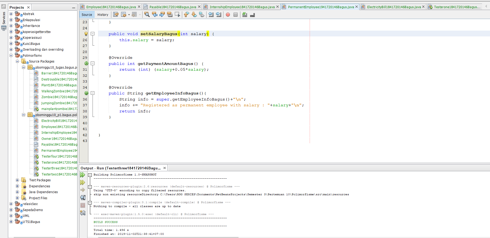

  [ini link ke kode program PermanentEmployee1941720146Bagus](../../src/10_Polimorfisme/Percobaan3/PermanentEmployee1941720146Bagus.java)


  [ini link ke kode program ElectricityBill1841720146Bagus](../../src/10_Polimorfisme/Percobaan3/ElectricityBill1841720146Bagus.java)

  

  [ini link ke kode program Testerthree1841720146Bagus](../../src/10_Polimorfisme/Percobaan3/Testerthree1841720146Bagus.java)


**6.2. Pertanyaan** 

1. Perhatikan array e pada baris ke-8, mengapa ia bisa diisi dengan objek-objek dengan tipe yang berbeda, yaitu objek **pEmp** (objek dari **PermanentEmployee**) dan objek **iEmp** (objek dari **InternshipEmployee**) ? 

2. Perhatikan juga baris ke-9, mengapa array **p** juga biisi dengan objekobjek dengan tipe yang berbeda, yaitu objek **pEmp** (objek dari **PermanentEmployee**) dan objek **eBill** (objek dari **ElectricityBilling**) ? 

3. Perhatikan baris ke-10, mengapa terjadi error?

**Hasil / Jawaban Pertanyaan Percobaan 3**

1. karena array e[] merupakan deklarasi dari class Employee, dan class Employee tersebut merupakan super class dari 2 class yaitu => Class PermanentEmployee dan class InternshipEmployee

2. karena array p[] merupakan deklarasi dari interface Payable, dan class PermanentEmployee dan ElectricityBill merupakan class implementasi ke interface Payable.

3.  terjadi error karena class ElectricityBill tidak mempunyai relasi dengan class Employe, baik relasi inheritance maupun implement interface


**7. Percobaan 4 – Argumen polimorfisme, instanceod dan casting objek** 

**7.1. Langkah Percobaan** 

1. Percobaan 4 ini juga masih menggunakan class-class dan interface yang digunakan pada percobaan sebelumnya. 

4. Buat class baru dengan nama **Owner. Owner** bisa melakukan pembayaran baik kepada pegawai permanen maupun rekening listrik melalui method **pay()**. Selain itu juga bisa menampilkan info pegawai permanen maupun pegawai magang melalui method **showMyEmployee().** 


2. Buat class baru **Tester4.**


**Hasil percobaan 4**


[ini link ke kode program Employee1841720146Bagus](../../src/10_Polimorfisme/Percobaan4/Employee1841720146Bagus.java)


[ini link ke kode program Payable1841720146Bagus](../../src/10_Polimorfisme/Percobaan4/Payable1841720146Bagus.java)

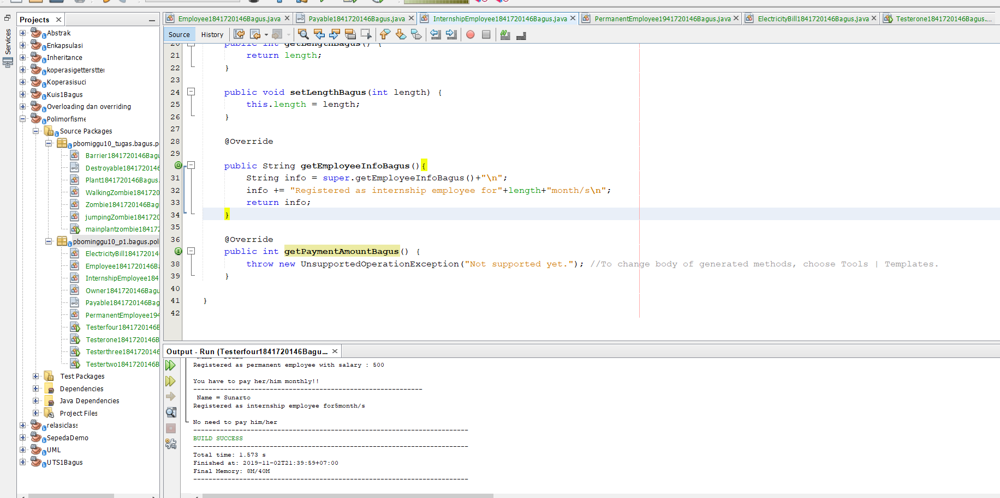

[ini link ke kode program InternshipEmployee1841720146Bagus](../../src/10_Polimorfisme/Percobaan4/InternshipEmployee1841720146Bagus.java)

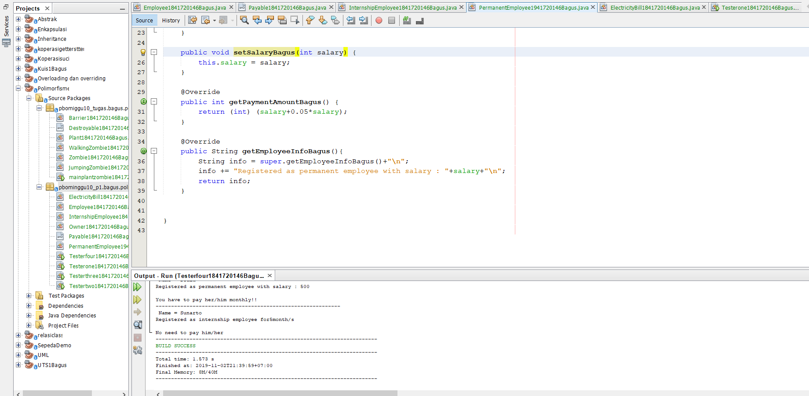

[ini link ke kode program PermanentEmployee1941720146Bagus](../../src/10_Polimorfisme/Percobaan4/PermanentEmployee1941720146Bagus.java)


[ini link ke kode program ElectricityBill1841720146Bagus](../../src/10_Polimorfisme/Percobaan4/ElectricityBill1841720146Bagus.java)

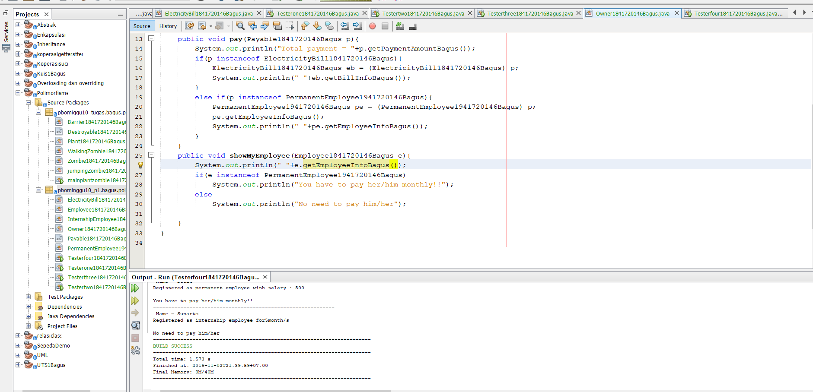

[ini link ke kode program Owner1841720146Bagus](../../src/10_Polimorfisme/Percobaan4/Owner1841720146Bagus.java)


[ini link ke kode program Testerfour1841720146Bagus](../../src/10_Polimorfisme/Percobaan4/Testerfour1841720146Bagus.java)


**7.2. Pertanyaan** 

1. Perhatikan class **Tester4** baris ke-7 dan baris ke-11, mengapa pemanggilan **ow.pay(eBill)** dan **ow.pay(pEmp)** bisa dilakukan, padahal jika diperhatikan method **pay()** yang ada di dalam class **Owner** memiliki argument/parameter bertipe **Payable?** Jika diperhatikan lebih detil eBill merupakan objek dari ElectricityBill dan pEmp merupakan objek dari PermanentEmployee? 

2. Jadi apakah tujuan membuat argument bertipe **Payable** pada method **pay()** yang ada di dalam class **Owner?** 

3. Coba pada baris terakhir method **main()** yang ada di dalam class **Tester4** ditambahkan perintah **ow.pay(iEmp);** 


Mengapa terjadi error?  

4. Perhatikan class **Owner**, diperlukan untuk apakah sintaks **p** **instanceof ElectricityBill** pada baris ke-6 ? 

5. Perhatikan kembali class Owner baris ke-7, untuk apakah casting objek disana (**ElectricityBill eb =** (**ElectricityBill**) **p**) diperlukan ? Mengapa objek **p** yang bertipe **Payable** harus di-casting ke dalam objek **eb** yang bertipe **ElectricityBill** ? 

**Hasil / Jawaban  Pertanyaan Percobaan 4**

1. Karena class ElectricityBill dan class PermanentEmployee merupakan implements ke interface Payable

2.  Tujuannya adalah agar method pay() yang ada di dalam class Owner bisa mengakses/menerima argument objek eBill (Objek dari class ElectricityBill) dan pEmp ( Objek dari class PermanentEmployee). Karena kedua class tersebut merupakan implements ke interface Payable 

3. karena iEmp merupakan objek dari class InternshipEmplooye, sedangkan class tersebut tidak implements ke interface Payable. 

4. sintaks p diperlukan untuk mengecek apakah p merupakan objek hasil instansiasi dari class ElectricityBill. Jika ya, akan dijalankan program di dalamnya. Jika tidak, ke kondisi berikutnya. 

5. Casting diperlukan karena untuk mengakses method (behaviour) spesifik dari suatu subtype yaitu ElectricityBill yang merupakan implements dari interface Payable. 


**8. Tugas** 

Dalam suatu permainan, Zombie dan Barrier bisa dihancurkan oleh Plant dan bisa menyembuhkan diri. Terdapat dua jenis Zombie, yaitu Walking Zombie dan Jumping Zombie. Kedua Zombie tersebut memiliki cara penyembuhan yang berbeda, demikian juga cara penghancurannya, yaitu ditentukan oleh aturan berikut ini: 

• Pada WalkingZombie 

* Penyembuhan : Penyembuhan ditentukan berdasar level zombie yang bersangkutan 

* Jika zombie level 1, maka setiap kali penyembuhan, health akan bertambah 20% 

* Jika zombie level 2, maka setiap kali penyembuhan, health akan bertambah 30%  

* Jika zombie level 3, maka setiap kali penyembuhan, health akan bertambah 40% 

* Penghancuran : setiap kali penghancuran, health akan berkurang 2%

• Pada Jumping Zombie 

* Penyembuhan : Penyembuhan ditentukan berdasar level zombie yang bersangkutan 

* Jika zombie level 1, maka setiap kali penyembuhan, health akan bertambah 30% 

* Jika zombie level 2, maka setiap kali penyembuhan, health akan bertambah 40%  

* Jika zombie level 3, maka setiap kali penyembuhan, health akan bertambah 50% 

* Penghancuran : setiap kali penghancuran, health akan berkurang 1% 

Buat program dari class diagram di bawah ini! 

**hasil Tugas**


[ini link ke kode program Zombie1841720146Bagus](../../src/10_Polimorfisme/Tugas/Zombie1841720146Bagus.java)


[ini link ke kode program Destroyable1841720146Bagus](../../src/10_Polimorfisme/Tugas/Destroyable1841720146Bagus.java)


[ini link ke kode program WalkingZombie1841720146Bagus](../../src/10_Polimorfisme/Tugas/WalkingZombie1841720146Bagus.java)


[ini link ke kode program jumpingZombie1841720146Bagus](../../src/10_Polimorfisme/Tugas/jumpingZombie1841720146Bagus.java)


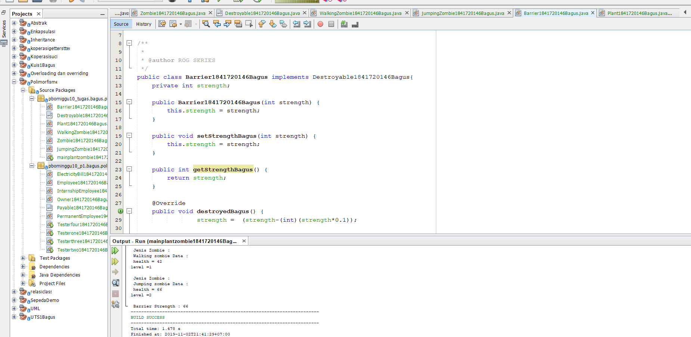

[ini link ke kode program Barrier1841720146Bagus](../../src/10_Polimorfisme/Tugas/Barrier1841720146Bagus.java)


[ini link ke kode program Plant1841720146Bagus](../../src/10_Polimorfisme/Tugas/Plant1841720146Bagus.java)

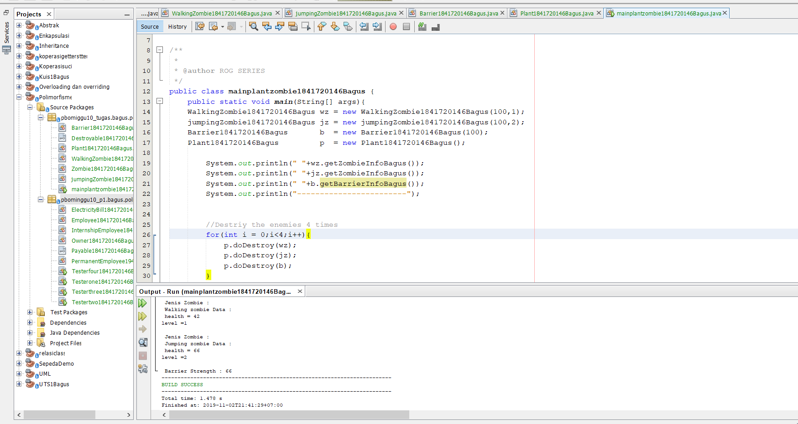

[ini link ke kode program mainplantzombie1841720146Bagus](../../src/10_Polimorfisme/Tugas/mainplantzombie1841720146Bagus.java)


## Pernyataan Diri

Saya menyatakan isi tugas, kode program, dan laporan praktikum ini dibuat oleh saya sendiri. Saya tidak melakukan plagiasi, kecurangan, menyalin/menggandakan milik orang lain.

Jika saya melakukan plagiasi, kecurangan, atau melanggar hak kekayaan intelektual, saya siap untuk mendapat sanksi atau hukuman sesuai peraturan perundang-undangan yang berlaku.

Ttd,

***(Bagus Satria Putra)***


 


 


 

 
 


