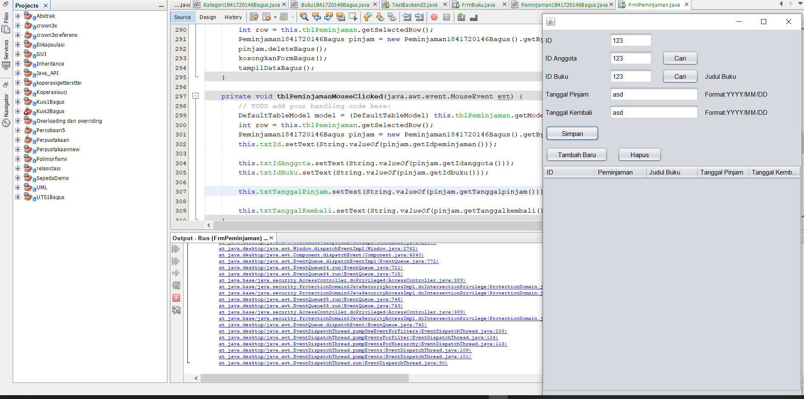

# Laporan Praktikum #14 - GUI dan Database
  

**JOBSHEET 14 - GUI dan Database**

# 1. Kompetensi 

Setelah menempuh materi percobaan ini, mahasiswa mampu mengenal: 

1. Menggunakan paradigma berorientasi objek untuk interaksi dengan database 

2. Membuat backend dan frontend 

3. Membuat form sebagai frontend 
 
# 2. Pendahuluan 

Kali ini kita akan menggunakan paradigma berorientasi objek yang telah kita pelajari untuk membuat aplikasi berbasis database dan dilengkapi dengan form sebagai Graphical User Interface (GUI). 
Secara umum, tahapan yang akan kita lakukan adalah sebagai berikut: 

1. Membuat database dan tabel-tabelnya. 

2. Membuat backend yang berisi class-class yang mewakili data yang ada pada database, dan class helper untuk melakukan eksekusi query database. 

3. Membuat frontend yang merupakan antarmuka kepada pengguna. Frontend ini bisa berbasis teks (console), GUI, web, mobile, dan sebagainya. 

Library yang digunakan untuk project ini antara lain: 

1. JDBC, untuk melakukan interaksi ke database. 

2. ArrayList, untuk menampung data hasil query ke database. 

3. Swing, untuk membuat tampilan GUI. 


Untuk percobaan, kita akan membuat sistem informasi Perpustakaan, yang memiliki data antara lain: Buku, Kategori, Anggota dan Peminjaman. Fitur yang ada pada aplikasi ini adalah anggota dapat melakukan peminjaman dan pengembalian buku. Berikut adalah class diagram untuk sistem informasi ini: 
 
 

Dapat dilihat dari class diagram diatas, terdapat relasi antar class. Class Buku berelasi dengan Kategori dikarenakan terdapat atribut bertipe data Kategori di dalam class buku. Begitu juga class Peminjaman yang berelasi dengan class Buku dan Anggota. 
 
**3. Percobaan** 

**3.1 Percobaan 1** 

Membuat database.


1. Langkah pertama untuk percobaan ini adalah membuat database. Install XAMPP, buka phpMyAdmin, buat database **dbperpus,** dan tabel-tabelnya: 

 


Set semua primary key id pada tiap tabel (idanggota, idkategori, idpeminjaman, idbuku) dengan **Auto Increment.** 

 


**3.2 Percobaan 2**

Mempersiapkan project. 


1. Buat project baru, beri nama **Perpustakaan.** 

2. Pada project explorer, klik kanan pada Libraries → Add Library, pilih MySQL JDBC Driver. 

 


3. Buat package **frontend** dan **backend**. Cara membuat package adalah, pada project explorer, klik kanan pada Source Packages → New → Java Package, beri nama package nya (frontend, backend). 

 


 
**3.3 Percobaan 3** 

Membuat class helper untuk mengeksekusi query SQL.

1. Pada package **backend**, buat class **DBHelper**. 

2. Import java.sql.* 

3. Didalam class ini ada method-method antara lain:

a. **bukaKoneksi()**, untuk membuka koneksi ke database 

b. **insertQueryGetId(String query)**, untuk melakukan insert ke tabel dan mengembalikan nilai ID yang digenerate oleh database (hasil Auto Increment). 

c. **executeQuery(String query)**, untuk mengeksekusi query yang tidak mengembalikan nilai (misal: insert, update, delete). 

d. **selectQuery(String query)**, untuk mengeksekusi select query yang mengembalikan nilai hasil query. 

4. Berikut adalah kode dari class DBHelper. Anda perlu sesuaikan method **bukaKoneksi()** dengan setting database yang terinstall di sistem anda. Namun jika anda install XAMPP secara default, maka setting ini tidak perlu diubah, mungkin nama database saja yang perlu disesuaikan. Silahkan COPAS kode berikut ini. 

```java
/*
 * To change this license header, choose License Headers in Project Properties.
 * To change this template file, choose Tools | Templates
 * and open the template in the editor.
 */
package backend;

/**
 *
 * @author ROG SERIES
 */
import java.sql.*;

public class DBHelper1841720146Bagus {

    private static Connection sKoneksi;

    public static void bukaKoneksiBagus() {
        if (sKoneksi == null) {
            try {
                String url = "jdbc:mysql://localhost:3306/dbperpus";
                String user = "root";
                String password = "";
                DriverManager.registerDriver(new com.mysql.jdbc.Driver());
                sKoneksi = DriverManager.getConnection(url, user, password);
            } catch (SQLException t) {
                System.out.println("Error koneksi!");
            }
        }
    }

    public static int insertQueryGetIdBagus(String query) {
        bukaKoneksiBagus();
        int num = 0;
        int result = -1;

        try {
            Statement stmt = sKoneksi.createStatement();
            num = stmt.executeUpdate(query, Statement.RETURN_GENERATED_KEYS);
            ResultSet rs = stmt.getGeneratedKeys();
            if (rs.next()) {
                result = rs.getInt(1);
            }
            rs.close();
            stmt.close();
        } catch (Exception e) {
            e.printStackTrace();
            result = -1;
        }
        return result;
    }

    public static boolean executeQueryBagus(String query) {
        bukaKoneksiBagus();
        boolean result = false;

        try {
            Statement stmt = sKoneksi.createStatement();
            stmt.executeUpdate(query);
            result = true;
            stmt.close();
        } catch (Exception e) {
            e.printStackTrace();
        }
        return result;
    }

    public static ResultSet selectQueryBagus(String query) {
        bukaKoneksiBagus();
        ResultSet rs = null;
        try {
            Statement stmt = sKoneksi.createStatement();
            rs = stmt.executeQuery(query);
        } catch (Exception e) {
            e.printStackTrace();
        }
        return rs;
    }

    
}

```


  [ini link ke kode program DBHelper1841720146Bagus](../../src/14_GUI_dan_Database/backend/DBHelper1841720146Bagus.java)


**3.4 Percobaan 4** 

Membuat class Kategori untuk menghandle CRUD pada tabel kategori. 


1. Pada package backend, buat class baru yaitu Kategori. 

2. Tambahkan import java.util.ArrayList dan java.sql.* 

```java
import java.util.ArrayList;
import java.sql.*;
```

3. Tambahkan atribut sesuai field pada tabel kategori.

```java
    private int idkategori;
    private String nama;
    private String keterangan;
```
4. Tambahkan getter setter untuk setiap atribut. Anda bisa gunakan fasilitas **Insert Code** pada NetBeans. Caranya adalah, klik kanan sembarang tempat di editor, pilih Insert Code, pilih Setter and Getter, centang semua atribut yang ada (idkategori, nama, keterangan). 
 
5. Tambahkan konstruktor default dan konstruktor custom, yang digunakan untuk mengeset atribut nama dan keterangan. Atribut idkategori tidak boleh diset, karena id ini akan digenerate secara otomatis lewat fitur AutoIncrement pada MySQL.  
 
```java
public Kategori1841720146Bagus() {
    }

    public Kategori1841720146Bagus(String nama, String keterangan) {
        this.nama = nama;
        this.keterangan = keterangan;
    }
```

6. Tambahkan method **getById()** untuk mendapatkan objek Kategori yang ada di database berdasarkan id-nya. 

```java
public Kategori1841720146Bagus getByIdBagus(int id) {
        Kategori1841720146Bagus kat = new Kategori1841720146Bagus();
        ResultSet rs = DBHelper1841720146Bagus.selectQueryBagus("SELECT * FROM kategori " + " WHERE idkategori = '" + id + "'");

        try {
            while (rs.next()) {
                kat = new Kategori1841720146Bagus();
                kat.setIdkategoriBagus(rs.getInt("idkategori"));
                kat.setNamaBagus(rs.getString("nama"));
                kat.setKeteranganBagus(rs.getString("keterangan"));
            }
        } catch (Exception e) {
            e.printStackTrace();
        }
        return kat;
    }
```

7. Tambahkan method **getAll()** untuk mendapatkan semua data Kategori yang ada di database, dan ditampung ke ArrayList<Kategori>. 

```java
 public ArrayList<Kategori1841720146Bagus> getAllBagus() {
        ArrayList<Kategori1841720146Bagus> ListKategori = new ArrayList();

        ResultSet rs = DBHelper1841720146Bagus.selectQueryBagus("SELECT * FROM kategori");

        try {
            while (rs.next()) {
                Kategori1841720146Bagus kat = new Kategori1841720146Bagus();
                kat.setIdkategoriBagus(rs.getInt("idkategori"));
                kat.setNamaBagus(rs.getString("nama"));
                kat.setKeteranganBagus(rs.getString("keterangan"));

                ListKategori.add(kat);
            }
        } catch (Exception e) {
            e.printStackTrace();
        }
        return ListKategori;
    }
```

8. Tambahkan method **search()** agar bisa melakukan pencarian data. Method ini mirip dengan method **getAll()** namun querynya berbeda. 

```java
 public ArrayList<Kategori1841720146Bagus> searchBagus(String keyword) {
        ArrayList<Kategori1841720146Bagus> ListKategori = new ArrayList();

        String sql = "SELECT * FROM kategori WHERE " + " nama LIKE '%" + keyword + "%' " + " OR keterangan LIKE '%" + keyword + "%' ";

        ResultSet rs = DBHelper1841720146Bagus.selectQueryBagus(sql);

        try {
            while (rs.next()) {
                Kategori1841720146Bagus kat = new Kategori1841720146Bagus();
                kat.setIdkategoriBagus(rs.getInt("idkategori"));
                kat.setNamaBagus(rs.getString("nama"));
                kat.setKeteranganBagus(rs.getString("keterangan"));

                ListKategori.add(kat);
            }
        } catch (Exception e) {
            e.printStackTrace();
        }
        return ListKategori;
    }
```

9. Tambahkan method **save()**. Method ini memiliki dua fungsi, yaitu insert dan update. Jika data yang diinputkan belum ada (idkategori = 0) maka akan otomatis insert. Jika data yang diinputkan sudah ada, maka otomatis update. 

```java
public void saveBagus() {
        if (getByIdBagus(idkategori).getIdkategoriBagus() == 0) {
            String SQL = "INSERT INTO kategori (nama, keterangan) VALUES(" + " '" + this.nama + "', " + " '" + this.keterangan + "' " + " )";
            this.idkategori = DBHelper1841720146Bagus.insertQueryGetIdBagus(SQL);
        } else {
            String SQL = "UPDATE kategori SET " + " nama = '" + this.nama + "', " + " keterangan = '" + this.keterangan + "' " + " WHERE idkategori = '" + this.idkategori + "'";
            DBHelper1841720146Bagus.executeQueryBagus(SQL);
        }
    }
```

10. Tambahkan method **delete()** untuk melakukan operasi penghapusan pada tabel kategori pada database. 

```java
 public void deleteBagus()
    {
        String SQL = "DELETE FROM kategori WHERE idkategori = '" + this.idkategori + "'";
        DBHelper1841720146Bagus.executeQueryBagus(SQL);
    }
```


  [ini link ke kode program Kategori1841720146Bagus](../../src/14_GUI_dan_Database/backend/Kategori1841720146Bagus.java)


**3.5 Percobaan 5**

Mencoba backed yang sudah dibuat dengan mengoperasikannya lewat frontend berbasis teks (console). Percobaan ini dapat anda skip jika anda telah yakin bahwa backend yang anda buat sudah berfungsi dengan baik. 


1. Pada package **frontend**, buat class **TestBackend**. Tambahkan import backend.* 

2. Berikut kode lengkap untuk class TestBackend. Silahkan di COPAS. import 

```java
/*
 * To change this license header, choose License Headers in Project Properties.
 * To change this template file, choose Tools | Templates
 * and open the template in the editor.
 */
package frontend;

/**
 *
 * @author ROG SERIES
 */
import backend.*;
public class TestBackend1841720146Bagus {

    public static void main(String[] args) {
        Kategori1841720146Bagus kat1 = new Kategori1841720146Bagus("Novel", "Koleksi bubku novel");
        Kategori1841720146Bagus kat2 = new Kategori1841720146Bagus("Referensi", "Buku referensi ilmiah");
        Kategori1841720146Bagus kat3 = new Kategori1841720146Bagus("Komik", "Komik anak-anak");

        //test insert
        kat1.saveBagus();
        kat2.saveBagus();
        kat3.saveBagus();

        // test update
        kat2.setKeteranganBagus("koleksi buku referensi ilmiah");
        kat2.saveBagus();

        //test delete
        kat3.deleteBagus();

        //test select all
        for (Kategori1841720146Bagus k : new Kategori1841720146Bagus().getAllBagus()) {
            System.out.println("Nama : " + k.getNamaBagus() + ", ket : " + k.getKeteranganBagus());

        }
        //test search
        for (Kategori1841720146Bagus k : new Kategori1841720146Bagus().searchBagus("ilmiah")) {
            System.out.println("Nama : " + k.getNamaBagus() + ", ket : " + k.getKeteranganBagus());
        }
    }
}

```

3. Jalankan TestBackend dengan klik kanan, Run File. Cocokkan outputnya: 

 


  [ini link ke kode program TestBackend1841720146Bagus](../../src/14_GUI_dan_Database/frontend/TestBackend1841720146Bagus.java)


**3.6 Percobaan 6** 

Pada percobaan ini kita akan membuat interface GUI untuk class Kategori. 


1. Pada package **frontend**, buat JFrame dengan nama FrmKategori. Caranya adalah, klik kanan pada package frontend → New →JFrame Form. 

2. Susun form sehingga seperti berikut ini, atur propertinya sesuai nomor: 

 

Pengaturan properti:

 

3. Edit kodenya, tambahkan import backend.*, java.util.ArrayList, javax.swing.table.DefaultTableModel; 
  
```java
import backend.*;
import java.util.ArrayList;
import javax.swing.table.DefaultTableModel;
```

4. Tambahkan method **kosongkanForm()** untuk mengosongkan isian textbox pada form. 

```java
public void kosongkanForm(){
        txtIdKategori.setText("0");
        txtNama.setText("");
        txtKeterangan.setText("");
        
    }
```

5. Tambahkan method **tampilkanData()** untuk mengambil semua data kategori dari database dan menampilkannya ke JTable tblKategori. 

```java
public void tampilkanData(){
        String[] kolom = {"idkategori", "nama", "keterangan"};
        ArrayList<Kategori1841720146Bagus> list = new Kategori1841720146Bagus().getAllBagus();
        Object rowData[] = new Object[3];
        tblKategori.setModel(new DefaultTableModel(new Object[][] {}, kolom));
        for(Kategori1841720146Bagus kat : list){
            rowData[0] = kat.getIdkategoriBagus();
            rowData[1] = kat.getNamaBagus();
            rowData[2] = kat.getKeteranganBagus();
            
            ((DefaultTableModel)tblKategori.getModel()).addRow(rowData);
        }
        
    }
```

6. Tambahkan method **cari()** untuk melakukan pencarian berdasarkan keyword tertentu. 

```java
public void cari(String keyword){
        String[] kolom = {"idkategori","nama","keterangan"};
        ArrayList<Kategori1841720146Bagus> list = new Kategori1841720146Bagus().searchBagus(keyword);
        Object rowData[] = new Object[3];
        
        tblKategori.setModel(new DefaultTableModel(new Object[][] {}, kolom));
        
        for(Kategori1841720146Bagus kat : list){
            rowData[0] = kat.getIdkategoriBagus();
            rowData[1] = kat.getNamaBagus();
            rowData[2] = kat.getKeteranganBagus();
            
            ((DefaultTableModel) tblKategori.getModel()).addRow(rowData);
        }
    }
```

7. Pada konstruktor, tambahkan pemanggilan method kosongkanForm() dan tampilkanData(), agar ketika form ditampilkan pertama kali, maka form isian akan kosong dan data kategori langsung ditampilkan. 

```java
public FrmKategori() {
        initComponents();
        tampilkanData();
        kosongkanForm();
    }
```

8. Double klik pada **btnSimpan** untuk menambahkan kode untuk menyimpan data. Aksi menyimpan ini secara otomatis menentukan apakah insert atau update, karena pada method **save()** dari objek **kat**, sudah dicek apakah data baru atau sudah ada (baca Percobaan 4, no. 9) 

```java
private void btnSimpanActionPerformed(java.awt.event.ActionEvent evt) {                                          
        // TODO add your handling code here:
        Kategori1841720146Bagus kat = new Kategori1841720146Bagus();
        kat.setIdkategoriBagus(Integer.parseInt(txtIdKategori.getText()));
        kat.setNamaBagus(txtNama.getText());
        kat.setKeteranganBagus(txtKeterangan.getText());
        kat.saveBagus();
        txtIdKategori.setText(Integer.toString(kat.getIdkategoriBagus()));
        tampilkanData();
    }     
```

9. Double klik pada **btnHapus** untuk menambahkan kode untuk menghapus data. 

```java
private void btnHapusActionPerformed(java.awt.event.ActionEvent evt) {                                         
        // TODO add your handling code here:
        DefaultTableModel model =(DefaultTableModel)tblKategori.getModel();
        int row = tblKategori.getSelectedRow();
        
        Kategori1841720146Bagus kat = new Kategori1841720146Bagus().getByIdBagus(Integer.parseInt(model.getValueAt(row, 0).toString()));
        kat.deleteBagus();
        kosongkanForm();
        tampilkanData();
    } 
```

10. Double klik pada **btnTambahBaru** untuk mengosongkan form sehingga dapat digunakan untuk menginputkan data baru.

```java
 private void btnTambahBaruActionPerformed(java.awt.event.ActionEvent evt) {                                              
        // TODO add your handling code here:
        kosongkanForm();
    } 
```

11. Double klik pada **btnCari** untuk melakukan pencarian terhadap keyword yang dimasukkan pada **txtCari**.

```java
 private void btnCariActionPerformed(java.awt.event.ActionEvent evt) {                                        
        // TODO add your handling code here:
        cari(txtCari.getText());
    } 
```

12. Agar kita dapat memilih data yang ada pada **tblKategori**, agar dapat diedit atau dihapus, maka kita tambahkan event mouse click pada **tblKategori**. Ketika pengguna mengklik pada tblKategori, maka data tersebut akan ditampilkan di tex field. Caranya, klik kanan pada **tblKategori**, pilih Events → Mouse → MouseClicked. Tambahkan kode berikut ini: 

```java
 private void tblKategoriMouseClicked(java.awt.event.MouseEvent evt) {                                         
        // TODO add your handling code here:
        DefaultTableModel model = (DefaultTableModel)tblKategori.getModel();
        int row = tblKategori.getSelectedRow();
        
        txtIdKategori.setText(model.getValueAt(row, 0).toString());
        txtNama.setText(model.getValueAt(row, 1).toString());
        txtKeterangan.setText(model.getValueAt(row, 2).toString());
    } 
```

13. Jalankan form dengan opsi Run File. Kemudian ujicoba tambah baru, edit, hapus, cari.


**Hasil GUI JFrame FrmKategori**


  [ini link ke kode program FrmKategori](../../src/14_GUI_dan_Database/frontend/FrmKategori.java)


**3.6 Percobaan 6** 

Lakukan hal yang sama untuk data **Anggota!** 

1. Buat class **Anggota** pada package **backend**, lengkapi atribut dan method-nya.  
2. Lakukan test pada class TestBackend pada package **frontend.** 


[ini link ke kode program Anggota1841720146Bagus](../../src/14_GUI_dan_Database/backend/Anggota1841720146Bagus.java)

[ini link ke kode program TestBackendAnggota1841720146Bagus](../../src/14_GUI_dan_Database/frontend/TestBackendAnggota1841720146Bagus.java)
```java
/*
 * To change this license header, choose License Headers in Project Properties.
 * To change this template file, choose Tools | Templates
 * and open the template in the editor.
 */
package backend;

/**
 *
 * @author ROG SERIES
 */
import java.sql.ResultSet;
import java.util.ArrayList;
import java.sql.*;

public class Anggota1841720146Bagus {

   private int idanggota;
    private String nama;
    private String alamat;
    private String telepon;

    public Anggota1841720146Bagus() {
    }
    
    @Override
    public String toString(){
        return nama;
    }

    public int getIdanggota() {
        return idanggota;
    }

    public String getNama() {
        return nama;
    }

    public String getAlamat() {
        return alamat;
    }

    public String getTelepon() {
        return telepon;
    }

    public void setIdanggota(int idanggota) {
        this.idanggota = idanggota;
    }

    public void setNama(String nama) {
        this.nama = nama;
    }

    public void setAlamat(String alamat) {
        this.alamat = alamat;
    }

    public void setTelepon(String telepon) {
        this.telepon = telepon;
    }

    public Anggota1841720146Bagus( String nama, String alamat, String telepon) {
        
        this.nama = nama;
        this.alamat = alamat;
        this.telepon = telepon;
    }
   

    public Anggota1841720146Bagus getByIdBagus(int id) {
        Anggota1841720146Bagus kat = new Anggota1841720146Bagus();
        ResultSet rs = DBHelper1841720146Bagus.selectQueryBagus("SELECT * FROM anggota " + " WHERE idanggota = '" + id + "'");

        try {
            while (rs.next()) {
                kat = new Anggota1841720146Bagus();
                kat.setIdanggota(rs.getInt("idanggota"));
                kat.setNama(rs.getString("nama"));
                kat.setAlamat(rs.getString("alamat"));
                kat.setTelepon(rs.getString("telepon"));
            }
        } catch (Exception e) {
            e.printStackTrace();
        }
        return kat;
    }

    public ArrayList<Anggota1841720146Bagus> getAllBagus() {
        ArrayList<Anggota1841720146Bagus> listAnggota = new ArrayList();

        ResultSet rs = DBHelper1841720146Bagus.selectQueryBagus("SELECT * FROM anggota");

        try {
            while (rs.next()) {
                Anggota1841720146Bagus kat = new Anggota1841720146Bagus();
                kat.setIdanggota(rs.getInt("idanggota"));
                kat.setNama(rs.getString("nama"));
                kat.setAlamat(rs.getString("alamat"));
                kat.setTelepon(rs.getString("telepon"));

                listAnggota.add(kat);
            }
        } catch (Exception e) {
            e.printStackTrace();
        }
        return listAnggota;
    }

     public ArrayList<Anggota1841720146Bagus> searchBagus(String keyword) {
        ArrayList<Anggota1841720146Bagus> listAnggota = new ArrayList();

        String sql = "SELECT * FROM anggota WHERE " + " nama LIKE '%" + keyword + "%' " + " OR alamat LIKE '%" + keyword + "%' " + " OR telepon LIKE '%"+ keyword + "%' ";

        ResultSet rs = DBHelper1841720146Bagus.selectQueryBagus(sql);

        try {
            while (rs.next()) {
                Anggota1841720146Bagus kat = new Anggota1841720146Bagus();
                kat.setIdanggota(rs.getInt("idanggota"));
                kat.setNama(rs.getString("nama"));
                kat.setAlamat(rs.getString("alamat"));
                kat.setTelepon(rs.getString("telepon"));

                listAnggota.add(kat);
            }
        } catch (Exception e) {
            e.printStackTrace();
        }
        return listAnggota;
    }

    public void saveBagus() {
        if (getByIdBagus(idanggota).getIdanggota()== 0) {
            String SQL = "INSERT INTO anggota (nama, alamat, telepon) VALUES(" + " '" + this.nama + "', " + " '" + this.alamat + "', "+" '" + this.telepon + "' "+" )";
            this.idanggota = DBHelper1841720146Bagus.insertQueryGetIdBagus(SQL);
        } else {
            String SQL = "UPDATE anggota SET " + " nama = '" + this.nama + "', " + " alamat = '" + this.alamat + "', " + " telepon = '" + this.telepon + "' " +" WHERE idanggota = '" + this.idanggota + "'";
            DBHelper1841720146Bagus.executeQueryBagus(SQL);
        }
    }

    public void deleteBagus()
    {
        String SQL = "DELETE FROM anggota WHERE idanggota = '" + this.idanggota + "'";
        DBHelper1841720146Bagus.executeQueryBagus(SQL);
    }
  
}

```


 
**3.7 Percobaan 7**

 Buat form untuk data **Anggota**.

1. Buat **FrmAnggota** pada package **frontend** dan lengkapi komponen, method serta event-nya. 


[ini link ke kode program FrmAnggota](../../src/14_GUI_dan_Database/frontend/FrmAnggota.java)


**Hasil java**

```java
/*
 * To change this license header, choose License Headers in Project Properties.
 * To change this template file, choose Tools | Templates
 * and open the template in the editor.
 */
package frontend;

/**
 *
 * @author ROG SERIES
 */import backend.Anggota1841720146Bagus;
import java.util.ArrayList;
import javax.swing.table.DefaultTableModel;
public class FrmAnggota extends javax.swing.JFrame {

    /**
     * Creates new form FrmAnggota
     */
    public FrmAnggota() {
        initComponents();
         tampilkanDataBagus();
        kosongkanFormBagus();
    }

    public void kosongkanFormBagus(){
        txtIdAnggota.setText("0");
        txtNama.setText("");
        txtalamat.setText("");
        txttelepon.setText("");
    }
    
    public void tampilkanDataBagus(){
        String[] kolom = {"ID Anggota", "Nama", "Alamat", "Telepon"};
        ArrayList<Anggota1841720146Bagus> list = new Anggota1841720146Bagus().getAllBagus();
        Object rowData[] = new Object[4];
        
        tblanggota.setModel(new DefaultTableModel(new Object[][] {}, kolom));
        
        for (Anggota1841720146Bagus ang : list) {
            rowData[0] = ang.getIdanggota();
            rowData[1] = ang.getNama();
            rowData[2] = ang.getAlamat();
            rowData[3] = ang.getTelepon();
            
            ((DefaultTableModel)tblanggota.getModel()).addRow(rowData);
        }
    }
    
    public void cari (String keyword){
        String[] kolom = {"ID Anggota", "Nama", "Alamat", "Telepon"};
        ArrayList<Anggota1841720146Bagus> list = new Anggota1841720146Bagus().searchBagus(keyword);
        Object rowData[] = new Object[5];
        
        tblanggota.setModel(new DefaultTableModel(new Object[][] {}, kolom));
        
        for (Anggota1841720146Bagus ang : list) {
            rowData[0] = ang.getIdanggota();
            rowData[1] = ang.getNama();
            rowData[2] = ang.getAlamat();
            rowData[3] = ang.getTelepon();
            
            
            ((DefaultTableModel)tblanggota.getModel()).addRow(rowData);
        }
    }
    /**
     * This method is called from within the constructor to initialize the form.
     * WARNING: Do NOT modify this code. The content of this method is always
     * regenerated by the Form Editor.
     */
    @SuppressWarnings("unchecked")
    // <editor-fold defaultstate="collapsed" desc="Generated Code">                          
    private void initComponents() {

        txtIdAnggota = new javax.swing.JTextField();
        txtNama = new javax.swing.JTextField();
        txtalamat = new javax.swing.JTextField();
        jButton1 = new javax.swing.JButton();
        tambahbaru = new javax.swing.JButton();
        hapus = new javax.swing.JButton();
        txtcari = new javax.swing.JTextField();
        cari = new javax.swing.JButton();
        txttelepon = new javax.swing.JTextField();
        jLabel1 = new javax.swing.JLabel();
        jLabel2 = new javax.swing.JLabel();
        jLabel3 = new javax.swing.JLabel();
        jLabel4 = new javax.swing.JLabel();
        jScrollPane1 = new javax.swing.JScrollPane();
        tblanggota = new javax.swing.JTable();

        setDefaultCloseOperation(javax.swing.WindowConstants.EXIT_ON_CLOSE);

        txtalamat.addActionListener(new java.awt.event.ActionListener() {
            public void actionPerformed(java.awt.event.ActionEvent evt) {
                txtalamatActionPerformed(evt);
            }
        });

        jButton1.setText("Simpan");
        jButton1.addActionListener(new java.awt.event.ActionListener() {
            public void actionPerformed(java.awt.event.ActionEvent evt) {
                jButton1ActionPerformed(evt);
            }
        });

        tambahbaru.setText("Tambah Baru");
        tambahbaru.addActionListener(new java.awt.event.ActionListener() {
            public void actionPerformed(java.awt.event.ActionEvent evt) {
                tambahbaruActionPerformed(evt);
            }
        });

        hapus.setText("Hapus");
        hapus.addActionListener(new java.awt.event.ActionListener() {
            public void actionPerformed(java.awt.event.ActionEvent evt) {
                hapusActionPerformed(evt);
            }
        });

        cari.setText("Cari");
        cari.addActionListener(new java.awt.event.ActionListener() {
            public void actionPerformed(java.awt.event.ActionEvent evt) {
                cariActionPerformed(evt);
            }
        });

        jLabel1.setText("ID Anggota");

        jLabel2.setText("Nama Anggota");

        jLabel3.setText("Alamat Anggota");

        jLabel4.setText("Telepon Anggota");

        tblanggota.setModel(new javax.swing.table.DefaultTableModel(
            new Object [][] {
                {null, null, null, null},
                {null, null, null, null},
                {null, null, null, null},
                {null, null, null, null}
            },
            new String [] {
                "Title 1", "Title 2", "Title 3", "Title 4"
            }
        ));
        tblanggota.addMouseListener(new java.awt.event.MouseAdapter() {
            public void mousePressed(java.awt.event.MouseEvent evt) {
                tblanggotaMousePressed(evt);
            }
        });
        jScrollPane1.setViewportView(tblanggota);

        javax.swing.GroupLayout layout = new javax.swing.GroupLayout(getContentPane());
        getContentPane().setLayout(layout);
        layout.setHorizontalGroup(
            layout.createParallelGroup(javax.swing.GroupLayout.Alignment.LEADING)
            .addGroup(layout.createSequentialGroup()
                .addContainerGap()
                .addGroup(layout.createParallelGroup(javax.swing.GroupLayout.Alignment.LEADING)
                    .addGroup(layout.createSequentialGroup()
                        .addComponent(tambahbaru, javax.swing.GroupLayout.PREFERRED_SIZE, 124, javax.swing.GroupLayout.PREFERRED_SIZE)
                        .addGap(18, 18, 18)
                        .addComponent(hapus)
                        .addPreferredGap(javax.swing.LayoutStyle.ComponentPlacement.RELATED)
                        .addComponent(txtcari, javax.swing.GroupLayout.PREFERRED_SIZE, 191, javax.swing.GroupLayout.PREFERRED_SIZE)
                        .addPreferredGap(javax.swing.LayoutStyle.ComponentPlacement.RELATED, 10, Short.MAX_VALUE)
                        .addComponent(cari, javax.swing.GroupLayout.PREFERRED_SIZE, 69, javax.swing.GroupLayout.PREFERRED_SIZE)
                        .addGap(19, 19, 19))
                    .addGroup(layout.createSequentialGroup()
                        .addGroup(layout.createParallelGroup(javax.swing.GroupLayout.Alignment.LEADING, false)
                            .addComponent(jLabel1, javax.swing.GroupLayout.DEFAULT_SIZE, javax.swing.GroupLayout.DEFAULT_SIZE, Short.MAX_VALUE)
                            .addComponent(jLabel2, javax.swing.GroupLayout.DEFAULT_SIZE, javax.swing.GroupLayout.DEFAULT_SIZE, Short.MAX_VALUE)
                            .addComponent(jLabel3, javax.swing.GroupLayout.DEFAULT_SIZE, javax.swing.GroupLayout.DEFAULT_SIZE, Short.MAX_VALUE)
                            .addComponent(jLabel4, javax.swing.GroupLayout.DEFAULT_SIZE, 108, Short.MAX_VALUE))
                        .addPreferredGap(javax.swing.LayoutStyle.ComponentPlacement.RELATED)
                        .addGroup(layout.createParallelGroup(javax.swing.GroupLayout.Alignment.LEADING, false)
                            .addComponent(txtIdAnggota, javax.swing.GroupLayout.PREFERRED_SIZE, 75, javax.swing.GroupLayout.PREFERRED_SIZE)
                            .addComponent(txtNama)
                            .addComponent(txtalamat)
                            .addComponent(txttelepon, javax.swing.GroupLayout.DEFAULT_SIZE, 236, Short.MAX_VALUE))
                        .addContainerGap(javax.swing.GroupLayout.DEFAULT_SIZE, Short.MAX_VALUE))))
            .addGroup(layout.createSequentialGroup()
                .addComponent(jButton1, javax.swing.GroupLayout.PREFERRED_SIZE, 92, javax.swing.GroupLayout.PREFERRED_SIZE)
                .addGap(0, 0, Short.MAX_VALUE))
            .addGroup(layout.createSequentialGroup()
                .addComponent(jScrollPane1)
                .addContainerGap())
        );
        layout.setVerticalGroup(
            layout.createParallelGroup(javax.swing.GroupLayout.Alignment.LEADING)
            .addGroup(layout.createSequentialGroup()
                .addContainerGap()
                .addGroup(layout.createParallelGroup(javax.swing.GroupLayout.Alignment.BASELINE)
                    .addComponent(txtIdAnggota, javax.swing.GroupLayout.PREFERRED_SIZE, javax.swing.GroupLayout.DEFAULT_SIZE, javax.swing.GroupLayout.PREFERRED_SIZE)
                    .addComponent(jLabel1))
                .addPreferredGap(javax.swing.LayoutStyle.ComponentPlacement.RELATED)
                .addGroup(layout.createParallelGroup(javax.swing.GroupLayout.Alignment.BASELINE)
                    .addComponent(txtNama, javax.swing.GroupLayout.PREFERRED_SIZE, javax.swing.GroupLayout.DEFAULT_SIZE, javax.swing.GroupLayout.PREFERRED_SIZE)
                    .addComponent(jLabel2))
                .addPreferredGap(javax.swing.LayoutStyle.ComponentPlacement.RELATED)
                .addGroup(layout.createParallelGroup(javax.swing.GroupLayout.Alignment.BASELINE)
                    .addComponent(txtalamat, javax.swing.GroupLayout.PREFERRED_SIZE, javax.swing.GroupLayout.DEFAULT_SIZE, javax.swing.GroupLayout.PREFERRED_SIZE)
                    .addComponent(jLabel3))
                .addPreferredGap(javax.swing.LayoutStyle.ComponentPlacement.RELATED)
                .addGroup(layout.createParallelGroup(javax.swing.GroupLayout.Alignment.BASELINE)
                    .addComponent(txttelepon, javax.swing.GroupLayout.PREFERRED_SIZE, javax.swing.GroupLayout.DEFAULT_SIZE, javax.swing.GroupLayout.PREFERRED_SIZE)
                    .addComponent(jLabel4))
                .addGap(15, 15, 15)
                .addComponent(jButton1)
                .addPreferredGap(javax.swing.LayoutStyle.ComponentPlacement.UNRELATED)
                .addGroup(layout.createParallelGroup(javax.swing.GroupLayout.Alignment.BASELINE)
                    .addComponent(tambahbaru)
                    .addComponent(hapus)
                    .addComponent(txtcari, javax.swing.GroupLayout.PREFERRED_SIZE, javax.swing.GroupLayout.DEFAULT_SIZE, javax.swing.GroupLayout.PREFERRED_SIZE)
                    .addComponent(cari))
                .addPreferredGap(javax.swing.LayoutStyle.ComponentPlacement.RELATED, javax.swing.GroupLayout.DEFAULT_SIZE, Short.MAX_VALUE)
                .addComponent(jScrollPane1, javax.swing.GroupLayout.PREFERRED_SIZE, javax.swing.GroupLayout.DEFAULT_SIZE, javax.swing.GroupLayout.PREFERRED_SIZE))
        );

        pack();
    }// </editor-fold>                        

    private void txtalamatActionPerformed(java.awt.event.ActionEvent evt) {                                          
        // TODO add your handling code here:
    }                                         

    private void hapusActionPerformed(java.awt.event.ActionEvent evt) {                                      
        // TODO add your handling code here:
        DefaultTableModel model =(DefaultTableModel)tblanggota.getModel();
        int row = tblanggota.getSelectedRow();
        
        Anggota1841720146Bagus kat = new Anggota1841720146Bagus().getByIdBagus(Integer.parseInt(model.getValueAt(row, 0).toString()));
        kat.deleteBagus();
        kosongkanFormBagus();
        tampilkanDataBagus();
    }                                     

    private void jButton1ActionPerformed(java.awt.event.ActionEvent evt) {                                         
        // TODO add your handling code here:
        Anggota1841720146Bagus kat = new Anggota1841720146Bagus();
        kat.setIdanggota(Integer.parseInt(txtIdAnggota.getText()));
        kat.setNama(txtNama.getText());
        kat.setAlamat(txtalamat.getText());
        kat.setTelepon(txttelepon.getText());
        kat.saveBagus();
        txtIdAnggota.setText(Integer.toString(kat.getIdanggota()));
        tampilkanDataBagus();
    }                                        

    private void tambahbaruActionPerformed(java.awt.event.ActionEvent evt) {                                           
        // TODO add your handling code here:
        kosongkanFormBagus();
    }                                          

    private void cariActionPerformed(java.awt.event.ActionEvent evt) {                                     
        // TODO add your handling code here:
        cari(txtcari.getText());
    }                                    

    private void tblanggotaMousePressed(java.awt.event.MouseEvent evt) {                                        
        // TODO add your handling code here:
        DefaultTableModel model = (DefaultTableModel)tblanggota.getModel();
        int row = tblanggota.getSelectedRow();
        
        txtIdAnggota.setText(model.getValueAt(row, 0).toString());
        txtNama.setText(model.getValueAt(row, 1).toString());
        txtalamat.setText(model.getValueAt(row, 2).toString());
        txttelepon.setText(model.getValueAt(row, 3).toString());
    }                                       

    /**
     * @param args the command line arguments
     */
    public static void main(String args[]) {
        /* Set the Nimbus look and feel */
        //<editor-fold defaultstate="collapsed" desc=" Look and feel setting code (optional) ">
        /* If Nimbus (introduced in Java SE 6) is not available, stay with the default look and feel.
         * For details see http://download.oracle.com/javase/tutorial/uiswing/lookandfeel/plaf.html 
         */
        try {
            for (javax.swing.UIManager.LookAndFeelInfo info : javax.swing.UIManager.getInstalledLookAndFeels()) {
                if ("Nimbus".equals(info.getName())) {
                    javax.swing.UIManager.setLookAndFeel(info.getClassName());
                    break;
                }
            }
        } catch (ClassNotFoundException ex) {
            java.util.logging.Logger.getLogger(FrmAnggota.class.getName()).log(java.util.logging.Level.SEVERE, null, ex);
        } catch (InstantiationException ex) {
            java.util.logging.Logger.getLogger(FrmAnggota.class.getName()).log(java.util.logging.Level.SEVERE, null, ex);
        } catch (IllegalAccessException ex) {
            java.util.logging.Logger.getLogger(FrmAnggota.class.getName()).log(java.util.logging.Level.SEVERE, null, ex);
        } catch (javax.swing.UnsupportedLookAndFeelException ex) {
            java.util.logging.Logger.getLogger(FrmAnggota.class.getName()).log(java.util.logging.Level.SEVERE, null, ex);
        }
        //</editor-fold>

        /* Create and display the form */
        java.awt.EventQueue.invokeLater(new Runnable() {
            public void run() {
                new FrmAnggota().setVisible(true);
            }
        });
    }

    // Variables declaration - do not modify                     
    private javax.swing.JButton cari;
    private javax.swing.JButton hapus;
    private javax.swing.JButton jButton1;
    private javax.swing.JLabel jLabel1;
    private javax.swing.JLabel jLabel2;
    private javax.swing.JLabel jLabel3;
    private javax.swing.JLabel jLabel4;
    private javax.swing.JScrollPane jScrollPane1;
    private javax.swing.JButton tambahbaru;
    private javax.swing.JTable tblanggota;
    private javax.swing.JTextField txtIdAnggota;
    private javax.swing.JTextField txtNama;
    private javax.swing.JTextField txtalamat;
    private javax.swing.JTextField txtcari;
    private javax.swing.JTextField txttelepon;
    // End of variables declaration                   
}

```


 
**3.7 Percobaan 7** 

Untuk data **Buku**, caranya kurang lebih sama seperti data Kategori dan Anggota. Hanya saja yang berbeda adalah: 

a. Pemanggilan **getKategori()**.**getIdKategori()** pada query insert dan update untuk mengeset **idkategori** pada tabel **buku** 

b. Query select yang melibatkan join table pada method getById(), getAll() dan search(). 

Kode lengkap class Buku dapat anda lihat di **Lampiran 1**. Untuk test buku pada **frontend**, bisa anda lihat di **Lampiran 2.** 

  [ini link ke kode program Buku1841720146Bagus](../../src/14_GUI_dan_Database/backend/Buku1841720146Bagus.java)

```java
/*
 * To change this license header, choose License Headers in Project Properties.
 * To change this template file, choose Tools | Templates
 * and open the template in the editor.
 */
package backend;

/**
 *
 * @author ROG SERIES
 */
import java.util.ArrayList;
import java.sql.*;
public class Buku1841720146Bagus{
    private int idbuku;
    private Kategori1841720146Bagus kategori = new Kategori1841720146Bagus();
    private String judul;
    private String penerbit;
    private String penulis;

    public Buku1841720146Bagus() {
    }

    public Buku1841720146Bagus(Kategori1841720146Bagus kategori, String judul, String penerbit, String penulis) {
        this.kategori = kategori;
        this.judul = judul;
        this.penerbit = penerbit;
        this.penulis = penulis;
    }

    public int getIdbuku() {
        return idbuku;
    }

    public Kategori1841720146Bagus getKategori() {
        return kategori;
    }

    public String getJudul() {
        return judul;
    }

    public String getPenerbit() {
        return penerbit;
    }

    public String getPenulis() {
        return penulis;
    }

    public void setIdbuku(int idbuku) {
        this.idbuku = idbuku;
    }

    public void setKategori(Kategori1841720146Bagus kategori) {
        this.kategori = kategori;
    }

    public void setJudul(String judul) {
        this.judul = judul;
    }

    public void setPenerbit(String penerbit) {
        this.penerbit = penerbit;
    }

    public void setPenulis(String penulis) {
        this.penulis = penulis;
    }

    

    public Buku1841720146Bagus getByIdBagus(int id) {
        Buku1841720146Bagus buku = new Buku1841720146Bagus();
        ResultSet rs = DBHelper1841720146Bagus.selectQueryBagus("SELECT" +" b.idbuku AS idbuku, "+"b.judul AS judul, "+"b.penerbit AS penerbit,"+"b.penulis AS penulis,"+"k.idkategori AS idkategori, "+"k.nama AS nama, "+"k.keterangan AS keterangan"+"FROM buku b"+"LEFT JOIN kategori k ON b.idkategori = k.idkategori"+"WHERE b.idbuku = '"+id+"'");
        
        try {
            while (rs.next()) {
                buku = new Buku1841720146Bagus();
                buku.setIdbuku(rs.getInt("idbuku"));
                buku.getKategori().setIdkategoriBagus(rs.getInt("idkategori"));
                buku.getKategori().setNamaBagus(rs.getString("nama"));
                buku.getKategori().setKeteranganBagus(rs.getString("keterangan"));
                buku.setJudul(rs.getString("judul"));
                buku.setPenerbit(rs.getString("penerbit"));
                buku.setPenulis(rs.getString("penulis"));
            }
        } catch (Exception e) {
            e.printStackTrace();
        }
        return buku;
    }

    public ArrayList<Buku1841720146Bagus> getAllBagus() {
        ArrayList<Buku1841720146Bagus> ListBuku= new ArrayList();

        ResultSet rs = DBHelper1841720146Bagus.selectQueryBagus("SELECT "+" b.idbuku AS idbuku, "+"b.judul AS judul, "+"b.penerbit AS penerbit,"+"b.penulis AS penulis,"+"k.idkategori AS idkategori, "+"k.nama AS nama, "+"k.keterangan AS keterangan"+"FROM buku b"+"LEFT JOIN kategori k ON b.idkategori = k.idkategori");

        try {
            while (rs.next()) {
                Buku1841720146Bagus buku = new Buku1841720146Bagus();
                buku.setIdbuku(rs.getInt("idbuku"));
                buku.getKategori().setIdkategoriBagus(rs.getInt("idkategori"));
                buku.getKategori().setNamaBagus(rs.getString("nama"));
                buku.getKategori().setKeteranganBagus(rs.getString("keterangan"));
                buku.setJudul(rs.getString("judul"));
                buku.setPenerbit(rs.getString("penerbit"));
                buku.setPenulis(rs.getString("penulis"));

                ListBuku.add(buku);
            }
        } catch (Exception e) {
            e.printStackTrace();
        }
        return ListBuku;
    }

     public ArrayList<Buku1841720146Bagus> searchBagus(String keyword) {
        ArrayList<Buku1841720146Bagus> ListBuku = new ArrayList();


        ResultSet rs = DBHelper1841720146Bagus.selectQueryBagus("SELECT "+" b.idbuku AS idbuku, "+"b.judul AS judul, "+"b.penerbit AS penerbit,"+"b.penulis AS penulis,"+"k.idkategori AS idkategori, "+"k.nama AS nama, "+"k.keterangan AS keterangan"+"FROM buku b"+"LEFT JOIN kategori k ON b.idkategori = k.idkategori"+"WHERE b.judul LIKE '%"+keyword+"%'"+"OR b.penerbit LIKE '%"+keyword+"%'"+"OR b.penulis LIKE '%"+keyword+"%'" );

        try {
            while (rs.next()) {
                Buku1841720146Bagus buku = new Buku1841720146Bagus();
                buku.setIdbuku(rs.getInt("idbuku"));
                buku.getKategori().setIdkategoriBagus(rs.getInt("idkategori"));
                buku.getKategori().setNamaBagus(rs.getString("nama"));
                buku.getKategori().setKeteranganBagus(rs.getString("keterangan"));
                buku.setJudul(rs.getString("judul"));
                buku.setPenerbit(rs.getString("penerbit"));
                buku.setPenulis(rs.getString("penulis"));

                ListBuku.add(buku);
            }
        } catch (Exception e) {
            e.printStackTrace();
        }
        return ListBuku;
    }

    public void saveBagus() {
        if (getByIdBagus(idbuku).getIdbuku()== 0) {
            String SQL = "INSERT INTO buku (judul, idkategori, penulis, penerbit) VALUES(" + " '" + this.judul + "', " + " '" + this.getKategori().getIdkategoriBagus() + "' " +"   '"+this.penulis+"',"+"  '"+this.penerbit+"' "+" )";
            
            this.idbuku = DBHelper1841720146Bagus.insertQueryGetIdBagus(SQL);
        } else {
            String SQL = "UPDATE buku SET " + " judul = '" + this.judul + "', " + " idkategori = '" + this.getKategori().getIdkategoriBagus() + ", " + " penulis = '" + this.penulis + ","+"penerbit= '"+this.penerbit+"'"+"WHERE idbuku = '"+this.idbuku+"'";
            DBHelper1841720146Bagus.executeQueryBagus(SQL);
        }
    }

    public void deleteBagus()
    {
        String SQL = "DELETE FROM kategori WHERE idbuku = '" + this.idbuku + "'";
        DBHelper1841720146Bagus.executeQueryBagus(SQL);
    }
}

```
 
**3.8 Percobaan 8** 

Membuat GUI untuk data Buku, yang dilengkapi dengan combo box untuk memilih kategori yang terhubung dengan tabel kategori.

1. Pada package **frontend**, buat jFrame FrmBuku. Susun formnya sebagai berikut: 


2. Edit kodenya, tambahkan import backend.*, java.util.ArrayList, javax.swing.table.DefaultTableModel, javax.swing.DefaultComboBoxModel; 

```java
import backend.*;
import java.util.ArrayList;
import javax.swing.table.DefaultTableModel;
import javax.swing.DefaultComboBoxModel;
```

3. Tambahkan method **kosongkanForm()** untuk mengosongkan isian textbox pada form. 

```java
public void kosongkanForm(){
        txtIdBuku.setText("0");
        cmbKategori.setSelectedIndex(0);
        txtJudul.setText("");
        txtPenulis.setText("");
        txtPenerbit.setText("");
    }
```

4. Tambahkan method **tampilkanData()** untuk mengambil semua data buku dari database dan menampilkannya ke JTable tblBuku. 

```java
public void tampilkanData() {
        String[] kolom = {"ID", "Kategori", "Judul", "Penulis", "Penerbit"};
        ArrayList<Buku1841720146Bagus> list = new Buku1841720146Bagus().getAllBagus();
        Object rowData[] = new Object[5];
        tblBuku.setModel(new DefaultTableModel(new Object[][]{}, kolom));

        for (int i = 0; i < list.size(); i++) {
            rowData[0] = list.get(i).getIdbuku();
            rowData[1] = list.get(i).getKategori().getNamaBagus();
            rowData[2] = list.get(i).getJudul();
            rowData[3] = list.get(i).getPenulis();
            rowData[4] = list.get(i).getPenerbit();

            ((DefaultTableModel) tblBuku.getModel()).addRow(rowData);
        }
    }
```

5. Tambahkan method cari() untuk melakukan pencarian berdasarkan keyword tertentu. 

```java
public void cari(String keyword) {
        String[] kolom = {"ID", "Kategori", "Judul", "Penulis", "Penerbit"};
        ArrayList<Buku1841720146Bagus> list = new Buku1841720146Bagus().search(keyword);
        Object rowData[] = new Object[5];

        tblBuku.setModel(new DefaultTableModel(new Object[][]{}, kolom));
        for (Buku1841720146Bagus buku : list) {
            rowData[0] = buku.getIdbuku();
            rowData[1] = buku.getKategori().getNamaBagus();
            rowData[2] = buku.getJudul();
            rowData[3] = buku.getPenulis();
            rowData[4] = buku.getPenerbit();

            ((DefaultTableModel) tblBuku.getModel()).addRow(rowData);
        }

    }
```

6. Tambahkan method tampilkanCmbKategori() untuk mengambil data Kategori dari database dan menampilkannya ke cmbKategori. 

```java
 public void tampilkanCmbKategori() {
        cmbKategori.setModel(new DefaultComboBoxModel(new Kategori1841720146Bagus().getAllBagus().toArray()));
    }
    
```

Agar cmbKategori menampilkan nama kategori, maka override method toString() pada class Kategori. Tambahkan kode berikut ini pada class Kategori: 

```java
@Override
    public String toString(){
        return nama;
    }
```

7. Pada konstruktor, tambahkan pemanggilan method kosongkanForm(), tampilkanCmbKategori() dan tampilkanData(), agar ketika form ditampilkan pertama kali, maka form isian akan kosong dan data buku langsung ditampilkan. 
 
 ```java
public FrmBuku() {
        initComponents();
        tampilkanData();
        tampilkanCmbKategori();
        kosongkanForm();
    }
 ```

8. Double klik pada btnSimpan untuk menambahkan kode untuk menyimpan data. Aksi menyimpan ini secara otomatis menentukan apakah insert atau update, karena pada method save() dari objek kat, sudah dicek apakah data baru atau sudah ada (baca Percobaan 4, no. 9) 

```java
private void btnSimpanActionPerformed(java.awt.event.ActionEvent evt) {                                          
        // TODO add your handling code here:
        
        Buku1841720146Bagus buku = new Buku1841720146Bagus();
        buku.setIdbuku(Integer.parseInt(txtIdBuku.getText()));
        buku.setKategori((Kategori1841720146Bagus)cmbKategori.getSelectedItem());
        buku.setJudul(txtJudul.getText());
        buku.setPenulis(txtPenulis.getText());
        buku.setPenerbit(txtPenerbit.getText());
        buku.saveBagus();
        
        txtIdBuku.setText(Integer.toString(buku.getIdbuku()));
        
        tampilkanData();
    }    
```

9. Double klik pada btnHapus untuk menambahkan kode untuk menghapus data. 

```java
private void btnHapusActionPerformed(java.awt.event.ActionEvent evt) {                                         
        // TODO add your handling code here:
        DefaultTableModel model = (DefaultTableModel)tblBuku.getModel();
        int row = tblBuku.getSelectedRow();
        
        Buku1841720146Bagus buku = new Buku1841720146Bagus().getByIdBagus(Integer.parseInt(model.getValueAt(row, 0).toString()));
        
        buku.deleteBagus();
        kosongkanForm();
        tampilkanData();
    }
```

10. Double klik pada btnTambahBaru untuk mengosongkan form sehingga dapat digunakan untuk menginputkan data baru.

```java
private void btnTambahBaruActionPerformed(java.awt.event.ActionEvent evt) {                                              
        // TODO add your handling code here:
        kosongkanForm();
    } 
```

11. Double klik pada btnCari untuk melakukan pencarian terhadap keyword yang dimasukkan pada txtCari.

```java
private void btnCariActionPerformed(java.awt.event.ActionEvent evt) {                                        
        // TODO add your handling code here:
        cari(txtCari.getText());
    } 
```

12. Agar kita dapat memilih data yang ada pada tblBuku, agar dapat ditampilkan di textfield untuk diedit atau dihapus, maka kita tambahkan event mouse click pada tblKategori. Caranya, klik kanan pada tblBuku, pilih Events → Mouse → MouseClicked. Tambahkan kode berikut ini: 

```java
private void tblBukuMouseClicked(java.awt.event.MouseEvent evt) {                                     
        // TODO add your handling code here:
        DefaultTableModel model = (DefaultTableModel)tblBuku.getModel();
        int row = tblBuku.getSelectedRow();
        Buku1841720146Bagus buku = new Buku1841720146Bagus();
        
        buku = buku.getByIdBagus(Integer.parseInt(model.getValueAt(row, 0).toString()));
        
        txtIdBuku.setText(String.valueOf(buku.getIdbuku()));
        cmbKategori.getModel().setSelectedItem(buku.getKategori());
        txtJudul.setText(buku.getJudul());
        txtPenerbit.setText(buku.getPenerbit());
        txtPenulis.setText(buku.getPenulis());
    }
```

13. Jalankan form dengan opsi Run File. Kemudian ujicoba tambah baru, edit, hapus, cari. 


**Hasil Percobaan 8**


  [ini link ke kode program FrmBuku](../../src/14_GUI_dan_Database/frontend/FrmBuku.java)


# 4. Tugas 

1. Buatlah class Peminjaman. 

2. Buatlah form FrmPeminjaman dan susun sebagai berikut: 


3. Atur kode program agar dapat menangani transaksi peminjaman dan pengembalian. 

Note: 

Pada textbox ID Anggota, pengguna tinggal memasukkan ID anggota, kemudian menekan tombol Cari. Jika ketemu, maka label **“Nama Anggota”** yang ada di samping tombol Cari tersebut akan menampilkan nama anggota dari ID yang dimasukkan tadi. Begitu juga dengan ID Buku. 
 
   [ini link ke kode program Peminjaman1841720146Bagus](../../src/14_GUI_dan_Database/backend/Peminjaman1841720146Bagus.java)


  [ini link ke kode program FrmPeminjaman](../../src/14_GUI_dan_Database/frontend/FrmPeminjaman.java)




```java 
/*
 * To change this license header, choose License Headers in Project Properties.
 * To change this template file, choose Tools | Templates
 * and open the template in the editor.
 */
package backend;

/**
 *
 * @author ROG SERIES
 */
import java.util.ArrayList;
import java.sql.ResultSet;
import java.sql.*;

public class Peminjaman1841720146Bagus {

    private int idbuku, idanggota, idpeminjaman;
    private Buku1841720146Bagus buku = new Buku1841720146Bagus();
    private Anggota1841720146Bagus anggota = new Anggota1841720146Bagus();
    private String tanggalpinjam;
    private String tanggalkembali;

    public Peminjaman1841720146Bagus() {
    }

    public Peminjaman1841720146Bagus(int idbuku, int idanggota, String tanggalpinjam, String tanggalkembali) {
        this.idbuku = idbuku;
        this.idanggota = idanggota;
        this.tanggalpinjam = tanggalpinjam;
        this.tanggalkembali = tanggalkembali;
    }

    public int getIdbuku() {
        return idbuku;
    }

    public int getIdanggota() {
        return idanggota;
    }

    public int getIdpeminjaman() {
        return idpeminjaman;
    }

    public Buku1841720146Bagus getBuku() {
        return buku;
    }

    public Anggota1841720146Bagus getAnggota() {
        return anggota;
    }

    public String getTanggalpinjam() {
        return tanggalpinjam;
    }

    public String getTanggalkembali() {
        return tanggalkembali;
    }

    public void setIdbuku(int idbuku) {
        this.idbuku = idbuku;
    }

    public void setIdanggota(int idanggota) {
        this.idanggota = idanggota;
    }

    public void setIdpeminjaman(int idpeminjaman) {
        this.idpeminjaman = idpeminjaman;
    }

    public void setBuku(Buku1841720146Bagus buku) {
        this.buku = buku;
    }

    public void setAnggota(Anggota1841720146Bagus anggota) {
        this.anggota = anggota;
    }

    public void setTanggalpinjam(String tanggalpinjam) {
        this.tanggalpinjam = tanggalpinjam;
    }

    public void setTanggalkembali(String tanggalkembali) {
        this.tanggalkembali = tanggalkembali;
    }

    public Peminjaman1841720146Bagus getByIdBagus(int id) {
        Peminjaman1841720146Bagus peminjaman = new Peminjaman1841720146Bagus();
        ResultSet rs = DBHelper1841720146Bagus.selectQueryBagus("Select "
                + "p.idpeminjaman as idpeminjaman, "
                + "p.tanggalpinjam as tanggalpinjam, "
                + "p.tanggalkembali as tanggalkembali, "
                + "a.idanggota as idanggota, "
                + "b.idbuku as idbuku "
                + "from peminjaman p left join anggota a on p.idanggota = a.idanggota "
                + "left join buku b on p.idbuku = b.idbuku where p.idpeminjaman = '" + id + "'");

        try {
            while (rs.next()) {
                Peminjaman1841720146Bagus pem = new Peminjaman1841720146Bagus();
                pem.setIdpeminjaman(rs.getInt("idpeminjaman"));
                pem.setIdanggota(rs.getInt("idanggota"));
                pem.setIdbuku(rs.getInt("idbuku"));
                pem.setTanggalpinjam(rs.getString("tanggalpinjam"));
                pem.setTanggalpinjam(rs.getString("tanggalkembali"));
                pem.setAnggota(new Anggota1841720146Bagus().getByIdBagus(pem.getIdanggota()));
                pem.setBuku(new Buku1841720146Bagus().getByIdBagus(pem.getIdbuku()));
            }
        } catch (Exception e) {
            e.printStackTrace();
        }
        return peminjaman;
    }

    public ArrayList<Peminjaman1841720146Bagus> getAllBagus() {
        Peminjaman1841720146Bagus peminjaman = new Peminjaman1841720146Bagus();
        ArrayList<Peminjaman1841720146Bagus> ListPinjam = new ArrayList();
        ResultSet rs = DBHelper1841720146Bagus.selectQueryBagus("Select "
                + "p.idpeminjaman as idpeminjaman, "
                + "p.tanggalpinjam as tanggalpinjam, "
                + "p.tanggalkembali as tanggalkembali, "
                + "a.idanggota as idanggota, "
                + "b.idbuku as idbuku "
                + "from peminjaman p left join anggota a on p.idanggota = a.idanggota "
                + "left join buku b on p.idbuku = b.idbuku");
        try {
            while (rs.next()) {
                Peminjaman1841720146Bagus pem = new Peminjaman1841720146Bagus();
                pem.setIdpeminjaman(rs.getInt("idpeminjaman"));
                pem.setIdanggota(rs.getInt("idanggota"));
                pem.setIdbuku(rs.getInt("idbuku"));
                pem.setTanggalpinjam(rs.getString("tanggalpinjam"));
                pem.setTanggalpinjam(rs.getString("tanggalkembali"));
                pem.setAnggota(new Anggota1841720146Bagus().getByIdBagus(pem.getIdanggota()));
                pem.setBuku(new Buku1841720146Bagus().getByIdBagus(pem.getIdbuku()));

                ListPinjam.add(pem);
            }
        } catch (Exception e) {
            e.printStackTrace();
        }
        return ListPinjam;
    }

    public void saveBagus() {
        if (getByIdBagus(idpeminjaman).getIdpeminjaman() == 0) {
            String sql = "Insert into peminjaman (idanggota, idbuku, tanggalpinjam, tanggalkembali) "
                    + "values ("
                    + "'" + this.getAnggota().getIdanggota() + "', "
                    + "'" + this.getBuku().getIdbuku() + "',"
                    + "'" + this.tanggalpinjam + "', "
                    + "'" + this.tanggalkembali + "' "
                    + ")";
            this.idpeminjaman = DBHelper1841720146Bagus.insertQueryGetIdBagus(sql);
        } else {
            String sql = "Update buku set "
                    + "idanggota = '" + this.getAnggota().getIdanggota() + "', "
                    + "idbuku = '" + this.getBuku().getIdbuku() + "', "
                    + "tanggalpinjam = '" + this.tanggalpinjam + "', "
                    + "tanggalkembali = '" + this.tanggalkembali + "'";
            DBHelper1841720146Bagus.executeQueryBagus(sql);
        }
    }

    public void cariAnggotaBagus(int id) {
        ResultSet rs = DBHelper1841720146Bagus.selectQueryBagus("Select * from anggota where idanggota = '" + id + "'");
        try {
            while (rs.next()) {
                getAnggota().setIdanggota(rs.getInt("idanggota"));
                getAnggota().setNama(rs.getString("nama"));
            }
        } catch (Exception e) {
            e.printStackTrace();
        }
    }

    public void cariBukuAbdulloh(int id) {
        ResultSet rs = DBHelper1841720146Bagus.selectQueryBagus("Select * from buku where idbuku = '" + id + "'");
        try {
            while (rs.next()) {
                getBuku().setIdbuku(rs.getInt("idbuku"));
                getBuku().setJudul(rs.getString("judul"));
            }
        } catch (Exception e) {
            e.printStackTrace();
        }
    }

    public void deleteBagus() {
        String SQL = "DELETE FROM peminjaman WHERE idpeminjaman = '" + this.idpeminjaman + "'";
        DBHelper1841720146Bagus.executeQueryBagus(SQL);
    }
}

```

## Pernyataan Diri

Saya menyatakan isi tugas, kode program, dan laporan praktikum ini dibuat oleh saya sendiri. Saya tidak melakukan plagiasi, kecurangan, menyalin/menggandakan milik orang lain.

Jika saya melakukan plagiasi, kecurangan, atau melanggar hak kekayaan intelektual, saya siap untuk mendapat sanksi atau hukuman sesuai peraturan perundang-undangan yang berlaku.

Ttd,

***(Bagus Satria Putra)***


