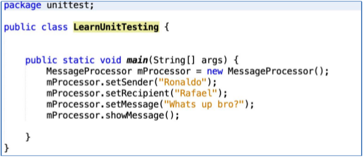
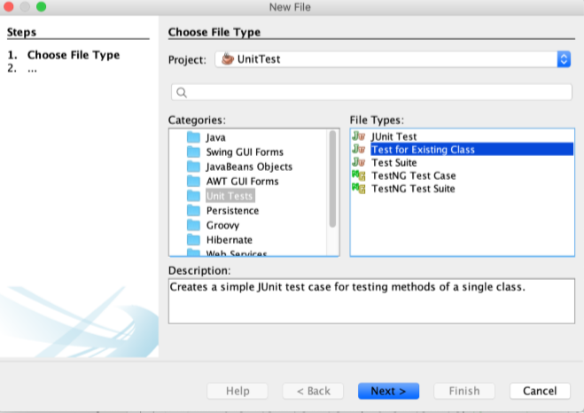

# Laporan Praktikum #15 - Unit Testing
  

**JOBSHEET 15 - Unit Testing**

# Kompetensi 

Setelah menyelesaikan lembar kerja ini mahasiswa diharapkan mampu:

1. Memahami konsep dan fungsi unit testing 2. Menerapkan unit testing dengan JUnit pada program sederhana. 3. Menerapkan unit testing dengan JUnit pada progam yang terkoneksi database 
 
# Percobaan 1: Dasar Unit Testing 

Pada percobaan yang pertama ini kita akan membuat sebuah program sederhana yang mengilustrasikan sebuah aplikasi pengiriman pesan. Pada program tersebut terdapat satu class utama dimana didalamnya terdapat beberapa method sederhana yang nantinya akan dibuatkan unit test-nya. 

1. Buatlah sebuah project baru di NetBeans dengan nama LearnUnitTesting. Pada package unittest, di tempat yang sama dengan class mainnya, buatlah 1 file class baru bernama MessageProcessor.java. 
 


2. Bukalah file MessageProcessor.java, ketikkan baris-baris kode berikut yang terdiri dari beberapa properties. Setelah itu generate-lah setter untuk semua variabel-nya. 
 
 ```java
/*
 * To change this license header, choose License Headers in Project Properties.
 * To change this template file, choose Tools | Templates
 * and open the template in the editor.
 */
package unittest;

/**
 *
 * @author ROG SERIES
 */
public class MessageProcessor1841720146Bagus {
    private String sender, recipient, message; 

    public String getSender() {
        return sender;
    }

    public String getRecipient() {
        return recipient;
    }

    public String getMessage() {
        return message;
    }

    public void setSender(String sender) {
        this.sender = sender;
    }

    public void setRecipient(String recipient) {
        this.recipient = recipient;
    }

    public void setMessage(String message) {
        this.message = message;
    }
    
    public String messageFormat(){
        String message = String.format("Hai %s, you have message from %s.\nThe message as follow : %s",this.recipient, this.sender, this.message);
        return message;
        }
    public void showMessage(){
        System.out.println(messageFormat());
    }
}

 ```

 3. Berikutnya, tambahkan 3 method berikut pada class MessageProcessor, pastikan semua access modifier-nya public. 


```java
public String messageFormat(){
        String message = String.format("Hai %s, you have message from %s.\nThe message as follow : %s",this.recipient, this.sender, this.message);
        return message;
        }
    public void showMessage(){
        System.out.println(messageFormat());
    }
```

Ketiga method yang dibuat ini adalah method yang sangat sederhana dan semua kegunaannya sesuai dengan nama methodnya. Method messageFormat(), hanya menambahkan beberapa kata pembuka yang berisi variabel sender dan recipient di awal dan message kemudian mengembalikannya sebagai sebuah 
 String. 
 
4. Berikutnya bukalah file class LearnUnitTesting.java yang telah dibuat pada langkah ke-1. Pada class tersebut tambahkan kode untuk menjalankan class MessageProcessor seperti berikut. 



```java
/*
 * To change this license header, choose License Headers in Project Properties.
 * To change this template file, choose Tools | Templates
 * and open the template in the editor.
 */
package unittest;

/**
 *
 * @author ROG SERIES
 */
public class LearnUnitTestingMain1841720146Bagus {
    public static void main(String[] args){
        MessageProcessor1841720146Bagus Processor = new MessageProcessor1841720146Bagus();
        Processor.setSender("Ronaldo");
        Processor.setRecipient("Rafael");
        Processor.setMessage("Whats up bro?");
        Processor.showMessage();
    }
}

```

5. Eksekusi program seperti biasa lewat NetBeans untuk melihat jalannya program MessageProcessor yang telah Anda buat. 


6. Sampai disini, aplikasi telah selesai dibuat. Berikutnya akan kita buat pengetesan unit sederhana untuk program kita tersebut. Untuk melakukannya, pertama kali buatlah sebuah package bernama unittesting (sama dengan nama package project), di folder Test Packages. Pada package tersebut, tambahkan 2 buah file class bernama MessageProcessorTest.java dan TestRunner.java. Perhatikan penamaan class testing disini! Untuk menamai class untuk pengetesan maka konvensinya adalah NamaClass + Test = NamaClassTest. 


7. Pertama-tama bukalah terlebih dahulu file class MessageProcessorTest.java pada class tersebut tambahkan baris-baris kode berikut. 


```java
/*
 * To change this license header, choose License Headers in Project Properties.
 * To change this template file, choose Tools | Templates
 * and open the template in the editor.
 */
package unittest;

/**
 *
 * @author ROG SERIES
 */
import org.junit.Assert;
import org.junit.Test;
public class MessageProcessorTest1841720146Bagus {
    MessageProcessor1841720146Bagus Processor;
    public MessageProcessorTest1841720146Bagus(){
        Processor.setSender("Ronaldo");
        Processor.setRecipient("Rafael");
        Processor.setMessage("Whats up bro?");
    }
    @Test
    public void testShowMessage(){
        String expectedResult = "Hai Rafael, you have message from Ronaldo."+"\nThe message as follow : Whats up bro?";
        Assert.assertEquals(expectedResult, Processor.messageFormat());
    }
}

```

Pada class ini terdapat objek dari class MessageProcessor dengan nama mProcessor, dimana variabel tersebut nantinya menjadi subjek uji dari class MessageProcessorTest. Data-data dari objek uji tersebut diisi manual pada konstruktor class test. Pada konstruktor tersebut diisi data-data yang diketahui agar dapat dibandingkan dengan data yang dihasilkan pada saat tes dijalankan. 
 
8. Berikutnya tambahkan kode berikut pada method uji testShowMessage(). Kode pada method tersebut alurnya hampir sama dengan method pada langkah sebelumnya yaitu membandingkan ‘hasil yang diharapkan’, yang diisi manual berdasarkan nilai properti pesan dari objek mProcessor yang diisikan pada konstruktor, dengan hasil aktual dari method messageFormat() pada objek tersebut. 
 


```java
@Test
    public void testShowMessage(){
        String expectedResult = "Hai Rafael, you have message from Ronaldo."+"\nThe message as follow : Whats up bro?";
        Assert.assertEquals(expectedResult, Processor.messageFormat());
    }
```

9. Kemudian bukalah file class TestRunner.java yang telah dibuat sebelumya, lalu isikan didalamnya baris-baris kode berikut. 


```java
/*
 * To change this license header, choose License Headers in Project Properties.
 * To change this template file, choose Tools | Templates
 * and open the template in the editor.
 */
package unittest;

import org.junit.runner.JUnitCore;
import org.junit.runner.notification.Failure;
import org.junit.runner.*;

/**
 *
 * @author ROG SERIES
 */
public class TestRunner1841720146Bagus {

    private static boolean failures;

    public static void main(String[] args) {
        Result mResult = new JUnitCore().runClasses(MessageProcessorTest1841720146Bagus.class);
        showMessageResult(mResult, MessageProcessorTest1841720146Bagus.class.getSimpleName());

    }

    private static void showMessageResult(Result mResult, String className) {
        if (mResult.wasSuccessful()) {

            System.out.format("The Result from %s : %s\n", className, mResult.wasSuccessful());

        } else {
            for (Failure failure : mResult.getFailures()) {
                System.out.println(failures);
            }
        }
    }
}

```

Class ini adalah class Main dari Test Packages, class ini yang nantinya dieksekusi ketika akan menjalankan tes secara keseluruhan. Pada class tersebut dilakukan eksekusi class MessageProcessorTest, dimana hasilnya kemudian akan diambil informasi mengenai unit-unit tes yang gagal dan kemudian ditampilkan pesan gagalnya karena apa. 

10. Klik kanan pada file class tersebut lalu pilih Run. Maka pada output window akan dapat dilihat hasil seperti berikut. 


11. Hasil unit testing juga dapat dilihat melalui Test Results Window jika kita menjalankan unit testing lewat menu Run  Test Project (Nama Project). Pada window ini akan ditampilkan bar warna hijau jika semua tes berhasil dijalankan, dan akan menampilkan warna merah jika sebaliknya. Disamping bar juga ditampilkan pesan-pesan yang kita kirim lewat System.out.println(). 


```java
/*
 * To change this license header, choose License Headers in Project Properties.
 * To change this template file, choose Tools | Templates
 * and open the template in the editor.
 */
package unittest;

/**
 *
 * @author ROG SERIES
 */
import org.junit.Assert;
import org.junit.Test;
public class MessageProcessorTest1841720146Bagus {
    MessageProcessor1841720146Bagus Processor;
    public MessageProcessorTest1841720146Bagus(){
        Processor.setSender("Ronaldo");
        Processor.setRecipient("Rafael");
        Processor.setMessage("Whats up bro?");
    }
    @Test
    public void testShowMessage(){
        String expectedResult = "Hai Rafael, you have message from Ronaldo."+"\nThe message as follow : Whats up bro?";
        Assert.assertEquals(expectedResult, Processor.messageFormat());
    }
}

```

# Hasil percobaan 1


  [ini link ke kode program MessageProcessor1841720146Bagus](../../src/15_Unit_Testing/MessageProcessor1841720146Bagus.java)

 ```java
/*
 * To change this license header, choose License Headers in Project Properties.
 * To change this template file, choose Tools | Templates
 * and open the template in the editor.
 */
package unittest;

/**
 *
 * @author ROG SERIES
 */
public class MessageProcessor1841720146Bagus {
    private String sender, recipient, message; 

    public String getSender() {
        return sender;
    }

    public String getRecipient() {
        return recipient;
    }

    public String getMessage() {
        return message;
    }

    public void setSender(String sender) {
        this.sender = sender;
    }

    public void setRecipient(String recipient) {
        this.recipient = recipient;
    }

    public void setMessage(String message) {
        this.message = message;
    }
    
    public String messageFormat(){
        String message = String.format("Hai %s, you have message from %s.\nThe message as follow : %s",this.recipient, this.sender, this.message);
        return message;
        }
    public void showMessage(){
        System.out.println(messageFormat());
    }
}

 ```


  [ini link ke kode program LearnUnitTestingMain1841720146Bagus](../../src/15_Unit_Testing/LearnUnitTestingMain1841720146Bagus.java)

```java
/*
 * To change this license header, choose License Headers in Project Properties.
 * To change this template file, choose Tools | Templates
 * and open the template in the editor.
 */
package unittest;

/**
 *
 * @author ROG SERIES
 */
public class LearnUnitTestingMain1841720146Bagus {
    public static void main(String[] args){
        MessageProcessor1841720146Bagus Processor = new MessageProcessor1841720146Bagus();
        Processor.setSender("Ronaldo");
        Processor.setRecipient("Rafael");
        Processor.setMessage("Whats up bro?");
        Processor.showMessage();
    }
}

```


  [ini link ke kode program MessageProcessorTest1841720146Bagus](../../src/15_Unit_Testing/MessageProcessorTest1841720146Bagus.java)

```java
/*
 * To change this license header, choose License Headers in Project Properties.
 * To change this template file, choose Tools | Templates
 * and open the template in the editor.
 */
package unittest;

/**
 *
 * @author ROG SERIES
 */
import org.junit.Assert;
import org.junit.Test;
public class MessageProcessorTest1841720146Bagus {
    MessageProcessor1841720146Bagus Processor;
    public MessageProcessorTest1841720146Bagus(){
        Processor.setSender("Ronaldo");
        Processor.setRecipient("Rafael");
        Processor.setMessage("Whats up bro?");
    }
    @Test
    public void testShowMessage(){
        String expectedResult = "Hai Rafael, you have message from Ronaldo."+"\nThe message as follow : Whats up bro?";
        Assert.assertEquals(expectedResult, Processor.messageFormat());
    }
}

```


  [ini link ke kode program TestRunner1841720146Bagus](../../src/15_Unit_Testing/TestRunner1841720146Bagus.java)

  ```java
/*
 * To change this license header, choose License Headers in Project Properties.
 * To change this template file, choose Tools | Templates
 * and open the template in the editor.
 */
package unittest;

import org.junit.runner.JUnitCore;
import org.junit.runner.notification.Failure;
import org.junit.runner.*;

/**
 *
 * @author ROG SERIES
 */
public class TestRunner1841720146Bagus {

    private static boolean failures;

    public static void main(String[] args) {
        Result mResult = new JUnitCore().runClasses(MessageProcessorTest1841720146Bagus.class);
        showMessageResult(mResult, MessageProcessorTest1841720146Bagus.class.getSimpleName());

    }

    private static void showMessageResult(Result mResult, String className) {
        if (mResult.wasSuccessful()) {

            System.out.format("The Result from %s : %s\n", className, mResult.wasSuccessful());

        } else {
            for (Failure failure : mResult.getFailures()) {
                System.out.println(failures);
            }
        }
    }
}

  ```


# Percobaan 2: Unit Testing dengan Test Case 

Pada percobaan kedua kita akan mencoba membuat test case dari salah satu percobaan pada jobsheet minggu ke 14. Struktur file dari percobaan ke satu terdiri dari 4 file class yaitu DBHelper.java, FormKategori.java, Kategori.java dan TestBackend.java. 
 


Hasil akhir dari percobaan satu jobsheet ke 14 adalah seperti pada gambar berikut. Aplikasi dapat melakukan insert, update, select dan delete ke database dbperpus tabel kategori. 


1. Bukalah project yang telah Anda buat pastikan dapat berjalan. Setelah project tersebut dapat dijalankan, bukalah folder Test Packages pada project explorer. Kemudian buat package dengan nama database, pilih New -> Other… 


2. Selanjutnya pilih Test for Existing Class. 



3. Di jendela dialog yang muncul berikutnya, klik Browse… lalu pilih class Kategori.java, karena class ini lah yang akan kita buatkan unit testnya. Di jendela dialog yang muncul berikutnya klik Finish. 
 


4. Setelah selesai langkah sebelumnya, perhatikan di folder Test Packages, sudah dibuatkan secara otomatis sebuah class test bernama KategoriTest. Bukalah class 
tersebut dan perhatikan kode-kode yang terdapat didalamnya! 


Pada bagian atas class terdapat beberapa baris kode yang terdiri dari konstruktor, static setUpClass(), static tearDownClass(), setup(), dan tearDown(). Masing- masing method tersebut diatasnya terdapat anotasi yang berbeda-beda. Maksud dari masing-masing anotasi tersebut adalah bahwa pada saat tes dijalankan maka method dengan anotasi @BeforeClass akan dijalankan sekali pada saat awal pertama kali class test akan dijalankan. @AfterClass dijalankan sekali pada saat seluruh class test dijalankan. @Before dijalankan setiap kali masing-masing method test akan dijalankan, dan sebaliknya @After dijalankan setiap kali masing-masing method test selesai dijalankan. 
 
5. Selain itu jika Anda perhatikan di bagian bawah class yang sama, terdapat beberapa method yang sesuai dengan yang ada pada class Kategori. Bukalah class Kategori tersebut, perhatikan disana terdapat method testGetIdkategori(), testSetIdkategori(), testSearch(), testSave(), dan testDelete(). Expand-lah semua method-method yang otomatis dibuatkan tersebut, lalu hapus method get test, set test, dan sisakan method testSave dan testSearch . Seperti pada screenshoot di bawah ini! 


6. Selanjutnya, kita buat class KategoriTest tersebut menjadi turunan dari class milik JUnit yaitu class TestCase. 


Dengan meng-extends class TestCase tersebut kita dapat dengan mudah memperoleh informasi tentang test yang saat ini sedang dijalankan. Contoh dari informasi-informasi ini salah satunya yang terpenting adalah tentang nama method unit test yang sedang dijalankan, cukup dipanggil dengan syntax: this.getName(). 
 
7. Selanjutnya tambahkan beberapa properties pada class KategoriTest yang kita buat sebagaimana ditunjukkan pada kode yang di-highlight pada gambar di bawah. 
 


8. Lalu pada method setUp() dan teardown(), tambahkan baris-baris kode berikut: 


Pada method setUp() ini kita mempersiapkan segala sesuatu yang dibutuhkan untuk semua method test pada class KategoriTest. Diantaranya adalah mengisi variabel secara manual sehingga kita bisa memprediksi hasil eksekusi method insert dan search.  
 
9. Selanjutnya adalah salah satu yang terpenting yaitu menulis kode untuk mengetes method testSave() dan testSearch()! 


Karena save atau insert ke database tidak memiliki return type maka salah satu cara yang valid untuk melihat insert ke database sukses atau tidak adalah dengan membuat query untuk me-select bedasarkan nama dan keterangan yang diinsert. Maka tambahkan method getByNamaDanKeterangan(), di Kategori.java 
 


```java
public ArrayList<Kategori1841720146Bagus> getByNamaAndKeterangan(String nama, String keterangan) {
        ArrayList<Kategori1841720146Bagus> ListKategori = new ArrayList();
        ResultSet rs;
        if ((nama.trim().length() > 0) && (keterangan.trim().length() > 0)) {
            rs = DBHelper1841720146Bagus.selectQueryBagus("SELECT * FROM kategori Where nama = '" + nama + "' and keterangan = '" + keterangan + "'");
        } else if ((nama.trim().length() > 0) && (keterangan.trim().length() == 0)) {
            rs = DBHelper1841720146Bagus.selectQueryBagus("SELECT * FROM kategori Where nama = '" + nama + "'");
        } else {
            rs = DBHelper1841720146Bagus.selectQueryBagus("SELECT * FROM kategori Where keterangan = '" + keterangan + "'");
        }
        try {
            while (rs.next()) {
                Kategori1841720146Bagus kat = new Kategori1841720146Bagus();
                kat.setIdkategoriBagus(rs.getInt("idkategori"));
                kat.setNamaBagus(rs.getString("nama"));
                kat.setKeteranganBagus(rs.getString("keterangan"));
                ListKategori.add(kat);
            }
        } catch (Exception e) {
            e.printStackTrace();
        }
        return ListKategori;
    }
```

10. Run class Kategori.java bagaimana hasilnya? 

11. Edit file bernama TestRunner pada percobaan sebelumnya menjadi seperti berikut. 


Kode-kode pada class ini hampir sama dengan kode class TestRunner yang ada pada percobaan sebelmnya. Bedanya hanya terletak pada class yang akan diuji di parameter method JUnitCore.runClasses() saja. Jika test Runner di run hasilnya adalah sebagai berikut:  


# Hasil Percobaan 2

[ini link ke kode program DBHelper1841720146Bagus](../../src/15_Unit_Testing/database/DBHelper1841720146Bagus.java)

```java
/*
 * To change this license header, choose License Headers in Project Properties.
 * To change this template file, choose Tools | Templates
 * and open the template in the editor.
 */
package unittest.database;

/**
 *
 * @author riza
 */
import java.sql.*;

public class DBHelper1841720146Bagus {

    private static Connection koneksi;

    public static void bukaKoneksi() {
        if (koneksi == null) {
            try {
                String url = "jdbc:mysql://localhost:3306/dbperpusnew";
                String user = "root";
                String password = "";
                DriverManager.registerDriver(new com.mysql.jdbc.Driver());
                koneksi = DriverManager.getConnection(url, user, password);
            } catch (SQLException t) {
                System.out.println("Error koneksi!");
            }
        }
    }

    public static int insertQueryGetId(String query) {
        bukaKoneksi();
        int num = 0;
        int result = -1;

        try {
            Statement stmt = koneksi.createStatement();
            num = stmt.executeUpdate(query, Statement.RETURN_GENERATED_KEYS);
            ResultSet rs = stmt.getGeneratedKeys();

            if (rs.next()) {
                result = rs.getInt(1);
            }

            rs.close();
            stmt.close();
        } catch (Exception e) {
            e.printStackTrace();
            result = -1;
        }

        return result;
    }

    public static boolean executeQuery(String query) {
        bukaKoneksi();
        boolean result = false;

        try {
            Statement stmt = koneksi.createStatement();
            stmt.executeUpdate(query);

            result = true;

            stmt.close();
        } catch (Exception e) {
            e.printStackTrace();
        }
        return result;
    }

    public static ResultSet selectQuery(String query) {
        bukaKoneksi();
        ResultSet rs = null;

        try {
            Statement stmt = koneksi.createStatement();
            rs = stmt.executeQuery(query);
        } catch (Exception e) {
            e.printStackTrace();
        }

        return rs;
    }
}
```


  [ini link ke kode program Kategori](../../src/15_Unit_Testing/database/Kategori.java)

```java
/*
 * To change this license header, choose License Headers in Project Properties.
 * To change this template file, choose Tools | Templates
 * and open the template in the editor.
 */
package unittest.database;

/**
 *
 * @author riza
 */
import java.util.ArrayList;
import java.sql.*;

public class Kategori {

    private int idkategori;
    private String nama;
    private String keterangan;

    public Kategori() {

    }

    public Kategori(String nama, String keterangan) {
        this.nama = nama;
        this.keterangan = keterangan;
    }

    public int getIdkategori() {
        return idkategori;
    }

    public void setIdkategori(int idkategori) {
        this.idkategori = idkategori;
    }

    public String getNama() {
        return nama;
    }

    public void setNama(String nama) {
        this.nama = nama;
    }

    public String getKeterangan() {
        return keterangan;
    }

    public void setKeterangan(String keterangan) {
        this.keterangan = keterangan;
    }

    public Kategori getById(int id) {
        Kategori kat = new Kategori();
        ResultSet rs = DBHelper1841720146Bagus.selectQuery("SELECT * FROM kategori"
                + " WHERE idkategori = '" + id + "'");

        try {
            while (rs.next()) {
                kat = new Kategori();
                kat.setIdkategori(rs.getInt("idkategori"));
                kat.setNama(rs.getString("nama"));
                kat.setKeterangan(rs.getString("keterangan"));

            }
        } catch (Exception e) {
            e.printStackTrace();
        }
        return kat;
    }

    public ArrayList<Kategori> getAll() {
        ArrayList<Kategori> ListKategori = new ArrayList();

        ResultSet rs = DBHelper1841720146Bagus.selectQuery("SELECT * FROM kategori ");
        try {
            while (rs.next()) {
                Kategori kat = new Kategori();
                kat.setIdkategori(rs.getInt("idkategori"));
                kat.setNama(rs.getString("nama"));
                kat.setKeterangan(rs.getString("keterangan"));

                ListKategori.add(kat);
            }
        } catch (Exception e) {
            e.printStackTrace();
        }
        return ListKategori;
    }

    public ArrayList<Kategori> search(String keyword) {
        ArrayList<Kategori> ListKategori = new ArrayList();

        String sql = "SELECT * FROM kategori WHERE"
                + " nama LIKE '%" + keyword + "%' "
                + " OR keterangan LIKE'%" + keyword + "%'";
        ResultSet rs = DBHelper1841720146Bagus.selectQuery(sql);

        try {
            while (rs.next()) {
                Kategori kat = new Kategori();
                kat.setIdkategori(rs.getInt("idkategori"));
                kat.setNama(rs.getString("nama"));
                kat.setKeterangan(rs.getString("keterangan"));

                ListKategori.add(kat);
            }
        } catch (Exception e) {
            e.printStackTrace();
        }
        return ListKategori;
    }

    public void save() {
        if (getById(idkategori).getIdkategori() == 0) {
            String SQL = "INSERT INTO kategori (nama, keterangan) VALUES("
                    + " '" + this.nama + "', "
                    + " '" + this.keterangan + "' "
                    + " )";
            this.idkategori = DBHelper1841720146Bagus.insertQueryGetId(SQL);

        } else {
            String SQL = "UPDATE kategori SET"
                    + " nama = '" + this.nama + "', "
                    + " keterangan = '" + this.keterangan + "' "
                    + " WHERE idkategori = '" + this.idkategori + "'";
            DBHelper1841720146Bagus.executeQuery(SQL);
        }
    }

    public void delete() {
        String SQL = "DELETE FROM kategori WHERE idkategori = '" + this.idkategori + "'";
        DBHelper1841720146Bagus.executeQuery(SQL);
    }
    
    public ArrayList<Kategori> getByNamaAndKeterangan(String nama, String keterangan) {
        ArrayList<Kategori> ListKategori = new ArrayList();
        ResultSet rs;
        if ((nama.trim().length() > 0) && (keterangan.trim().length() > 0)) {
            rs = DBHelper1841720146Bagus.selectQuery(
            "SELECT * FROM kategori "
                    + "Where nama = '"+ nama +"'  and keterangan = '"+ keterangan+"'  ");         

        } else if ((nama.trim().length() > 0) && (keterangan.trim().length() == 0)) {
            rs = DBHelper1841720146Bagus.selectQuery("SELECT * FROM kategori Where nama = '" + nama + "'");
        } else {
            rs = DBHelper1841720146Bagus.selectQuery(
            "SELECT * FROM kategori "
                    + "Where keterangan = '"+ keterangan+"'  ");         

        }
        try {
            while (rs.next()) {
                Kategori kat = new Kategori();
                kat.setIdkategori(rs.getInt("idkategori"));
                kat.setNama(rs.getString("nama"));
                kat.setKeterangan(rs.getString("keterangan"));
                ListKategori.add(kat);
            }
        } catch (Exception e) {
            e.printStackTrace();
        }
        return ListKategori;
    }
}

```


  

  [ini link ke kode program TestRunner](../../src/15_Unit_Testing/database/TestRunner.java)

  ```java
/*
 * To change this license header, choose License Headers in Project Properties.
 * To change this template file, choose Tools | Templates
 * and open the template in the editor.
 */
package unittest.database;

import org.junit.runner.JUnitCore;
import org.junit.runner.Result;
import org.junit.runner.notification.Failure;
import unittest.MessageProcessorTest1841720146Bagus;

/**
 *
 * @author riza
 */
public class TestRunner {
    public static void main(String[] args) {
        Result mResult = new JUnitCore().runClasses(MessageProcessorTest1841720146Bagus.class);
        showMessageResult(mResult, MessageProcessorTest1841720146Bagus.class.getSimpleName());
        
        mResult = new JUnitCore().runClasses(KategoriTest.class);
        showMessageResult(mResult, KategoriTest.class.getSimpleName());
        
   //    Result mResult = new JUnitCore().runClasses(AnggotaTest1841720146Bagus.class);
   //     showMessageResult(mResult, AnggotaTest1841720146Bagus.class.getSimpleName());
   }
    private static void showMessageResult(Result mResult, String className){
        if (mResult.wasSuccessful()) {
            System.out.format("The Result Test from %s : %s\n", className, mResult.wasSuccessful());
        }else{
            for (Failure failure : mResult.getFailures()) {
                System.out.println(failure);
            }
        }
    }
}

  ```

  


  [ini link ke kode program KategoriTest](../../src/15_Unit_Testing/database/KategoriTest.java)

  ```java
/*
 * To change this license header, choose License Headers in Project Properties.
 * To change this template file, choose Tools | Templates
 * and open the template in the editor.
 */
package unittest.database;

import java.sql.ResultSet;
import java.util.ArrayList;
import unittest.database.*;
import junit.framework.TestCase;
import org.junit.After;
import org.junit.AfterClass;
import org.junit.Before;
import org.junit.BeforeClass;
import org.junit.Test;
import org.junit.Assert;

/**
 *
 * @author riza
 */
public class KategoriTest extends TestCase {

    Kategori instance;

    public KategoriTest() {
    }

    @BeforeClass
    public static void setUpClass() {
    }

    @AfterClass
    public static void tearDownClass() {
    }

    @Before
    public void setUp() {
        instance = new Kategori("Comics", "Comics is combination words and pictures");
        System.out.format("Start Testing : %s \n", this.getName());
    }

    @After
    public void tearDown() {
        System.out.format("Finish Test %s\n", this.getName());
    }
    @Test
    public void testSave() {
        System.out.println("save test");
        this.instance.save();
        ArrayList<Kategori> expResult = instance.getByNamaAndKeterangan(instance.getNama(), instance.getKeterangan());
        assertTrue(expResult.size() > 0);
    }
    @Test
    public void testSearch() {
        System.out.println("search test");
        String keyword = "Comics";
        ArrayList<Kategori> result = instance.search(keyword);
        ArrayList<Kategori> expResult = instance.getByNamaAndKeterangan(keyword, "");
        assertEquals(expResult.size(), result.size());
    }   

}

  ```


# Tugas: 
 
1. Buat test case untuk percobaan kedua pada jobsheet ke 14. 


# Hasil Tugas


  [ini link ke kode program AnggotaTest1841720146Bagus](../../src/15_Unit_Testing/database/AnggotaTest1841720146Bagus.java)

  ```java
/*
 * To change this license header, choose License Headers in Project Properties.
 * To change this template file, choose Tools | Templates
 * and open the template in the editor.
 */
package unittest.database;

import java.util.ArrayList;
import junit.framework.TestCase;
import org.junit.After;
import org.junit.AfterClass;
import org.junit.Before;
import org.junit.BeforeClass;
import org.junit.Test;
import static org.junit.Assert.*;

/**
 *
 * @author riza
 */
public class AnggotaTest1841720146Bagus extends TestCase{
    Anggota1841720146Bagus instance;
    
    public AnggotaTest1841720146Bagus() {
        
    }
    
    @BeforeClass
    public static void setUpClass() {
    }
    
    @AfterClass
    public static void tearDownClass() {
    }
    
    @Before
    public void setUp() {
        instance = new Anggota1841720146Bagus("I Zoel", "Jl. Sembarang kalir", "08125423153");
        System.out.format("Start Testing : %s \n", this.getName());
    }
    
    @After
    public void tearDown() {
        System.out.format("Finish Test %s\n", this.getName());
    }


    @Test
    public void testSave() {
        System.out.println("save test");
        this.instance.save();
        ArrayList<Anggota1841720146Bagus> expResult = instance.getByNamaAndAlamatAndTelepon(instance.getNama(), instance.getAlamat(), instance.getTelepon());
        assertTrue(expResult.size() > 0);
    }

    @Test
    public void testSearch() {
        System.out.println("search test");
        String keyword = "I Zoel";
        ArrayList<Anggota1841720146Bagus> result = instance.search(keyword);
        ArrayList<Anggota1841720146Bagus> expResult = instance.getByNamaAndAlamatAndTelepon(keyword, "", "");
        assertEquals(expResult.size(), result.size());
    }
}

  ```

  

  [ini link ke kode program Anggota1841720146Bagus](../../src/15_Unit_Testing/database/Anggota1841720146Bagus.java)

```java
/*
 * To change this license header, choose License Headers in Project Properties.
 * To change this template file, choose Tools | Templates
 * and open the template in the editor.
 */
package unittest.database;

import java.sql.*;
import java.util.ArrayList;

/**
 *
 * @author riza
 */
public class Anggota1841720146Bagus {
    private int idanggota;
    private String nama;
    private String alamat;
    private String telepon;
    
    public Anggota1841720146Bagus(){
        
    }
    public Anggota1841720146Bagus(String nama, String alamat, String telepon){
        this.nama = nama;
        this.alamat = alamat;
        this.telepon = telepon;
    }

    public int getIdanggota() {
        return idanggota;
    }

    public void setIdanggota(int idanggota) {
        this.idanggota = idanggota;
    }

    public String getNama() {
        return nama;
    }

    public void setNama(String nama) {
        this.nama = nama;
    }

    public String getAlamat() {
        return alamat;
    }

    public void setAlamat(String alamat) {
        this.alamat = alamat;
    }

    public String getTelepon() {
        return telepon;
    }

    public void setTelepon(String telepon) {
        this.telepon = telepon;
    }
    public Anggota1841720146Bagus getById(int id) {
        Anggota1841720146Bagus ang = new Anggota1841720146Bagus();
        ResultSet rs = DBHelper1841720146Bagus.selectQuery("SELECT * FROM anggota"
                + " WHERE idanggota = '" + id + "'");

        try {
            while (rs.next()) {
                ang = new Anggota1841720146Bagus();
                ang.setIdanggota(rs.getInt("idanggota"));
                ang.setNama(rs.getString("nama"));
                ang.setAlamat(rs.getString("alamat"));
                ang.setTelepon(rs.getString("telepon"));

            }
        } catch (Exception e) {
            e.printStackTrace();
        }
        return ang;
    }

    public ArrayList<Anggota1841720146Bagus> getAll() {
        ArrayList<Anggota1841720146Bagus> ListAnggota = new ArrayList();

        ResultSet rs = DBHelper1841720146Bagus.selectQuery("SELECT * FROM anggota ");
        try {
            while (rs.next()) {
                Anggota1841720146Bagus ang = new Anggota1841720146Bagus();
                ang.setIdanggota(rs.getInt("idanggota"));
                ang.setNama(rs.getString("nama"));
                ang.setAlamat(rs.getString("alamat"));
                ang.setTelepon(rs.getString("telepon"));

                ListAnggota.add(ang);
            }
        } catch (Exception e) {
            e.printStackTrace();
        }
        return ListAnggota;
    }

    public ArrayList<Anggota1841720146Bagus> search(String keyword) {
        ArrayList<Anggota1841720146Bagus> ListAnggota = new ArrayList();

        String sql = "SELECT * FROM anggota WHERE"
                + " nama LIKE '%" + keyword + "%' "
                + " OR alamat LIKE'%" + keyword + "%'"
                + " OR telepon LIKE'%" + keyword + "%'";
        ResultSet rs = DBHelper1841720146Bagus.selectQuery(sql);

        try {
            while (rs.next()) {
                Anggota1841720146Bagus ang = new Anggota1841720146Bagus();
                ang.setIdanggota(rs.getInt("idanggota"));
                ang.setNama(rs.getString("nama"));
                ang.setAlamat(rs.getString("alamat"));
                ang.setTelepon(rs.getString("telepon"));

                ListAnggota.add(ang);
            }
        } catch (Exception e) {
            e.printStackTrace();
        }
        return ListAnggota;
    }

    public void save() {
        if (getById(idanggota).getIdanggota() == 0) {
            String SQL = "INSERT INTO anggota (nama, alamat, telepon) VALUES("
                    + " '" + this.nama + "', "
                    + " '" + this.alamat + "', "
                    + " '" + this.telepon + "' "
                    + " )";
            this.idanggota = DBHelper1841720146Bagus.insertQueryGetId(SQL);

        } else {
            String SQL = "UPDATE anggota SET"
                    + " nama = '" + this.nama + "', "
                    + " alamat = '" + this.alamat + "', "
                    + " telepon = '" + this.telepon + "' "
                    + " WHERE idanggota = '" + this.idanggota + "'";
            DBHelper1841720146Bagus.executeQuery(SQL);
        }
    }

    public void delete() {
        String SQL = "DELETE FROM anggota WHERE idanggota = '" + this.idanggota + "'";
        DBHelper1841720146Bagus.executeQuery(SQL);
    }
    
    public ArrayList<Anggota1841720146Bagus> getByNamaAndAlamatAndTelepon(String nama, String alamat, String telepon) {
        ArrayList<Anggota1841720146Bagus> ListAnggota = new ArrayList();
        ResultSet rs;
        if ((nama.trim().length() > 0) && (alamat.trim().length() > 0) && (telepon.trim().length() > 0)) {
            rs = DBHelper1841720146Bagus.selectQuery("SELECT * FROM anggota Where nama = '"+ nama +"'  and alamat = '"+alamat+"'  and telepon = '"+ telepon +"'");         

        } else if ((nama.trim().length() > 0) && (alamat.trim().length() > 0) && (telepon.trim().length() == 0)) {
            rs = DBHelper1841720146Bagus.selectQuery("SELECT * FROM anggota Where nama = '"+ nama +"'  and alamat = '"+alamat+"'");
        } else if ((nama.trim().length() > 0) && (alamat.trim().length() == 0)) {
            rs = DBHelper1841720146Bagus.selectQuery("SELECT * FROM anggota Where nama = '" + nama + "'");      

        }else {
            rs = DBHelper1841720146Bagus.selectQuery(
            "SELECT * FROM anggota "
                    + "Where alamat = '"+ alamat+"'  "); 
        }
        try {
            while (rs.next()) {
                Anggota1841720146Bagus ang = new Anggota1841720146Bagus();
                ang.setIdanggota(rs.getInt("idanggota"));
                ang.setNama(rs.getString("nama"));
                ang.setAlamat(rs.getString("alamat"));
                ang.setTelepon(rs.getString("telepon"));
                ListAnggota.add(ang);
            }
        } catch (Exception e) {
            e.printStackTrace();
        }
        return ListAnggota;
    }
  }
```


  

  [ini link ke kode program TestRunner](../../src/15_Unit_Testing/database/TestRunner.java)

  ```java
/*
 * To change this license header, choose License Headers in Project Properties.
 * To change this template file, choose Tools | Templates
 * and open the template in the editor.
 */
package unittest.database;

import org.junit.runner.JUnitCore;
import org.junit.runner.Result;
import org.junit.runner.notification.Failure;
import unittest.MessageProcessorTest1841720146Bagus;

/**
 *
 * @author riza
 */
public class TestRunner {
    public static void main(String[] args) {
     //   Result mResult = new JUnitCore().runClasses(MessageProcessorTest1841720146Bagus.class);
      //  showMessageResult(mResult, MessageProcessorTest1841720146Bagus.class.getSimpleName());
        
    //    mResult = new JUnitCore().runClasses(KategoriTest.class);
    //    showMessageResult(mResult, KategoriTest.class.getSimpleName());
        
       Result mResult = new JUnitCore().runClasses(AnggotaTest1841720146Bagus.class);
       showMessageResult(mResult, AnggotaTest1841720146Bagus.class.getSimpleName());
   }
    private static void showMessageResult(Result mResult, String className){
        if (mResult.wasSuccessful()) {
            System.out.format("The Result Test from %s : %s\n", className, mResult.wasSuccessful());
        }else{
            for (Failure failure : mResult.getFailures()) {
                System.out.println(failure);
            }
        }
    }
}

  ```


## Pernyataan Diri

Saya menyatakan isi tugas, kode program, dan laporan praktikum ini dibuat oleh saya sendiri. Saya tidak melakukan plagiasi, kecurangan, menyalin/menggandakan milik orang lain.

Jika saya melakukan plagiasi, kecurangan, atau melanggar hak kekayaan intelektual, saya siap untuk mendapat sanksi atau hukuman sesuai peraturan perundang-undangan yang berlaku.

Ttd,

***(Bagus Satria Putra)***


