# Laporan Praktikum #2 - CLASS DAN OBJECT

**Jobsheet 02** 

**Class dan Object** 
 
**1. Kompetensi**

**a.** Mahasiswa dapat memahami deskripsi dari class dan object 

**b.** Mahasiswa memahami implementasi dari class 

**c.** Mahasiswa dapat memahami implementasi dari attribute 

**d.** Mahasiswa dapat memahami implementasi dari method 

**e.** Mahasiswa dapat memahami implementasi dari proses instansiasi 

**f.** Mahasiswa dapat memahami implementasi dari try-catch 

**g.** Mahasiswa dapat memahami proses pemodelan class diagram menggunakan UML 
 
**2. Pendahuluan** 

**2.1 Class dan Object** 

Pada pertemuan sebelumnya anda sudah diberikan banyak penjelasan secara semantic (makna) mengenai deskripsi dari class dan object. Secara singkat class adalah abstraksi dari sebuah object (nyata ataupun tdk nyata) (roger s pressman). Apabila kita ingin membuat class mahasiswa, maka kita perlu melakukan abstraksi (mengindikasi bagian – bagian penting yang merepresentasikan benda itu sendiri) dari object mahasiswa itu sendiri. Contoh salah satu attribute yang mengidentifikasi jika seseorang itu mahasiswa adalah **Nim** (Nomor Induk Mahasiswa), dan **Nim** tidak akan anda temui pada attribute dosen. Selain attribute abstraksi juga digunakan untuk behavior (perilaku) , contoh salah satu perilaku yang bisa dilakukan oleh mahasiswa adalah mengikuti **UAS**, dan anda juga tidak akan pernah menemui perilaku tersebut pada object dosen. Oleh karena itu sangat mudah untuk seorang perancang system dalam memodelkan sebuah class dari sebuah object tertentu.  

Setelah kita memahami secara semantic pengertian dari class dan object, maka langkah selanjutnya adalah bagaimana cara melakukan implementasi class pada pendekatan Object Oriented Programming, terutama pada bahasa pemrograman java. Berikut adalah sintaks dari deklarasi class pada pemrograman java : 

 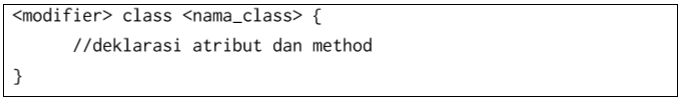
 
 Aturan penulisan class adalah sebagai berikut: 
 
 1. Berupa kata benda, 
 
 2. Diawali dengan **HURUF BESAR**, 
 
 3. Jika terdiri dari lebih dari 1 kata, maka antar kata satu dengan kata yang lain digandeng, dan tiap huruf awal dari tiap kata menggunakan **HURUF BESAR**.

***Untuk Access Modifier tidak dibahas pada jobsheet ini, melainkan akan dibahas pada jobsheet berikutnya.*** 

Contoh deklarasi class: 

 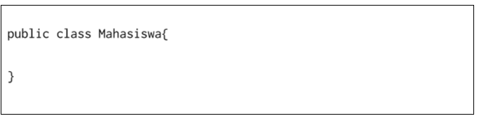

**2.2 Attribute** 

 Untuk melakukan pendeklarasian attribute dapat dilakukan dengan sintaks sebagai berikut: 

  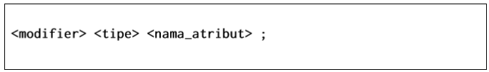

Aturan penulisan atribut adalah sebagai berikut: 

1. Berupa kata benda, 

2. Diawali dengan HURUF KECIL, 

3. Jika terdiri dari 2 atau lebih kata, kata pertama diawali HURUF KECIL sedangkan kata selanjutnya diawali HURUF BESAR. Dan antar kata disambung tidak (dipisah). 

Contoh deklarasi ***attribute***: 

  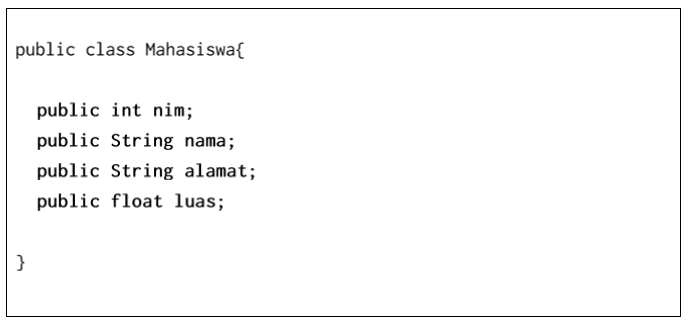

Nb : attribute yang dituliskan dengan **huruf** **tebal**. 
 
**2.3 Method** 

Method adalah suatu blok dari program yang berisi kode program nama dan properti yang dapat digunakan kembali. Method dapat mempunyai nilai balik atau tidak. Method yang tidak mempunyai nilai balik dipanggil dalam pernyataan yang akan dikerjakan, sedangkan method yang mempunyai nilai balik dipanggil dari suatu ekpresi. Kata kunci untuk mengembalikan/mengeluarkan suatu nilai adalah return Method dengan tipe data void, berarti tidak memiliki nilai balik, berarti tidak memerlukan kata kunci return di dalamnya. Method dengan tipe data bukan void, berarti memerlukan suatu nilai balik, yaitu harus memerlukan return di dalamnya 
 
Deklarasi method dapat dilakukan dengan sintaks sebagai berikut: 

  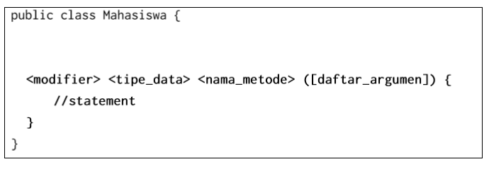

  Contoh method dengan tipe void dan method yang mengembalikan nilai (*return*) 

  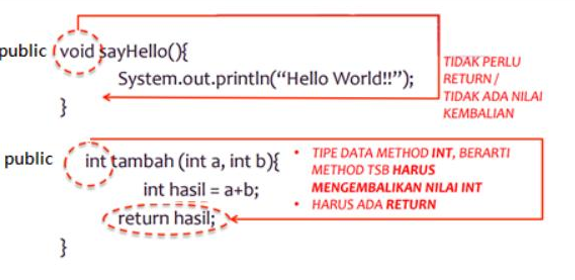

Aturan penulisan method adalah sebagai berikut: 

1. Berupa kata kerja, 

2. Diawali dengan **HURUF KECIL**, 

3. Jika terdiri dari 2 atau lebih kata, kata pertama diawali HURUF KECIL sedangkan kata selanjutnya diawali HURUF BESAR. Dan antar kata disambung tidak (dipisah).

Contoh deklarasi method: 

  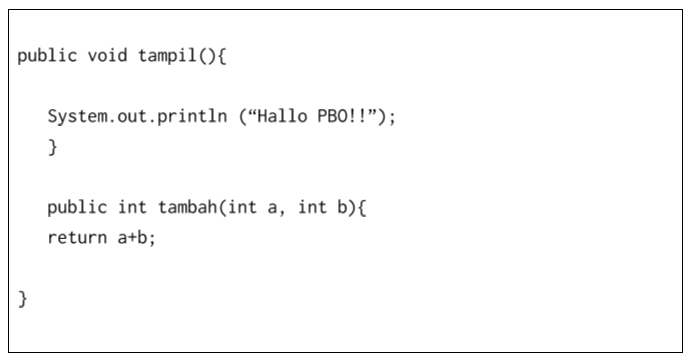

**2.4 Object**  

Setelah Class dibuat, langkah selanjutnya adalah membuat Object. Proses pembuatan Object dari suatu Class disebut instansiasi. Format dasar instansiasi adalah sebagai berikut:

  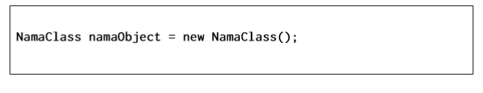

Proses membuat objek dari suatu class adalah INSTANSIASI, dan ditandai kata kunci new. Aturan penulisan objek adalah sama seperti penulisan atribut. Contoh : 

  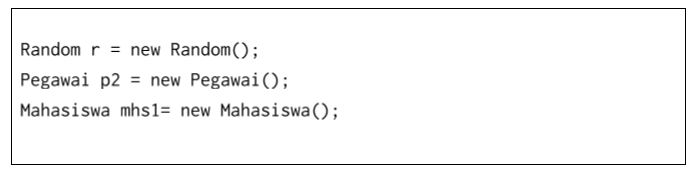

***2.5 Try – catch*** 

Untuk menangani ***error*** di Java, digunakan sebuah statement yang bernama try - catch. Statement tersebut digunakan untuk mengurung eksekusi yang menampilkan error dan dapat membuat program tetap berjalan tanpa dihentikan secara langsung. Error yang ditangani oleh try – catch biasa disebut dengan ***exception***. 
 
Ada beberapa hal yang perlu diingat ketika akan menggunakan try - catch di Java: 

1. Kita dapat membuat multiple try-catch, 

2. Kita dapat menambahkan statement finally untuk menangani berbagai hal ketika error terjadi atau tidak,

3. Kita dapat membuat exception sendiri disamping menggunakan bawaan Java. 

Untuk melihat hasil dari implementasi dari try-catch, maka kita perlu melakukan komparasi sintaks tanpa try-catch dengan sintaks yang menggunakan try-catch. Berikut percobaanya : 

Tanpa menggunakan try-catch : 

  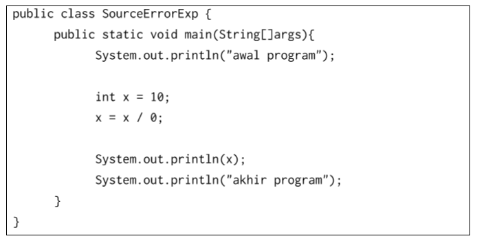

  Hasil : 

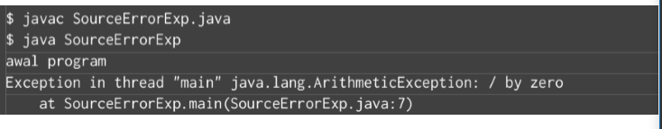

Berbeda bila kita kurung operasi pembagian nol diatas dengan try - catch, maka hasil eksekusi program akan sedikit berbeda: 

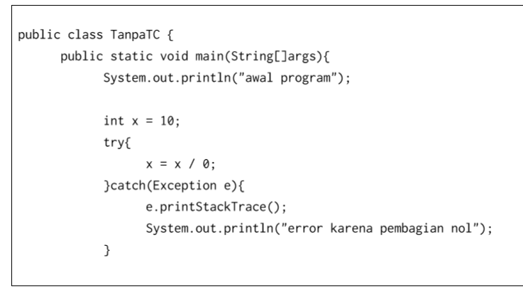

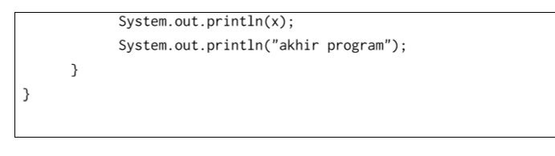

Hasil : 

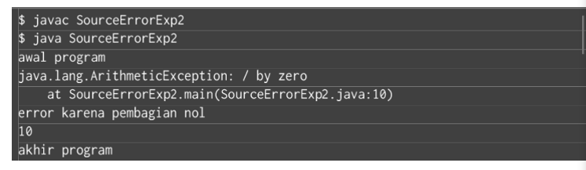

**3. Unified Modeling Language ( UML )** 

    Unified Modeling Language ( UML ) adalah tujuan umum, perkembangan, bahasa pemodelan di bidang rekayasa perangkat lunak , yang dimaksudkan untuk menyediakan cara standar untuk memvisualisasikan desain sistem. UML menyediakan sembilan jenis diagram yaitu Diagram kelas (Class Diagram), Diagram paket (Package Diagram), Diagram use-case (Usecase Diagram), Diagram interaksi dan sequence (Sequence Diagram), Diagram komunikasi (Communication Diagram), Diagram statechart (Statechart Diagram), Diagram aktivitas (Activity Diagram), Diagram komponen (Component Diagram), dan Diagram deployment (deployment diagram). Pada materi ini yang akan dipelajari adalah diagram class (class diagram). 

    Class diagram adalah sebuah class yang menggambarkan struktur dan penjelasan class, paket, dan objek serta hubungan satu sama lain seperti pewarisan, asosiasi, dan lainlain. Class diagram juga menjelaskan hubungan antar class dalam sebuah sistem yang sedang dibuat dan bagaimana caranya agar mereka saling berkolaborasi untuk mencapai sebuah tujuan. Class juga memiliki 3 area pokok (utama) yaitu : nama,atribut,dan operasi. Nama berfungsi untuk member identitas pada sebuah kelas, atribut fungsinya adalah untuk member karakteristik pada data yang dimiliki suatu objek di dalam kelas, sedangkan 
    operasi fungsinya adalah memberikan sebuah fungsi ke sebuah objek. Berikut ini merupakan contoh dari class diagram:
 
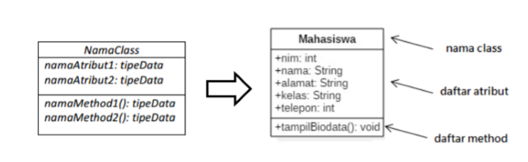

**4. Percobaan**

**4.1 Percobaan 1: Membuat Class Diagram**

**Pertanyaan:**

Studi Kasus 1: 

Dalam suatu perusahaan salah satu data yang diolah adalah data karyawan. Setiap karyawan memiliki id, nama, jenis kelamin, jabatan, jabatan, dan gaji. Setiap mahasiswa juga bisa menampilkan data diri pribadi dan melihat gajinya. 

1. Gambarkan desain class diagram dari studi kasus 1! 

2. Sebutkan Class apa saja yang bisa dibuat dari studi kasus 1!

3. Sebutkan atribut beserta tipe datanya yang dapat diidentifikasi dari masing-masing class dari studi kasus 1! 

4. Sebutkan method-method yang sudah anda buat dari masing-masing class pada studi kasus 1! 

**Jawaban:**

1.    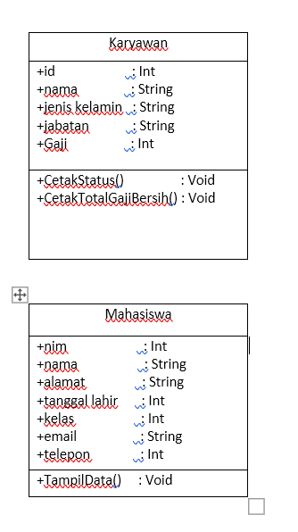

2.class Karyawan dan class Mahasiswa

3.class karyawan terdiri dari 5 atribut yaitu id,nama,jenis kelamin,jabatan,gaji
   Class Mahasiswa terdiri dari 7 atribut yaitu nim,nama,alamat,tanggal lahir,kelas,email

4.class Karyawan terditri dari 2 method yaitu method cetakStatus dan CetakTotalGajiBersih
    Class Mahasiswa terdiri 1 method yaitu method TampilData

**4.2 Percobaan 2: Membuat dan mengakses anggota suatu class**

Studi Kasus 2: 

Perhatikan class diagram dibawah ini. Buatlah program berdasarkan class diagram tersebut!

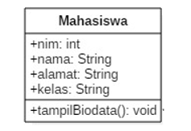

Langkah kerja: 

**PERTANYAAN**

1. Bukalah text editor atau IDE, misalnya Notepad ++ / netbeans. 
2. Ketikkan kode program berikut ini:

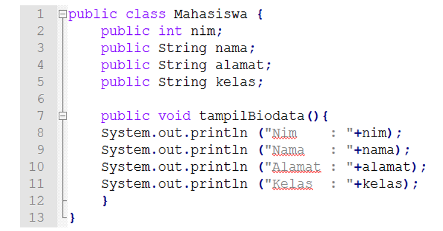

3. Simpan dengan nama file Mahasiswa.java. 
4. Untuk dapat mengakses anggota-anggota dari suatu obyek, maka harus dibuat instance dari class  tersebut terlebih dahulu. Berikut ini adalah cara pengaksesan anggota- anggota dari class Mahasiswa dengan membuka file baru kemudian ketikkan kode program berikut:
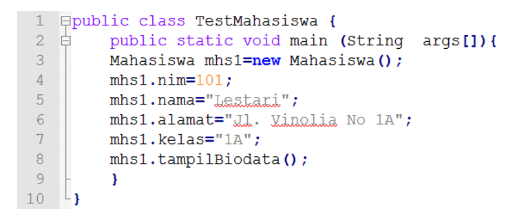

5. Simpan file dengan TestMahasiswa.java 

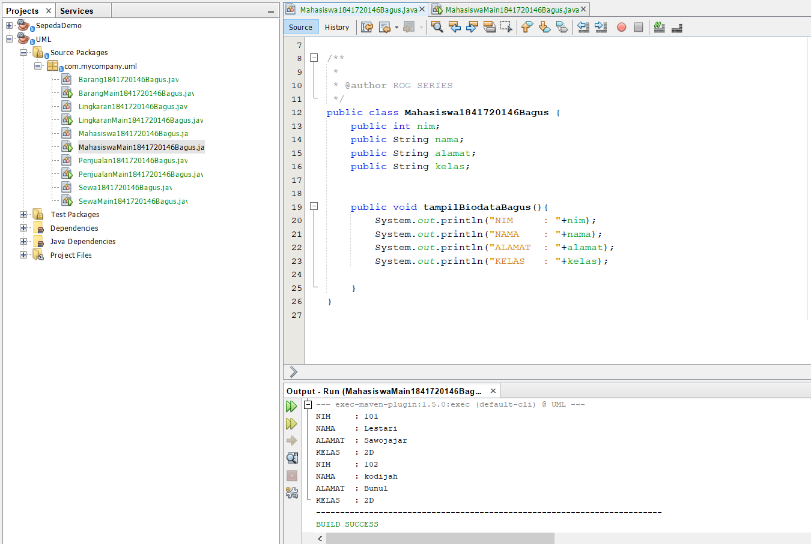

[ini link ke kode program Mahasiswa1841720146Bagus](../../src/1_Pengantar_Konsep_PBO/Mahasiswa1841720146Bagus.java)

6. Jalankan class TestMahasiswa 

[ini link ke kode program Mahasiswa1841720146Bagus](../../src/1_Pengantar_Konsep_PBO/Mahasiswa1841720146Bagus.java)

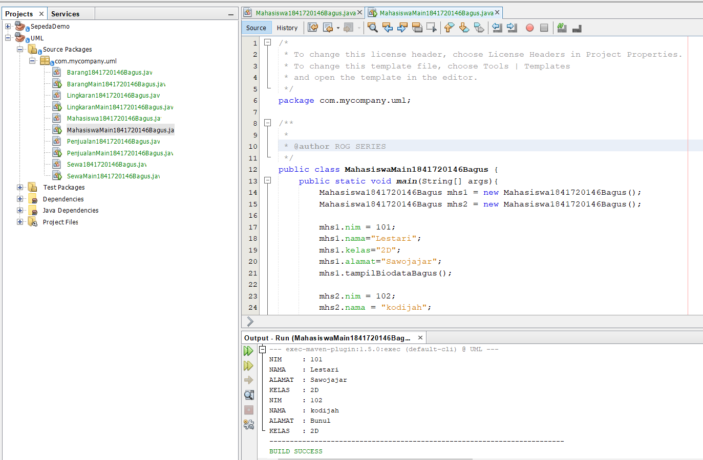

[ini link ke kode program MahasiswaMain1841720146Bagus](../../src/1_Pengantar_Konsep_PBO/MahasiswaMain1841720146Bagus.java)

7. Jelaskan pada bagian mana proses pendeklarasian atribut pada program diatas! 

8. Jelaskan pada bagian mana proses pendeklarasian method pada program diatas! 

9. Berapa banyak objek yang di instansiasi pada program diatas! 

10. Apakah yang sebenarnya dilakukan pada sintaks program “mhs1.nim=101” ? 

11. Apakah yang sebenarnya dilakukan pada sintaks program “mhs1.tampilBiodata()” ? 

12. Instansiasi 2 objek lagi pada program diatas!

**4.3 Percobaan 3: Menulis method yang memiliki argument/parameter dan memiliki return** 

**PERTANYAAN**

Langkah kerja: 

1. Bukalah text editor atau IDE, misalnya Notepad ++ / netbeans. 

2. Ketikkan kode program berikut ini:

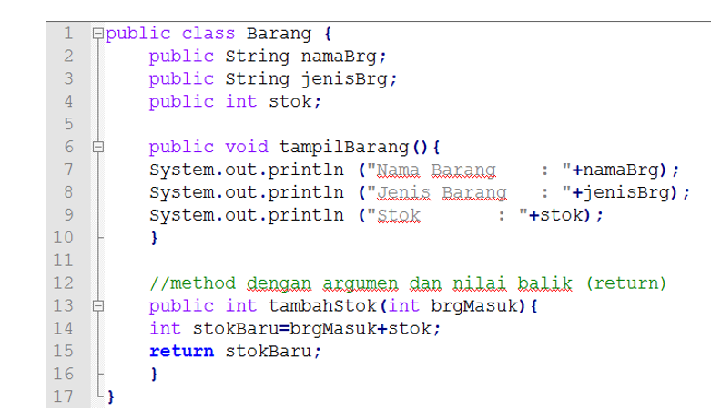

[ini link ke kode program Barang1841720146Bagus](../../src/1_Pengantar_Konsep_PBO/Barang1841720146Bagus.java)

3. Simpan dengan nama file Barang.java 
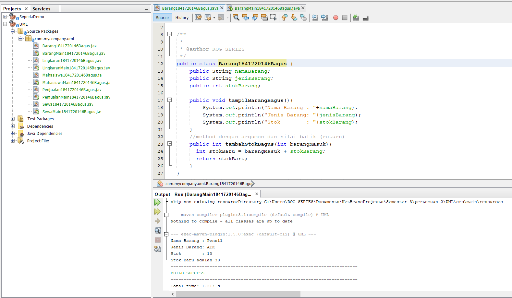

4. Untuk dapat mengakses anggota-anggota dari suatu obyek, maka harus dibuat instance dari class tersebut terlebih dahulu. Berikut ini adalah cara pengaksesan anggota- anggota dari class Barang dengan membuka file baru kemudian ketikkan kode program berikut: 
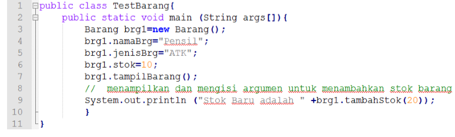

5. Simpan dengan nama file TestBarang.java 

6. Jalankan program tersebut! 

**JAWABAN**

[ini link ke kode program Barang1841720146Bagus](../../src/1_Pengantar_Konsep_PBO/Barang1841720146Bagus.java)

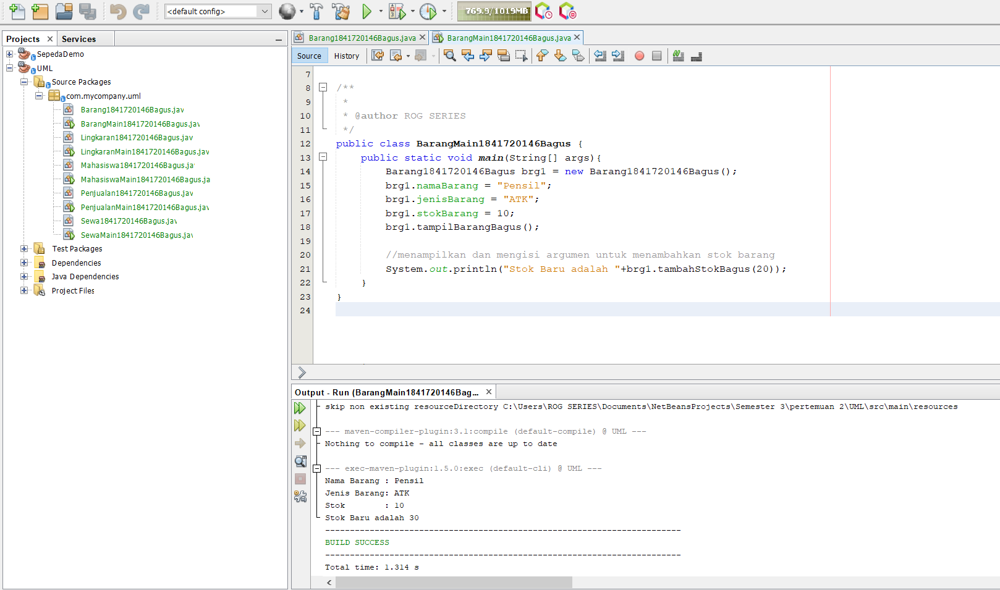

[ini link ke kode program BarangMain1841720146Bagus](../../src/1_Pengantar_Konsep_PBO/BarangMain1841720146Bagus.java)

7. Apakah fungsi argumen dalam suatu method?

8. Ambil kesimpulan tentang kegunaan dari kata kunci return , dan kapan suatu method harus memiliki return! 

**4.4 Tugas** 
1. Suatu toko persewaan video game salah satu yang diolah adalah peminjaman, dimana data yang dicatat ketika ada orang yang     melakukan peminjaman adalah id, nama member, nama game, dan harga yang harus dibayar. Setiap peminjaman bisa menampilkan data hasil peminjaman dan harga yang harus dibayar. Buatlah class diagram pada studi kasus diatas!

Penjelasan: 

•	Harga yang harus dibayar diperoleh dari lama sewa x harga. 

•	Diasumsikan 1x transaksi peminjaman game yang dipinjam hanya 1 game saja

2. Buatlah program dari class diagram yang sudah anda buat di no 1! 

**JAWABAN:**

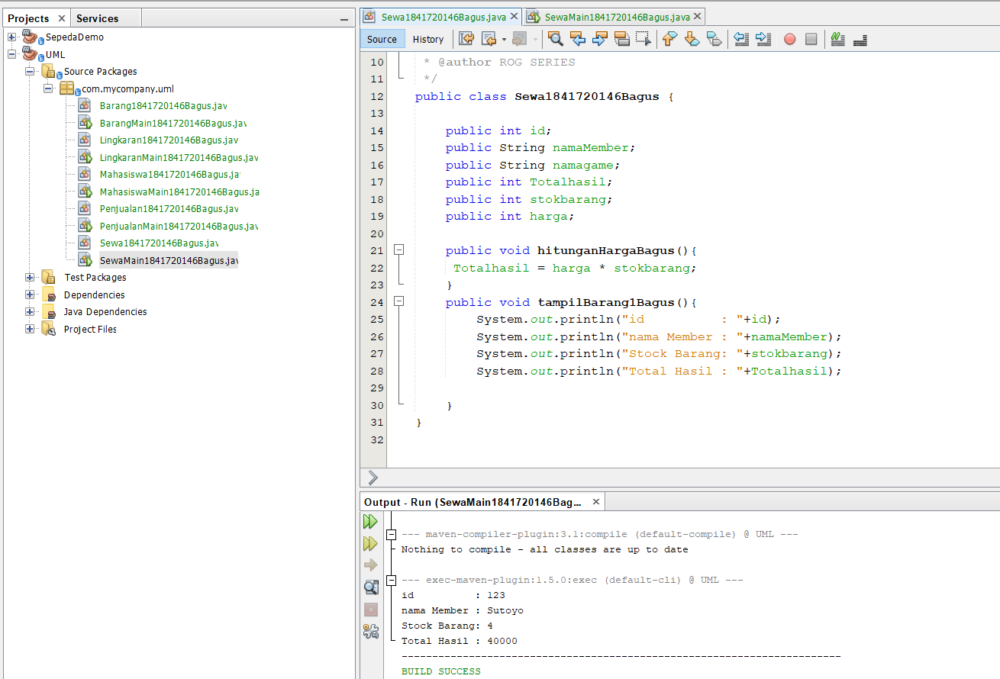

[ini link ke kode program Sewa1841720146Bagus](../../src/1_Pengantar_Konsep_PBO/Sewa1841720146Bagus.java)

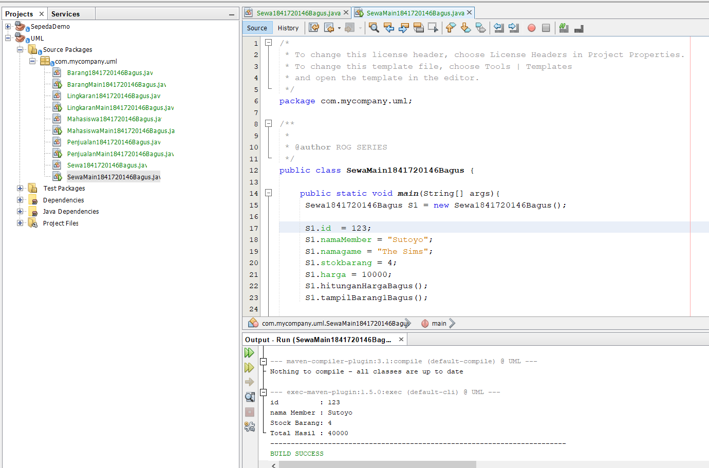

[ini link ke kode program SewaMain1841720146Bagus](../../src/1_Pengantar_Konsep_PBO/SewaMain1841720146Bagus.java)

3. Buatlah program sesuai dengan class diagram berikut ini:

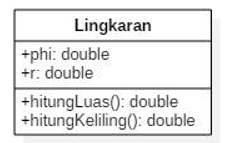

**JAWABAN:**

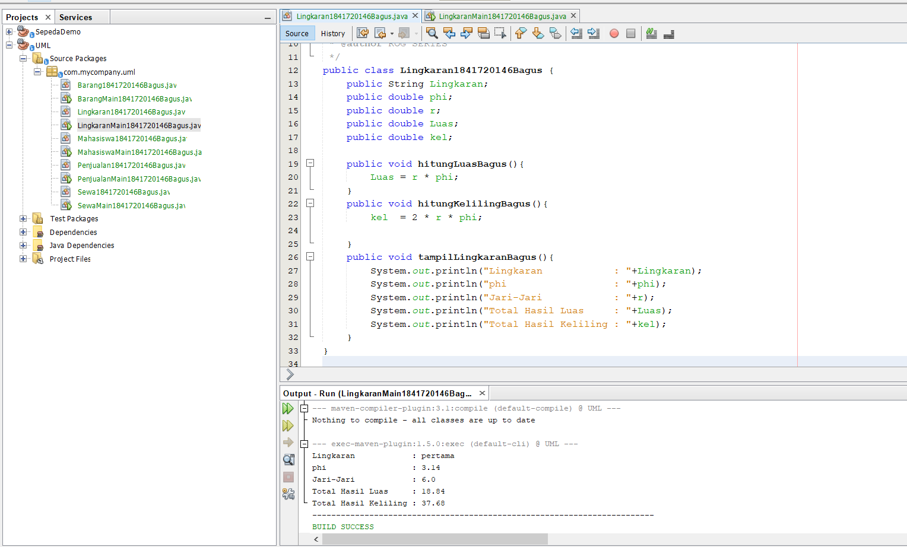

[ini link ke kode program Lingkaran1841720146Bagus](../../src/1_Pengantar_Konsep_PBO/Lingkaran1841720146Bagus.java)

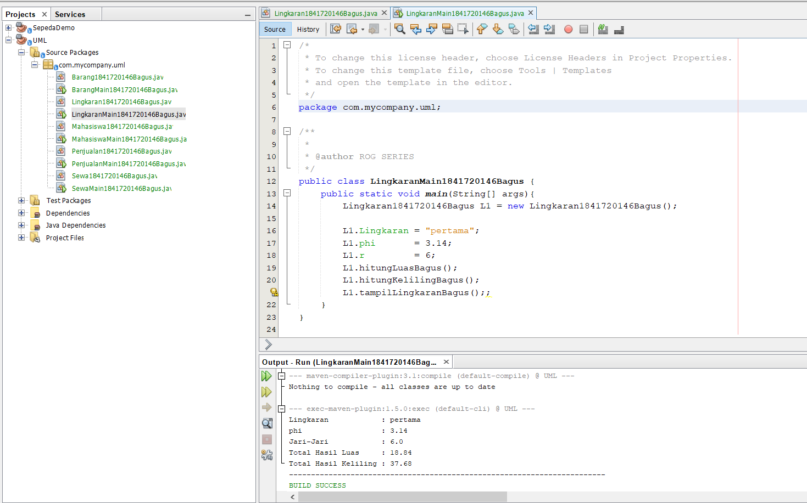

[ini link ke kode program Lingkaran1841720146Bagus](../../src/1_Pengantar_Konsep_PBO/LingkaranMain1841720146Bagus.java)

4. Buatlah program sesuai dengan class diagram berikut ini:

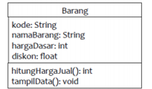

Deskripsi / Penjelasan : 

•	Nilai atribut hargaDasar dalam Rupiah dan atribut diskon dalam %

•	Method hitungHargaJual() digunakan untuk menghitung harga jual dengan perhitungan berikut ini: 
**harga jual = harga dasar – (diskon x harga dasar)**

•	Method tampilData() digunakan untuk menampilkan nilai dari kode, namaBarang, hargaDasar, diskon dan harga jual.

**JAWABAN:**

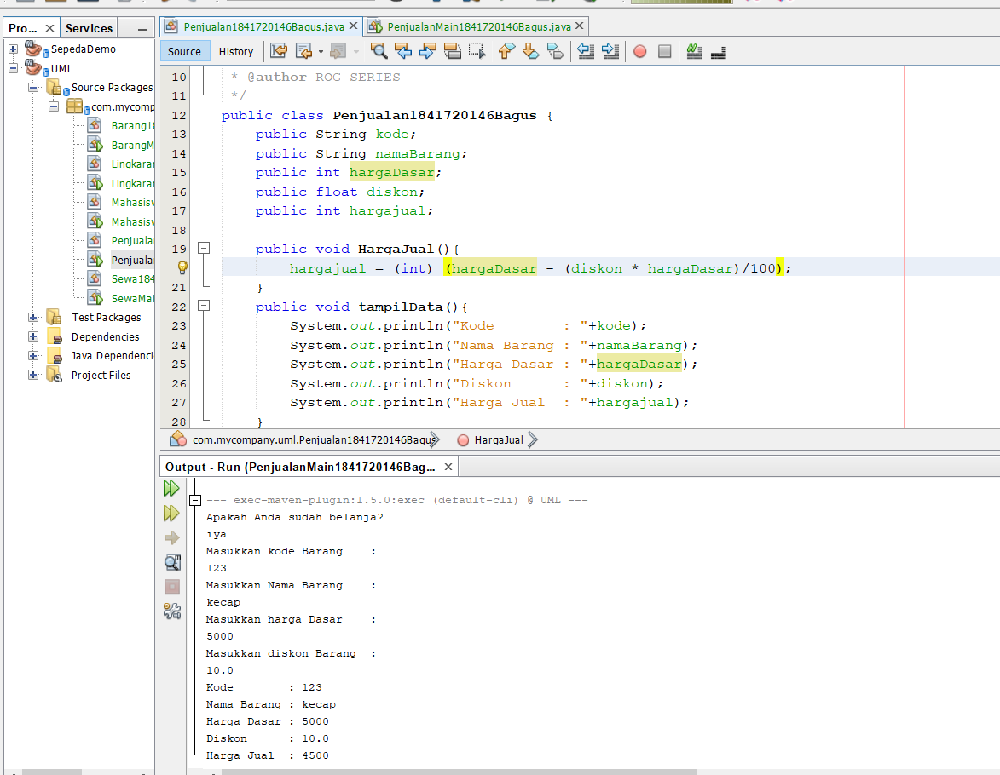

[ini link ke kode program Penjualan1841720146Bagus](../../src/1_Pengantar_Konsep_PBO/Penjualan1841720146Bagus.java)

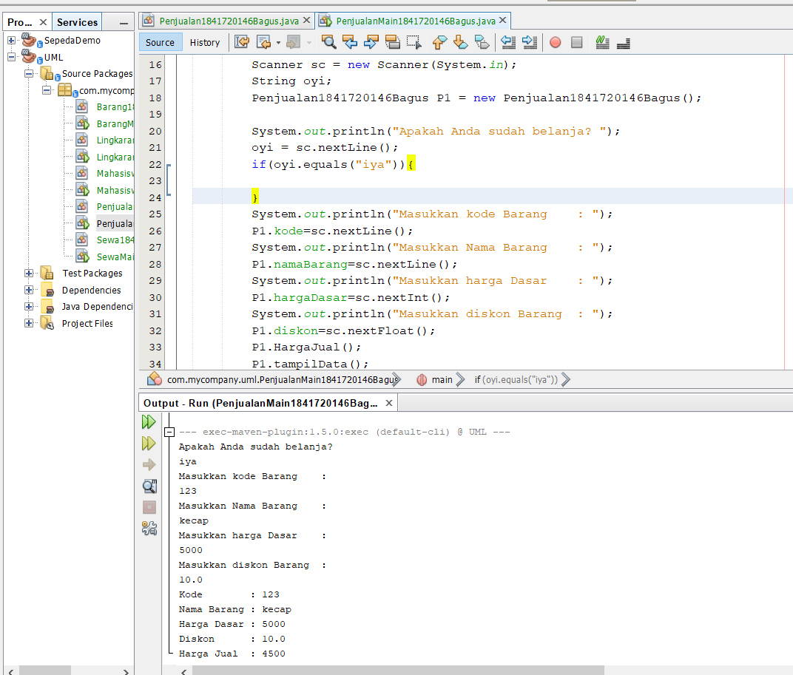

[ini link ke kode program PenjualanMain1841720146Bagus](../../src/1_Pengantar_Konsep_PBO/PenjualanMain1841720146Bagus.java)

## Kesimpulan

(Jadi kemsimpulan dari jobsheet 2 yaitu class dan object kita harus memahami deskripsi dari class dan object, implementasi dari class, implementasi dari attribute, implementasi dari method, implementasi dari proses instansiasi, implementasi dari try-catch, proses pemodelan class diagram menggunakan UML )

## Pernyataan Diri

Saya menyatakan isi tugas, kode program, dan laporan praktikum ini dibuat oleh saya sendiri. Saya tidak melakukan plagiasi, kecurangan, menyalin/menggandakan milik orang lain.

Jika saya melakukan plagiasi, kecurangan, atau melanggar hak kekayaan intelektual, saya siap untuk mendapat sanksi atau hukuman sesuai peraturan perundang-undangan yang berlaku.

Ttd,

***(Bagus Satria Putra)***