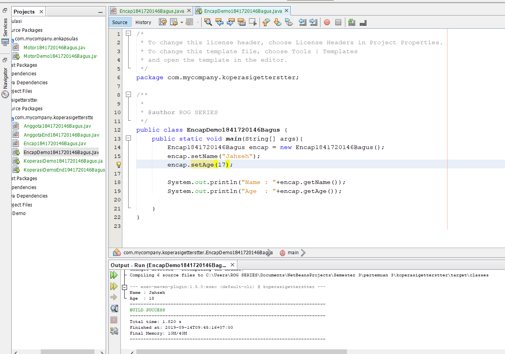
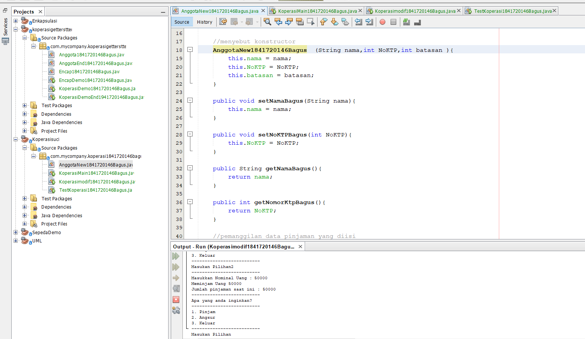

# Laporan Praktikum #3 - Enkapsulasi
3. Percobaan 

**3.1 Percobaan 1 - Enkapsulasi** 

 **Kompetensi**
 
Setelah melakukan percobaan pada modul ini, mahasiswa memahami konsep: 

1. Konstruktor

 2. Akses Modifier 
 
 3. Atribut/method pada class
 
 4. Intansiasi atribut/method  
  
 5. Setter dan getter 

 6. Memahami notasi pada UML Class Diagram 

  **Ringkasan Materi** 
 
Pada pertemuan pertama dan kedua telah dibahasan konsep dasar dari pemrograman berbasis objek (PBO), perbedaan antara pemrograman berbasis objek dengan pemrograman struktural, dan telah dibahas konsep class dan object pada PBO. Selanjutnya pada modul ini akan dibahas konsep enkapsulasi pada PBO dan notasi yang ada pada UML Class diagram. 

1. ***Enkapsulasi***

Pada modul pertama telah dijabarkan definisi dari enkapsulasi sebagai berikut: 

Enkapsukasi disebut juga dengan information-hiding. Dalam berinteraksi dengan objek, seringkali kita tidak perlu mengetahui kompleksitas yang ada didalamnya. Hal ini akan lebih mudah dipahami jika kita membayangkan atau menganalisa objek yang ada disekitar kita, misalnya objek sepeda, ketika kita mengganti gear pada sepeda, kita tinggal menekan tuas gear yang ada di grip setang sepeda saja. Kita tidak perlu mengetahui bagaimana cara gear berpindah secara teknis. Contoh objek lain misalnya mesin penghisap debu (vacum cleaner), ketika kita mencolokkan kabel vacum cleaner dan menyalakan sakelarnya maka mesin tersebut siap digunakan untuk menghisap debu. Dalam proses tersebut kita tidak mengetahui proses rumit yang terjadi ketika mengubah listrik menjadi tenaga dari vacum cleaner. Dalam contoh diatas vacum cleaner dan sepeda telah menerapkan enkapsulasi atau disebut juga information-hiding atau data hiding karena menyembunyikan detail proses suatu objek dari pengguna. 

2. konstruktor

Konstruktor mirip dengan method cara deklarasinya akan tetapi tidak memiliki tipe return. Dan konstruktor dieksekusi ketika instan dari objek dibuat. Jadi setiap kali sebuat objek dibuat dengan keyword new() maka konstruktor akan dieksekusi. Cara untuk membuat konstruktor adalah sebagai berikut: 

**a.** Nama konstruktor harus sama dengan nama class 

**b.** Konstruktor tidak memiliki tipe data return 

**c.** Konstruktor tidak boleh menggunakan modifier abstract, static, final, dan syncronized 

Note: Di java kita dapat memiliki konstruktor dengan modifier private, protected, public or default. 

3. Akses Modifier 

Terdapat 2 tipe modifier di java yaitu :

 akses modifier dan non-access modifier. Dalam hal ini kita akan fokus pada akses modifier yang berguna untuk mengatur akses method, class, dan constructor. Terdapat 4 akses modifier yaitu: 

**a.** private – hanya dapat diakses di dalam kelas yang sama 
 
**b.** default –  hanya dapat diakses di dalam package yang sama 
 
**c.** protected – dapat diakases di luar package menggunakan subclass  (membuat inheritance) 
 
**d.** public – dapat diakases dari mana saja 

 Detail akses modifier dapat dilihat pada Tabel 1.1. 

**Tabel 1. 1 Detail Access Modifier** 

 

 4. Getter  dan Setter 

 Getter adalah public method dan memiliki tipe data return, yang berfungsi untuk mendapatkan nilai dari atribut private. Sedangkan setter adalah public method yang tidak memliki tipe data return, yang berfungsi untuk memanipulasi nilai dari atribut private. 

5. Notasi UML Class Diagram 

Secara umum bentuk UML class diagram adalah seperti pada Gambar .. 

Keterangan : 

1. Class

 2. Interface 
 
 3. Enumeration – adalah tipe data yang memiliki nilai atau literal yang terbatas. 
 
 4. Atrributes 
 
 5. Method 
 
 6. Literals 
Notasi akses modifier pada UML class diagram adalah sebagai berikut: 

1. Tanda plus (+) untuk public 

2. Tanda pagar (#)  untuk protected 

3. Tanda  minus (-) untuk private 

4. Untuk default, maka tidak diberi notasi 

Didalam percobaan enkapsulasi, buatlah class Motor yang memiliki atribut kecepatan dan kontakOn, dan memiliki method printStatus() untuk menampilkan status motor. Seperti berikut 

1. Buka Netbeans, buat project MotorEncapsulation.

2. Buat class Motor. Klik kanan pada package motorencapsulation – New – Java Class. 

3. Ketikkan kode class Motor dibawah ini. 

 

 bentuk UML class diagram class Motor adalah sebagai berikut: 

 

 4. Kemudian buat class MotorDemo, ketikkan kode berikut ini. 

 

 5. Hasilnya adalah sebagai berikut: 

  

  [ini link ke kode program Motor1841720146Bagus](../../src/3_Enkapsulasi/Motor1841720146Bagus.java)

    [ini link ke kode program MotorDemo1841720146Bagus](../../src/3_Enkapsulasi/MotorDemo1841720146Bagus.java)

  Dari percobaan 1 - enkapsulasi, menurut anda, adakah yang janggal? 

**Jawaban**

Yaitu, kecepatan motor tiba-tiba saja berubah dari 0 ke 50. Lebih janggal lagi, posisi kontak motor masih dalam kondisi OFF. Bagaimana mungkin sebuah motor bisa sekejap berkecepatan dari nol ke 50, dan itupun kunci kontaknya OFF?  

Nah dalam hal ini, akses ke atribut motor ternyata tidak terkontrol. Padahal, objek di dunia nyata selalu memiliki batasan dan mekanisme bagaimana objek tersebut dapat digunakan. Lalu, bagaimana kita bisa memperbaiki class Motor diatas agar dapat digunakan dengan baik? Kita bisa pertimbangkan beberapa hal berikut ini:  

1. Menyembunyikan atribut internal (kecepatan, kontakOn) dari pengguna (class lain)  

2. Menyediakan method khusus untuk mengakses atribut.  
Untuk itu mari kita lanjutkan percobaan berikutknya tentang Access Modifier.  

3.2 Percobaan 2 - Access Modifier 

Pada percobaan ini akan digunakan access modifier untuk memperbaiki cara kerja class Motor pada percobaan ke-1. 

1. Ubah cara kerja class motor sesuai dengan UML class diagram berikut. 

 
 
 2. Berdasarkan UML class diagram tersebut maka class Motor terdapat perubahan, yaitu: 

**a.** Ubah access modifier kecepatan dan kontakOn menjadi private 
 
 **b.** Tambahkan method nyalakanMesin, matikanMesin, tambahKecepatan, kurangiKecepatan. 

Implementasi class Motor adalah sebagai berikut: 

 

 3. Kemudian pada class MotorDemo, ubah code menjadi seperti berikut:

  

  4. Hasilnya dari class MotorDemo adalah sebagai berikut: 

  Dari percobaan diatas, dapat kita amati sekarang atribut kecepatan tidak bisa diakses oleh pengguna dan diganti nilainya secara sembarangan. Bahkan ketika mencoba menambah kecepatan saat posisi kontak masih OFF, maka akan muncul notifikasi bahwa mesin OFF. Untuk mendapatkan kecepatan yang diinginkan, maka harus dilakukan secara gradual, yaitu dengan memanggil method tambahKecepatan() beberapa kali. Hal ini mirip seperti saat kita mengendarai motor.  

  
  

  **JAWABAN**

  

  

 

 [ini link ke kode program Motor1841720146Bagus](../../src/3_Enkapsulasi/Motor1841720146Bagus.java)

 [ini link ke kode program MotorDemo1841720146Bagus](../../src/3_Enkapsulasi/MotorDemo1841720146Bagus.java)

**3.3 Pertanyaan**  

  1.  Pada class TestMobil, saat kita menambah kecepatan untuk pertama kalinya, mengapa muncul peringatan “Kecepatan tidak bisa bertambah karena Mesin Off!”? 

**Jawaban :** karena harus dimulai dengan Nyalakan Mesin apabila tidak ada intruksi Nyalakan Mesin dan langsung melakukan penambahan mesin maka keluar lah “Kecepatan tidak bisa bertambah karena Mesin Off!”

2. Mengapa atribut kecepatan dan kontakOn diset private?

**Jawaban :** karena kecepatan dan kontakOn hanya dapat diakses di dalam kelas yang sama

3. Ubah class Motor sehingga kecepatan maksimalnya adalah 100! 

 [ini link ke kode program Motor1841720146Bagus](../../src/3_Enkapsulasi/Motor1841720146Bagus.java)

  [ini link ke kode program MotorDemo1841720146Bagus](../../src/3_Enkapsulasi/MotorDemo1841720146Bagus.java)

  **3.4 Percobaan 3 -  Getter dan Setter** 

Misalkan di sebuah sistem informasi koperasi, terdapat class Anggota. Anggota memiliki atribut nama, alamat dan simpanan, dan method setter, getter dan setor dan pinjam. Semua atribut pada anggota tidak boleh diubah sembarangan, melainkan hanya dapat diubah melalui method setter, getter, setor dan tarik. Khusus untuk atribut simpanan tidak terdapat setter karena simpanan akan bertambah ketika melakukan transaksi setor dan akan berkurang ketika melakukan peminjaman/tarik. 

1. Berikut ini UML class buatlah class Mahasiswa pada program:

2. Sama dengan percobaan 1 untuk membuat project baru 

a. Buka Netbeans, buat project KoperasiGetterSetter. 

b. Buat class Anggota. Klik kanan pada package koperasigettersetter – New – Java Class. 

c. Ketikkan kode class Anggota dibawah ini. 

Jika diperhatikan pada class Anggota, atribut nama dan alamat memili masing-masing 1 getter dan setter. Sedangkan atribut simpanan hanya memiliki getSimpanan() saja, karena seperti tujuan awal, atribut simpanan akan berubah nilainya jika melakukan transaksi setor() dan pinjam/tarik().

3. Selanjutnya buatlah class KoperasiDemo untuk mencoba class Anggota.

4. Hasil dari main method pada langkah ketiga adalah 

Dapat dilihat pada hasil percobaan diatas, untuk mengubah simpanan tidak dilakukan secara langsung dengan mengubah atribut simpanan, melainkan melalui method setor() dan pinjam(). Untuk menampilkan nama pun harus melalui method getNama(), dan untuk menampilkan simpanan melalui getSimpanan().  

**Jawaban**

 [ini link ke kode program Anggota1841720146Bagus](../../src/3_Enkapsulasi/Anggota1841720146Bagus.java)

 [ini link ke kode program KoperasiDemo1841720146Bagus](../../src/3_Enkapsulasi/KoperasiDemo1841720146Bagus.java)

**3.5 Percobaan 4 -  Konstruktor, Instansiasi**  

1. Langkah pertama percobaan 4 adalah ubah class KoperasiDemo seperti berikut 

2. Hasil dari program tersebut adalah sebagai berikut 

Dapat dilihat hasil running program, ketika dilakukan pemanggilan method getNama() hasilnya hal ini terjadi  karena atribut nama belum diset nilai defaultnya. Hal ini dapat ditangani dengan membuat kontruktor. 

3. Ubah class Anggota menjadi seperti berikut 

Pada class Anggota dibuat kontruktor dengan access modifier default yang memiliki 2 parameter nama dan alamat. Dan didalam konstruktor tersebut dipastikan nilai simpanan untuk pertama kali adalah Rp. 0. 

4. Selanjutnya ubah class KoperasiDemo sebagai berikut 

5. Hasil dari program tersebut adalah sebagai berikut 

Setelah menambah konstruktor pada class Anggoata maka atribut nama dan alamat secara otomatis harus diset terlebih dahulu dengan melakukan passing parameter jika melakukan instansiasi class Anggota. Hal ini biasa dilakukan untuk atribut yang membutuhkan nilai yang spesifik. Jika tidak membutuhkan nilai spesifik dalam konstruktor tidak perlu parameter. Contohnya simpanan untuk anggota baru diset 0, maka simpanan tidak perlu untuk dijadikan parameter pada konstruktor. 

**Jawaban**

 [ini link ke kode program AnggotaEnd1841720146Bagus](../../src/3_Enkapsulasi/AnggotaEnd1841720146Bagus.java)

  [ini link ke kode program KoperasiDemoEnd1941720146Bagus](../../src/3_Enkapsulasi/KoperasiDemoEnd1941720146Bagus.java)

  **3.6 Pertanyaan – Percobaan 3 dan 4**

  1. Apa yang dimaksud getter dan setter? 
  2. Apa kegunaan dari method getSimpanan()? 
  3. Method apa yang digunakan untk menambah saldo? 4. Apa yand dimaksud konstruktor? 
  5. Sebutkan aturan dalam membuat konstruktor? 
  6. Apakah boleh konstruktor bertipe private? 
  7. Kapan menggunakan parameter dengan passsing parameter? 
  8. Apa perbedaan atribut class dan instansiasi atribut? 
  9. Apa perbedaan class method dan instansiasi method?

  **jawaban**

    1.	Apa yang dimaksud getter dan setter?

Jawaban: Getter adalah public method dan memiliki tipe data return, yang berfungsi untuk mendapatkan nilai dari atribut private. Sedangkan setter adalah public method yang tidak memliki tipe data return, yang berfungsi untuk memanipulasi nilai dari atribut privat

2.	Apa kegunaan dari method getSimpanan()?

Jawaban:untuk sebagai simpanan apabila terjadi setor dan pinjam secara otomatis getSimpanan bisa berkurang,tetap atau bertambah
3.	Method apa yang digunakan untk menambah saldo?

Jawaban: 

    public void tambahSaldoBagus(){

		Simpanan += uang;

		}

4.	Apa yand dimaksud konstruktor?

Jawaban: method khusus yang akan dijalankan secara otomatis pada saat sebuah objek dibuat (instansiasi), yakni ketika perintah “new” dijalankan.

5.	Sebutkan aturan dalam membuat konstruktor?

Jawaban: Suatu constructor dapat di overload, Default constructor diberikan oleh compiler Java, Default constructor tidak akan diberikan oleh compiler jika pada class tersebut sudah ada constructor, Hanya compiler yang membuat default constructor, Suatu constructor tidak dapat diwariskan (inherited), Suatu Constructor bisa memiliki acces modifer private, Constructor default akan memiliki acces modifier yang sama dengan class-nya, Constructor default dari superclass akan dipanggil oleh constructor subclass-nya, super() atau this() adalah pernyataan pertama yang harus di panggil dalam constructor.

6.	Apakah boleh konstruktor bertipe private?

Jawaban: tidak boleh, karena tidak punya tipe data.

7.	Kapan menggunakan parameter dengan passsing parameter?

Jawaban: ketika ada konstruktor memiliki parameter

8.	Apa perbedaan atribut class dan instansiasi atribut?

Jawaban: atribut class adalah nilai data suatu objek pada class
	   Instansiasi atribut adalah  memanggil atribut dengan objek yang berada di class 

9.	Apa perbedaan class method dan instansiasi method?

Jawaban: class method berada di class seperti rumus
instansiasi method adalah memanggil method

**4. Kesimpulan** 

Dari percobaan diatas, telah dipelajari kosep dari enkapsulasi, kontruktor, access modifier yang terdiri dari 4 jenis yaitu public, protected, default dan private. Konsep atribut atau method class yang ada di dalam blok code class dan konsep instansiasi atribut atau method. Cara penggunaan getter dan setter beserta fungsi dari getter dan setter. Dan juga telah dipelajari atau memahami notasi UML 
 
 
**5. Tugas** 
1. Cobalah program dibawah ini dan tuliskan hasil outputnya 

 

 
 
 

  [ini link ke kode program Encap1841720146Bagus](../../src/3_Enkapsulasi/Encap1841720146Bagus.java)

   [ini link ke kode program EncapDemo1841720146Bagus](../../src/3_Enkapsulasi/EncapDemo1841720146Bagus.java)

   
 
2. Pada program diatas, pada class EncapTest kita mengeset age dengan nilai 35, namun pada saat ditampilkan ke layar nilainya 30, jelaskan mengapa. 

Jawaban:karena di method setAge age = 30 itu di else tulisan age = newAge jadi sama

3. Ubah program diatas agar atribut age dapat diberi nilai maksimal 30 dan minimal 18. 

Jawaban:

 [ini link ke kode program Encap1841720146Bagus](../../src/3_Enkapsulasi/Encap1841720146Bagus.java)

[ini link ke kode program EncapDemo1841720146Bagus](../../src/3_Enkapsulasi/EncapDemo1841720146Bagus.java)

4. Pada sebuah sistem informasi koperasi simpan pinjam, terdapat class Anggota yang memiliki atribut antara lain nomor KTP, nama, limit peminjaman, dan jumlah pinjaman. Anggota dapat meminjam uang dengan batas limit peminjaman yang ditentukan. Anggota juga dapat mengangsur pinjaman. Ketika Anggota tersebut mengangsur pinjaman, maka jumlah pinjaman akan berkurang sesuai dengan nominal yang diangsur. Buatlah class Anggota tersebut, berikan atribut, method dan konstruktor sesuai dengan kebutuhan. Uji dengan TestKoperasi berikut ini untuk memeriksa apakah class Anggota yang anda buat telah sesuai dengan yang diharapkan. 
 
 **Jawaban**

 

[ini link ke kode program AnggotaNew1841720146Bagus](../../src/3_Enkapsulasi/AnggotaNew1841720146Bagus.java)

[ini link ke kode program KoperasiMain1841720146Bagus](../../src/3_Enkapsulasi/KoperasiMain1841720146Bagus.java)

5. Modifikasi soal no. 4 agar nominal yang dapat diangsur minimal adalah 10% dari jumlah pinjaman saat ini. Jika mengangsur kurang dari itu, maka muncul peringatan “Maaf, angsuran harus 10% dari jumlah pinjaman”.

**jawaban**

[ini link ke kode program AnggotaNew1841720146Bagus](../../src/3_Enkapsulasi/AnggotaNew1841720146Bagus.java)

[ini link ke kode program TestKoperasi1841720146Bagus](../../src/3_Enkapsulasi/TestKoperasi1841720146Bagus.java)

6. Modifikasi class TestKoperasi, agar jumlah pinjaman dan angsuran dapat menerima input dari console. 

**jawaban**

[ini link ke kode program AnggotaNew1841720146Bagus](../../src/3_Enkapsulasi/AnggotaNew1841720146Bagus.java)

[ini link ke kode program Koperasimodif1841720146Bagus](../../src/3_Enkapsulasi/Koperasimodif1841720146Bagus.java)

 
