# Laporan Praktikum #4 - RELASI CLASS

**JOBSHEET 4 - RELASI CLASS**

**I. Kompetensi** 

Setelah menempuh pokok bahasan ini, mahasiswa mampu: 

1. Memahami konsep relasi kelas; 

2. Mengimplementasikan relasi has‑a dalam program. 
 
**II. Pendahuluan** 

Pada kasus yang lebih kompleks, dalam suatu sistem akan ditemukan lebih dari satu class yang saling memiliki keterkaitan antara class satu dengan yang lain. Pada percobaan‑percobaan sebelumnya, mayoritas kasus yang sudah dikerjakan hanya fokus pada satu class saja. Pada jobsheet ini akan dilakukan percobaan yang melibatkan beberapa class yang saling berelasi. Misalnya terdapat class Laptop yang memiliki atribut berupa merk dan prosesor. Jika diperhatikan lebih rinci, maka atribut prosesor sendiri didalamnya memiliki data berupa merk, nilai cache memori, dan nilai clock‑nya. Artinya, ada class lain yang namanya Processor yang memiliki atribut merk, cache dan clock, dan atribut prosesor yang ada di dalam class Laptop itu merupakan objek dari class Proceessor tersebut. Sehingga terlihat antara class Laptop dan class Processor memiliki relasi (has‑a). 

 

 Jenis relasi has‑a ini yang akan dicontohkan pada percobaan di jobsheet ini. Apabila dilihat lebih rinci lagi, relasi tersebut disebut juga dengan agregasi (has-a). Relasi antar kelas yang lain adalah dependensi (uses-a) dan inheritance (is-a). Diperlukan inisiatif mandiri dari tiap mahasiswa untuk memperdalam jenis relasi lain terutama yang tidak dibahas pada mata kuliah ini. 
 
 **III. Praktikum** 

 **Percobaan 1**

 a. Perhatikan diagram class berikut: 

  

  b. Buka project baru di Netbeans dan buat package dengan format berikut: <identifier>.relasiclass.percobaan1 (ganti dengan identitas anda atau nama domain), Contoh: ac.id.polinema, jti.polinema, dan sebagainya). 
 
**Catatan:**  Penamaan package dengan tambahan identifier untuk menghindari adanya kemungkinan penamaan class yang bentrok. 
 
c. Buatlah class Processor dalam package tersebut. 

    public class Processor { 
 
    } 

d. Tambahkan atribut merk dan cache pada class Processor dengan akses modifier private . 
 
**private String** merk; 

**private double** cache; 

e. Buatlah constructor default untuk class Processor. 
 
f. Buatlah constructor untuk class Processor dengan parameter merk dan cache. 
 
g. Implementasikan **setter** dan **getter** untuk class Processor. 
 
h. Implementasikan method info() seperti berikut: 

    public void info() { 

    System.out.printf("Merk Processor = %s\n", merk); 

    System.out.printf("Cache Memory = %.2f\n", cache); 

    } 

i. Kemudian buatlah class Laptop di dalam package yang telah anda buat. 
 
j. Tambahkan atribut merk dengan tipe String dan proc dengan tipe Object Processor 
 
**private** String merk; 

**private** Processor proc; 

k. Buatlah constructor default untuk class Laptop . 
 
l. Buatlah constructor untuk class Laptop dengan parameter merk dan proc . 
 
m. Selanjutnya implementasikan method info() pada class Laptop sebagai berikut 

    public void info() { 
    
    System.out.println("Merk Laptop = " + merk);
    
     proc.info(); 
     } 

n. Pada package yang sama, buatlah class MainPercobaan1 yang berisi method main(). 
 
o. Deklarasikan Object Processor dengan nama p kemudian instansiasi dengan informasi atribut Intel i5 untuk nilai merk serta 3 untuk nilai cache . 
 
Processor p = **new** Processor("**Intel i5**", 3); 
 
p. Kemudian deklarasikan serta instansiasi Objek Laptop dengan nama L dengan informasi atribut Thinkpad dan Objek Processor yang telah dibuat. 
 
q. Panggil method info() dari Objek L. 
 
    L.info(); 
 
r. Tambahkan baris kode berikut 
 
    Processor p1 = new Processor(); 
    p1.setMerk("Intel i5"); 
    p1.setCache(4); 
    Laptop L1 = new Laptop(); 
    L1.setMerk("Thinkpad"); 
    L1.setProc(p1); 
    L1.info(); 
 
s. Compile kemudian run class MainPercobaan1, akan didapatkan hasil seperti berikut: 

  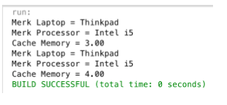

  **HASIL Pratikum PERCOBAAN 1:**

[ini link ke kode program Laptop1841720146Bagus](../../src/4_Relasi_Class/percobaan1/Laptop1841720146Bagus.java)

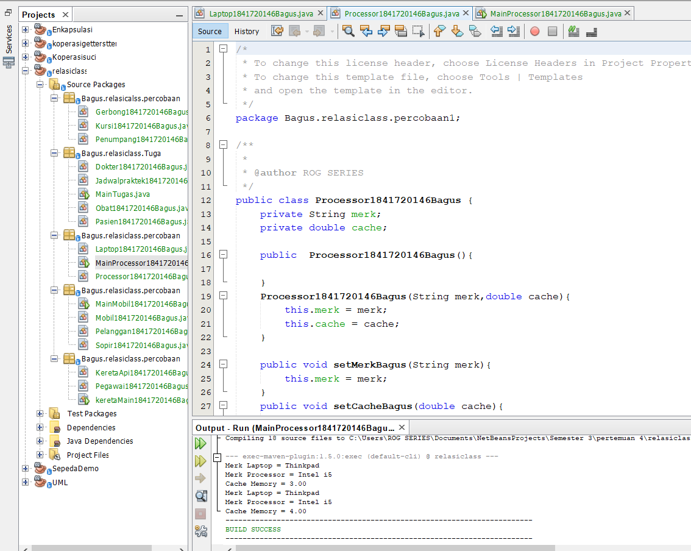

[ini link ke kode program Processor1841720146Bagus](../../src/4_Relasi_Class/percobaan1/Processor1841720146Bagus.java)

[ini link ke kode program MainProcessor1841720146Bagus](../../src/4_Relasi_Class/percobaan1/MainProcessor1841720146Bagus.java)

**Pertanyaan Percobaan 1** 
Berdasarkan percobaan 1, jawablah pertanyaan‑pertanyaan yang terkait: 

1. Di dalam class Processor dan class Laptop , terdapat method setter dan getter untuk masing‑masing atributnya. Apakah gunanya method setter dan getter tersebut ? 

2. Di dalam class Processor dan class Laptop, masing‑masing terdapat konstruktor default dan konstruktor berparameter. Bagaimanakah beda penggunaan dari kedua jenis konstruktor tersebut ? 

3. Perhatikan class Laptop, di antara 2 atribut yang dimiliki (merk dan proc), atribut manakah yang bertipe object ? 

4. Perhatikan class Laptop, pada baris manakah yang menunjukan bahwa class Laptop memiliki relasi dengan class Processor ? 

5. Perhatikan pada class Laptop , Apakah guna dari sintaks proc.info() ? 

6. Pada class MainPercobaan1, terdapat baris kode: 
Laptop l = new Laptop("Thinkpad", p);. 

Apakah p tersebut ? 

Dan apakah yang terjadi jika baris kode tersebut diubah menjadi: 

Laptop l = new Laptop("Thinkpad", new Processor("Intel i5", 3)); 

Bagaimanakah hasil program saat dijalankan, apakah ada perubahan ? 

**Jawaban Percobaan 1**

**1.** method setter dan getter inilah yang akan membantu kita mengakses data tersebut.

    a.Untuk meningkatkan keamanan data,

    b.Agar lebih mudah dalam mengontrol atribut dan dan method,

    c.Class bisa kita buat menjadi read-only dan write-only,

    d.dan fleksibel programmer dapat mengganti sebagian dari kode tanpa harus takut berdampak pada kode yang lain.

**2.** **konstruktor berparameter** adalah Konstruktor yang dapat   mengambil setidaknya satu argumen disebut sebagai konstruktor berparameter. Ketika suatu objek dideklarasikan dalam konstruktor berparameter, nilai awal harus diteruskan sebagai argumen ke fungsi konstruktor. Cara normal deklarasi objek mungkin tidak berfungsi. Konstruktor dapat dipanggil secara eksplisit atau implisit. Metode memanggil konstruktor secara implisit juga disebut metode singkatan. Jika kita ingin menginisialisasi bidang kelas dengan nilai Anda sendiri.

 **konstruktor default** adalah Jika programmer tidak menyediakan konstruktor untuk kelas instantiable, kompiler Java memasukkan konstruktor default ke dalam kode Anda atas nama Anda. merujuk ke konstruktor nullary yang secara otomatis dihasilkan oleh kompilator jika tidak ada konstruktor yang telah ditentukan untuk kelas atau dengan tidak adanya konstruktor yang ditentukan oleh programmer (mis. di Jawa, konstruktor default secara implisit memanggil konstruktor nullers superclass, kemudian mengeksekusi tubuh kosong).

 **3.**  p1 dan l1

 **4.** 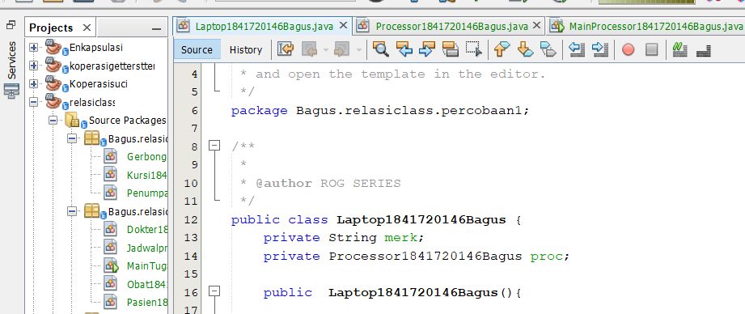

 **5.** untuk mengetahui data merk dan chache di class Processor agar bisa saling ber relasi antara class laptop dan processor

 **6.**  
 

 [ini link ke kode program MainProcessor1841720146Bagus](../../src/4_Relasi_Class/percobaan1/MainProcessor1841720146Bagus.java)

 Kegunaan p dalah mengambil data atau nilai

 **Percobaan 2**

 Perhatikan diagram class berikut yang menggambarkan sistem rental mobil. Pelanggan bisa menyewa mobil sekaligus sopir. Biaya sopir dan biaya sewa mobil dihitung per hari. 
 
  

**a.** Tambahkan package <identifier>.relasiclass.percobaan2. 
 
**b.** Buatlah class Mobil di dalam package tersebut. 
 
**c.** Tambahkan atribut merk tipe String dan biaya tipe int dengan akses modifier private. 
 
**d.** Tambahkan constructor default serta setter dan getter. 
 
**e.** Implementasikan method hitungBiayaMobil 
 
    public int hitungBiayaMobil(int hari) { 
    return biaya * hari; 
    } 
 
**f.** Tambahkan class Sopir dengan atribut nama tipe String dan biaya tipe int dengan akses modifier private berikut dengan constructor default. 

**g.** Implementasikan method hitungBiayaSopir 
 
    public int hitungBiayaSopir(int hari) { 
    return biaya * hari; 
    } 
 
**h.** Tambahkan class Pelanggan dengan constructor default. 
 
**i.** Tambahkan atribut‑atribut dengan akses modifier private berikut: 

  

**j.** Implementasikan setter dan getter. 
 
**k.** Tambahkan method hitungBiayaTotal 
 
    public int hitungBiayaTotal() { 
    return mobil.hitungBiayaMobil(hari) + sopir.hitungBiayaSopir(hari); 
    } 

**l.** Buatlah class MainPercobaan2 yang berisi method main(). Tambahkan baris kode berikut: 

    Mobil m = new Mobil(); 
    m.setMerk("Avanza"); 
    m.setBiaya(350000); 
    Sopir s = new Sopir();
    s.setNama("John Doe"); 
    s.setBiaya(200000); 
    Pelanggan p = new Pelanggan(); 
    p.setNama("Jane Doe"); 
    p.setMobil(m); 
    p.setSopir(s); 
    p.setHari(2); 
    System.out.println("Biaya Total = " +  p.hitungBiayaTotal()); 

**m.** Compile dan jalankan class MainPercobaan2, dan perhatikan hasilnya! 

**Hasil Pratikum PERCOBAAN 2**

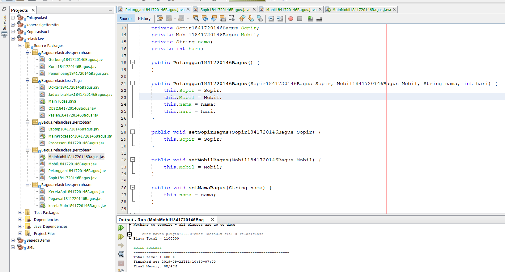

 [ini link ke kode program Pelanggan1841720146Bagus](../../src/4_Relasi_Class/percobaan2/Pelanggan1841720146Bagus.java)

 [ini link ke kode program Sopir1841720146Bagus](../../src/4_Relasi_Class/percobaan2/Sopir1841720146Bagus.java)

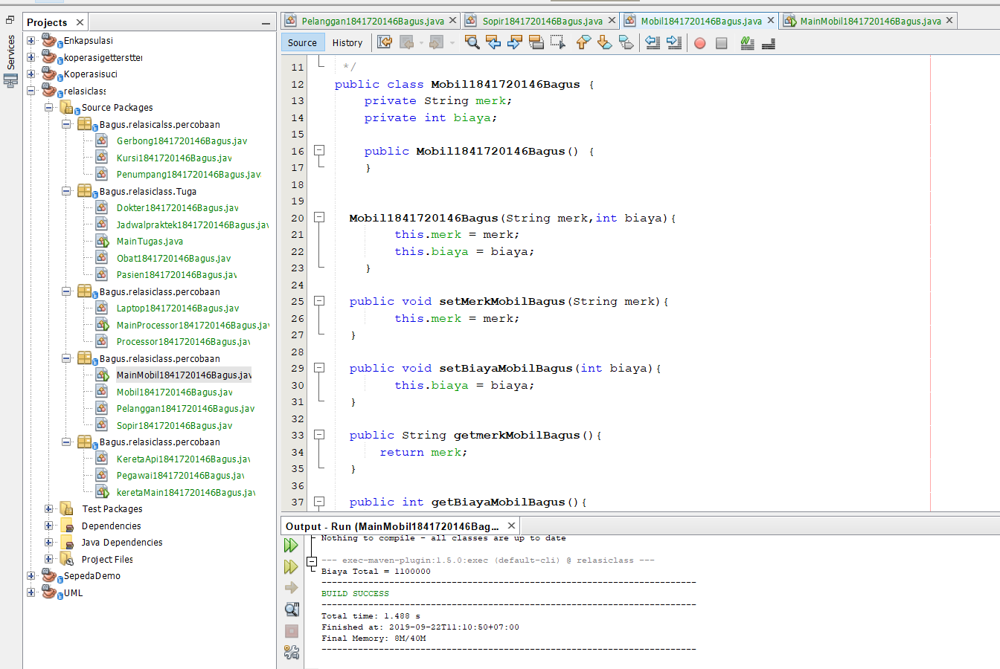

 [ini link ke kode program Mobil1841720146Bagus](../../src/4_Relasi_Class/percobaan2/Mobil1841720146Bagus.java)

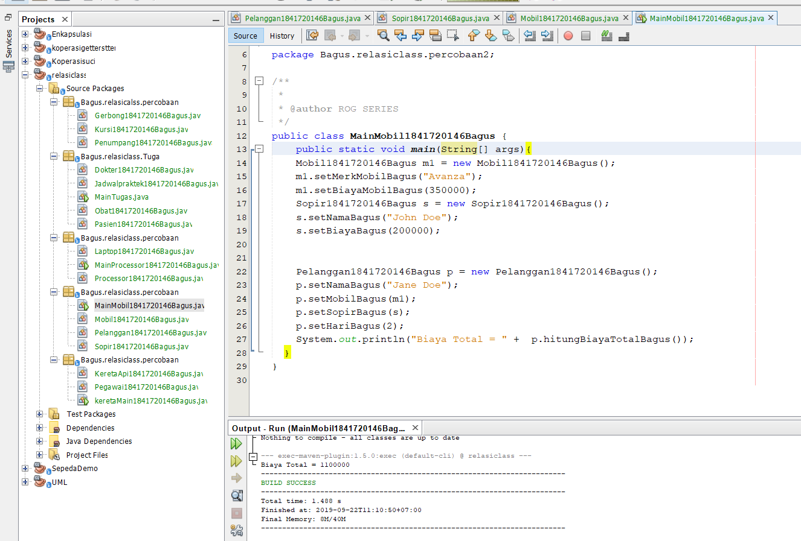

 [ini link ke kode program MainMobil1841720146Bagus](../../src/4_Relasi_Class/percobaan2/MainMobil1841720146Bagus.java)

 **Pertanyaan Percobaan 2** 

 1. Perhatikan class Pelanggan. Pada baris program manakah yang menunjukan bahwa class Pelanggan memiliki relasi dengan class Mobil dan class Sopir ? 
 
 2. Perhatikan method hitungBiayaSopir pada class Sopir, serta method hitungBiayaMobil pada class Mobil. Mengapa menurut Anda method tersebut harus memiliki argument hari ? 
Page 6 of 10 
 
3. Perhatikan kode dari class Pelanggan. Untuk apakah perintah mobil.hitungBiayaMobil(hari) dan sopir.hitungBiayaSopir(hari) ? 

4. Perhatikan class MainPercobaan2. Untuk apakah sintaks p.setMobil(m) dan p.setSopir(s) ? 

5. Perhatikan class MainPercobaan2. Untuk apakah proses p.hitungBiayaTotal() tersebut ? 

6. Perhatikan class MainPercobaan2, coba tambahkan pada baris terakhir dari method main dan amati perubahan saat di‑run! 
 
System.out.println(p.getMobil().getMerk()); 
 
Jadi untuk apakah sintaks p.getMobil().getMerk() yang ada di dalam method main tersebut? 

 **Jawaban Percobaan 2** 

1. 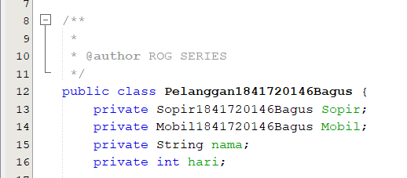

2. karena biaya sopir juga dihitung dengan hari karena Sopir melakukan setiap hari dan di biaya setiap hari

3. 

untuk menghitung sewa mobil dan ukuran hari sebagai biaya rentan hari untuk sewa mobil begitu pula dengan Sopir

4. untuk mengambil value tersebut agar bisa di return dan bisa di compile

5. menghitung keseluruhan total dari biaya sopir dan biaya mobil dan kegunaan p sebagai objek 

6.  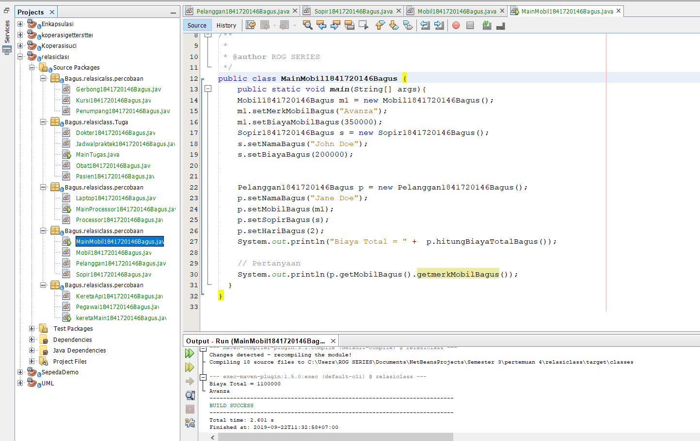

 [ini link ke kode program MainMobil1841720146Bagus](../../src/4_Relasi_Class/percobaan2/MainMobil1841720146Bagus.java)

 perubahan terletak yaitu muncul nama Mobil atau merek mobil

 **Percobaan 3** 

 Pada percobaan‑percobaan sebelumnya, relasi dalam class dinyatakan dalam one‑to‑one. Tetapi ada kalanya relasi class melibatkan lebih dari satu. Hal ini disebut dengan multiplicity. Untuk relasi lebih rinci mengenai multiplicity, dapat dilihat pada tabel berikut. 

**a.** Sebuah Kereta Api dioperasikan oleh Masinis serta seorang Asisten Masinis. Baik Masinis maupun Asisten Masinis keduanya merupakan Pegawai PT. Kereta Api Indonesia. Dari ilustrasi cerita tersebut, dapat digambarkan dalam diagram kelas sebagai berikut: 

**b.** Perhatikan dan pahami diagram kelas tersebut, kemudian bukalah IDE anda! 

**c.** Buatlah package <identifier>.relasiclass.percobaan3, kemudian tambahkan class Pegawai.

**d.** Tambahkan atribut‑atribut ke dalam class Pegawai 
 
private String nip; private String nama; 
 
**e.** Buatlah constructor untuk class Pegawai dengan parameter nip dan nama. 
 
**f.** Tambahkan setter dan getter untuk masing‑masing atribut. 
 
**g.** Implementasikan method info() dengan menuliskan baris kode berikut: 
 
    public String info() { 
    String info = "";
     info += "Nip: " + this.nip + "\n"; 
     info += "Nama: " + this.nama + "\n"; 
     return info; 
     } 
 
**h.** Buatlah class KeretaApi berdasarkan diagram class. 
 
**i.** Tambahkan atribut‑atribut pada class KeretaApi berupa nama, kelas, masinis, dan asisten. 
 
private String nama; private String kelas; private Pegawai masinis; private Pegawai asisten; 
 
**j.** Tambahkan constructor 3 parameter (nama, kelas, masinis) serta 4 parameter (nama, kelas, masinis, asisten). 
 
**k.** Tambahkan setter dan getter untuk atribut‑atribut yang ada pada class KeretaApi . 
 
**l.** Kemudian implementasikan method info() 
 
    public String info() { 

    String info = ""; 

    info += "Nama: " + this.nama + "\n"; 

    info += "Kelas: " + this.kelas + "\n";

    info += "Masinis: " + this.masinis.info() + "\n"; info += "Asisten: " + this.asisten.info() + "\n"; 

    return info; 

    } 
 
**m.** Buatlah sebuah class MainPercobaan3 dalam package yang sama. 
 
**n.** Tambahkan method main() kemudian tuliskan baris kode berikut. 
 
    Pegawai masinis = new Pegawai("1234", "Spongebob Squarepants"); 

    Pegawai asisten = new Pegawai("4567", "Patrick Star"); 

    KeretaApi keretaApi = new KeretaApi("Gaya Baru", "Bisnis", masinis, asisten); 
 
    System.out.println(keretaApi.info());

**Hasil Pratikum Percobaan 3**

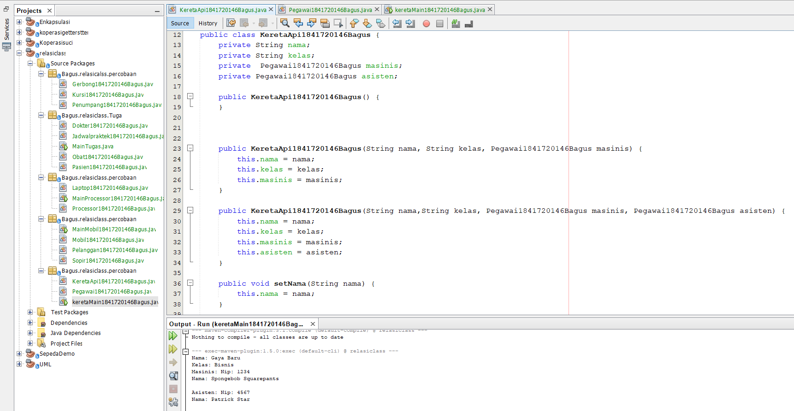

 [ini link ke kode program KeretaApi1841720146Bagus](../../src/4_Relasi_Class/percobaan3/KeretaApi1841720146Bagus.java)

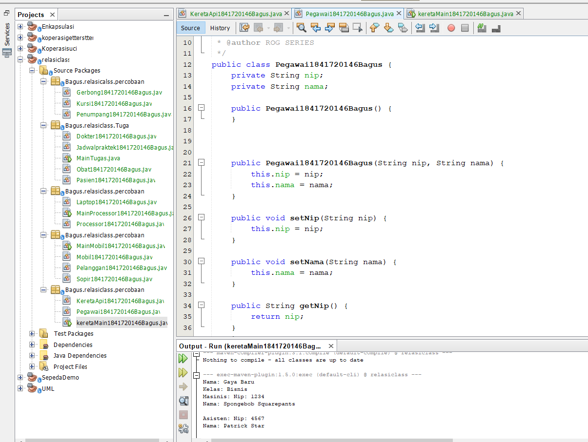

 [ini link ke kode program KeretaApi1841720146Bagus](../../src/4_Relasi_Class/percobaan3/KeretaApi1841720146Bagus.java)

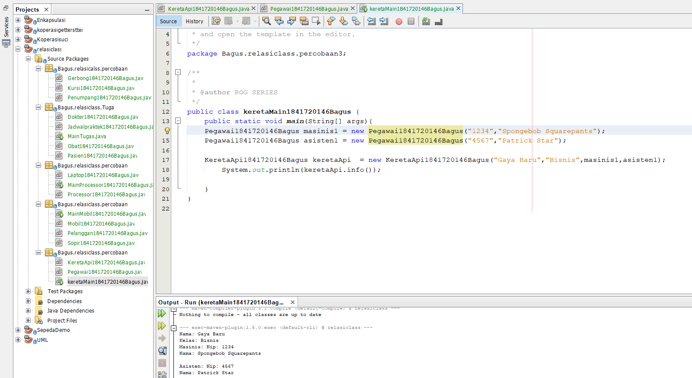

 [ini link ke kode program keretaMain1841720146Bagus](../../src/4_Relasi_Class/percobaan3/keretaMain1841720146Bagus.java)

**Pertanyaan Percobaan 3** 

1. Di dalam method info() pada class KeretaApi, baris this.masinis.info() dan this.asisten.info() digunakan untuk apa ? 

2. Buatlah main program baru dengan nama class MainPertanyaan pada package yang sama. Tambahkan kode berikut pada method main() ! 
 
        Pegawai masinis = new Pegawai("1234", "Spongebob Squarepants"); 

        KeretaApi keretaApi = new KeretaApi("Gaya Baru", "Bisnis", masinis); 
 
        System.out.println(keretaApi.info()); 
 
3. Apa hasil output dari main program tersebut ? Mengapa hal tersebut dapat terjadi ? 

4. Perbaiki class KeretaApi sehingga program dapat berjalan ! 

**Jawaban Percobaan 3** 

1. 

2. 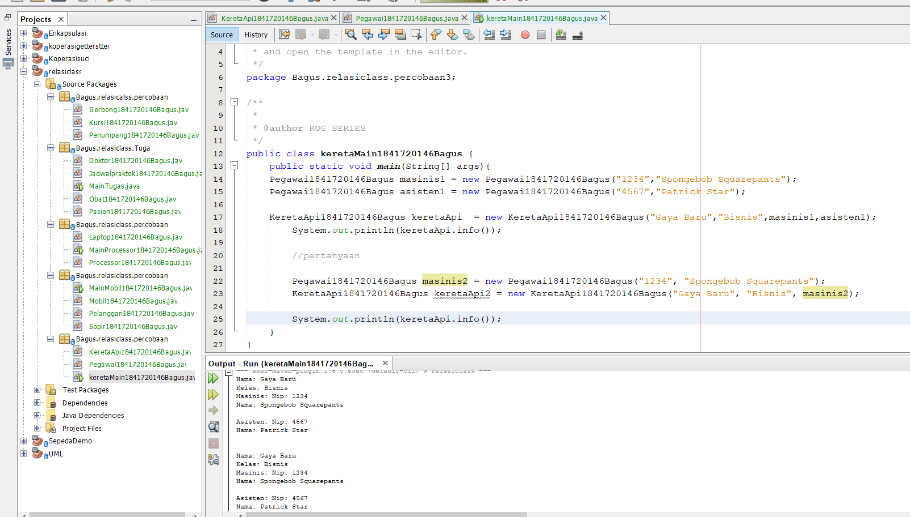

 [ini link ke kode program keretaMain1841720146Bagus](../../src/4_Relasi_Class/percobaan3/keretaMain1841720146Bagus.java)

3. terjadi erorr karena di main class perlu 2 objek apabila tidak ingin erorr

4. 

**Percobaan 4**

**a.** Perhatikan dan pahami diagram class tersebut. 
 
**b.** Buatlah masing‑masing class Penumpang, Kursi dan Gerbong sesuai rancangan tersebut pada package <identifier>.relasiclass.percobaan4. 
 
**c.** Tambahkan method info() pada class Penumpang 
 
 public String info() { 
    
    String info = ""; 
    
    info += "Ktp: " + ktp + "\n"; 
    
    info += "Nama: " + nama + "\n"; 
    
    return info; 
    
    } 
 
**d.** Tambahkan method info() pada class Kursi 
 
    public String info() { 
    
    String info = ""; 
    
    info += "Nomor: " + nomor + "\n"; 
    
    if (this.penumpang != null) { 
        
        info += "Penumpang: " + penumpang.info() + "\n"; 
        
        } return info; 
        
    } 
 
**e.** Pada class Gerbong buatlah method initKursi() dengan akses private. 
 
    private void initKursi() { 
    
    for (int i = 0; i < arrayKursi.length; i++) { 
        this.arrayKursi[i] = new Kursi(String.valueOf(i + 1)); 
        
        } 
        
    } 
 

**f.** Panggil method initKursi() dalam constructor Gerbong sehingga baris kode menjadi berikut: 
 
    public Gerbong(String kode, int jumlah) { 
    
    this.kode = kode; this.arrayKursi = new Kursi[jumlah]; 
    
    this.initKursi();    
    } 
 
**g.** Tambahkan method info() pada class Gerbong 
 
    public String info() { 
    
    String info = ""; 

    info += "Kode: " + kode + "\n"; 

    for (Kursi kursi : arrayKursi) { 
    
    info += kursi.info(); 
    
    } 
    
    return info;    
    } 
 
**h.** Implementasikan method untuk memasukkan penumpang sesuai dengan nomor kursi. 
 
 public void setPenumpang(Penumpang penumpang, int nomor) { 
    
    this.arrayKursi[nomor - 1].setPenumpang(penumpang);   
     } 
 
**i.** Buatlah class MainPercobaan4 yang berisi method main(). Kemudian tambahkan baris berikut! 
 
    Penumpang p = new Penumpang("12345", "Mr. Krab"); 

    Gerbong gerbong = new Gerbong("A", 10); 

    gerbong.setPenumpang(p, 1); 

    System.out.println(gerbong.info()); 

**Hasil Pratikum percobaan 4**

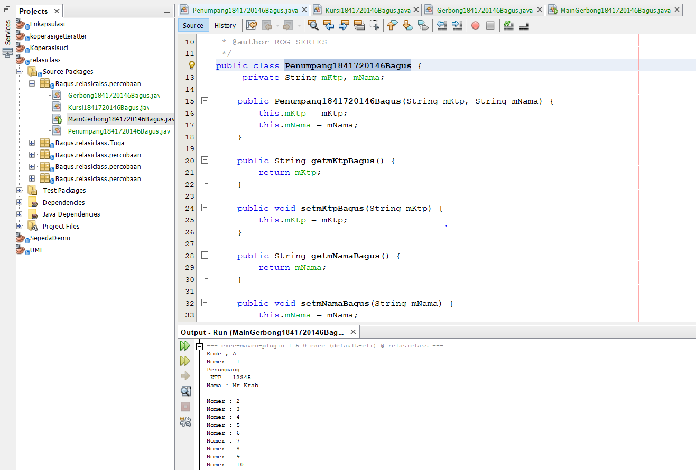

 [ini link ke kode program Penumpang1841720146Bagus](../../src/4_Relasi_Class/percobaan4/Penumpang1841720146Bagus.java)

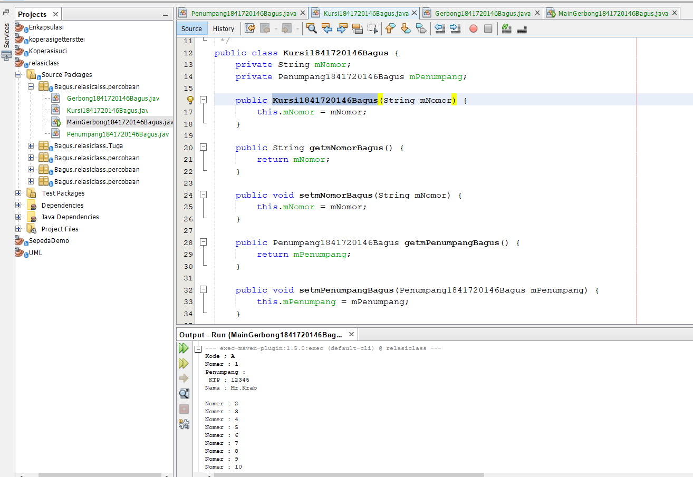

 [ini link ke kode program Kursi1841720146Bagus](../../src/4_Relasi_Class/percobaan4/Kursi1841720146Bagus.java)

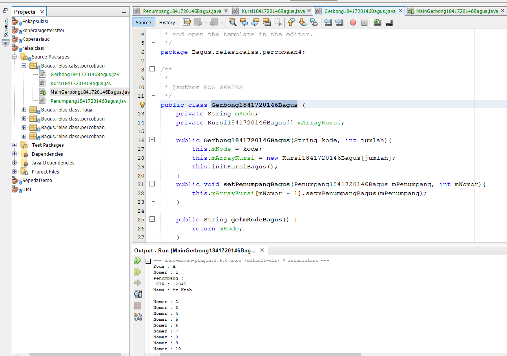

 [ini link ke kode program Gerbong1841720146Bagus](../../src/4_Relasi_Class/percobaan4/Gerbong1841720146Bagus.java)

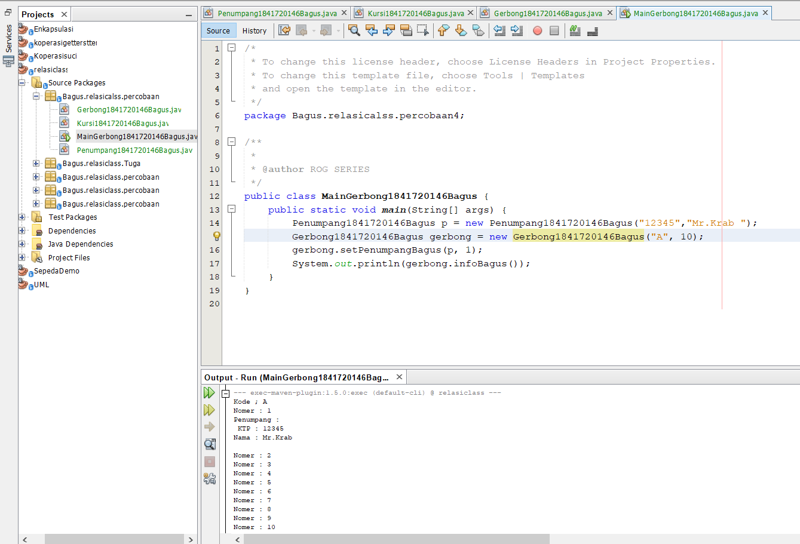

 [ini link ke kode program Gerbong1841720146Bagus](../../src/4_Relasi_Class/percobaan4/MainGerbong1841720146Bagus.java)

**Pertanyaan** 
 
1. Pada main program dalam class MainPercobaan4, berapakah jumlah kursi dalam Gerbong A ? 

2. Perhatikan potongan kode pada method info() dalam class Kursi. Apa maksud kode tersebut ? 
 
    ... 

    if (this.penumpang != null) { 
    
    info += "Penumpang: " + penumpang.info() + "\n"; 
    
    } 
    
    ... 
 
3. Mengapa pada method setPenumpang() dalam class Gerbong, nilai nomor dikurangi dengan angka 1 ? 

4. Instansiasi objek baru budi dengan tipe Penumpang, kemudian masukkan objek baru tersebut pada gerbong dengan gerbong.setPenumpang(budi, 1). Apakah yang terjadi ? 

5. Modifikasi program sehingga tidak diperkenankan untuk menduduki kursi yang sudah ada penumpang lain ! 

**Jawaban Pertanyaan Percobaan 4**

1. 10 kursi

2. Object penumpang pada class Kursi1841720146Bagus memiliki suatu nilai, maka tambahkan nilai method infoBagus clas 

3. karena di main sudah ada value 1 orang Penumpang1841720146Bagus ke dalam method info class Kursi1841720146Bagus

4. data yang ada akan di tumpuk

5. 

 [ini link ke kode program Gerbong1841720146Bagus](../../src/4_Relasi_Class/percobaan4/Gerbong1841720146Bagus.java)

**IV. Tugas** 

Buatlah sebuah studi kasus, rancang dengan class diagram, kemudian implementasikan ke dalam program! Studi kasus harus mewakili relasi class dari percobaan‑percobaan yang telah dilakukan pada materi ini, setidaknya melibatkan minimal 4 class (class yang berisi main tidak dihitung). 

**Hasil Tugas**

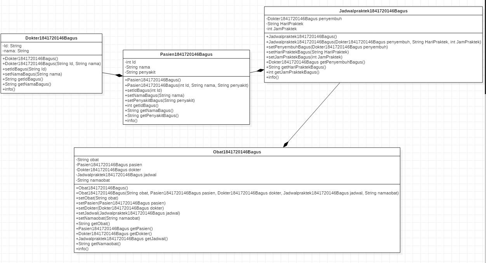

 [ini link ke kode program Pasien1841720146Bagus](../../src/4_Relasi_Class/Tugas/Pasien1841720146Bagus.java)

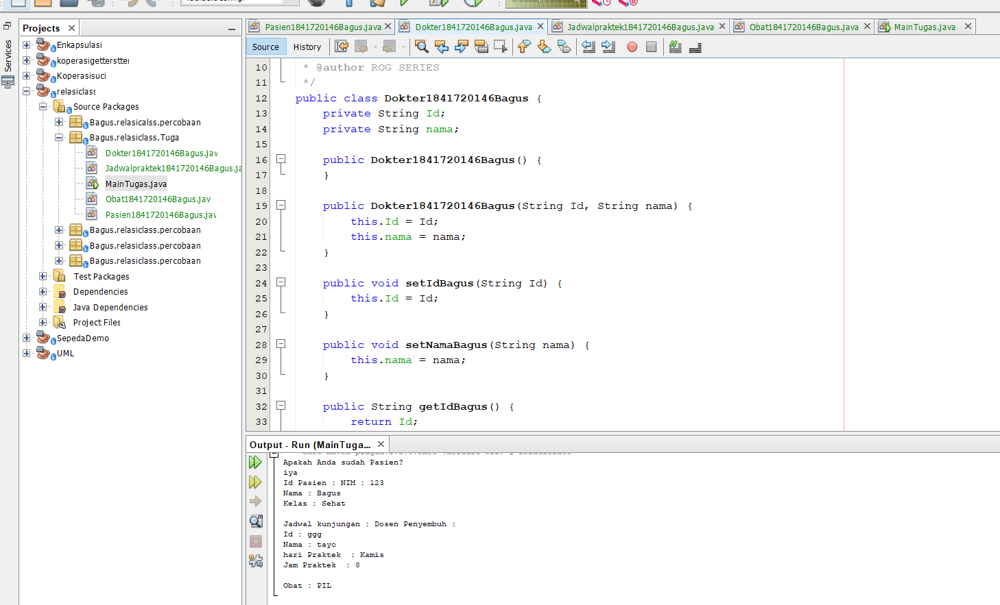

 [ini link ke kode program Dokter1841720146Bagus](../../src/4_Relasi_Class/Tugas/Dokter1841720146Bagus.java)

 [ini link ke kode program Jadwalpraktek1841720146Bagus](../../src/4_Relasi_Class/Tugas/Jadwalpraktek1841720146Bagus.java)

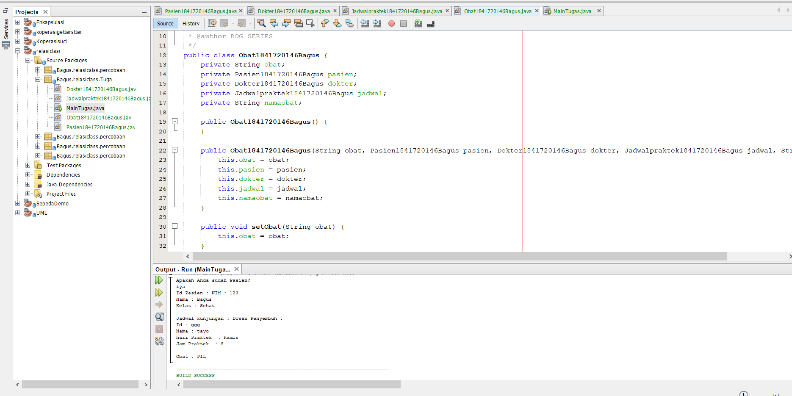

 [ini link ke kode program Obat1841720146Bagus](../../src/4_Relasi_Class/Tugas/Obat1841720146Bagus.java)

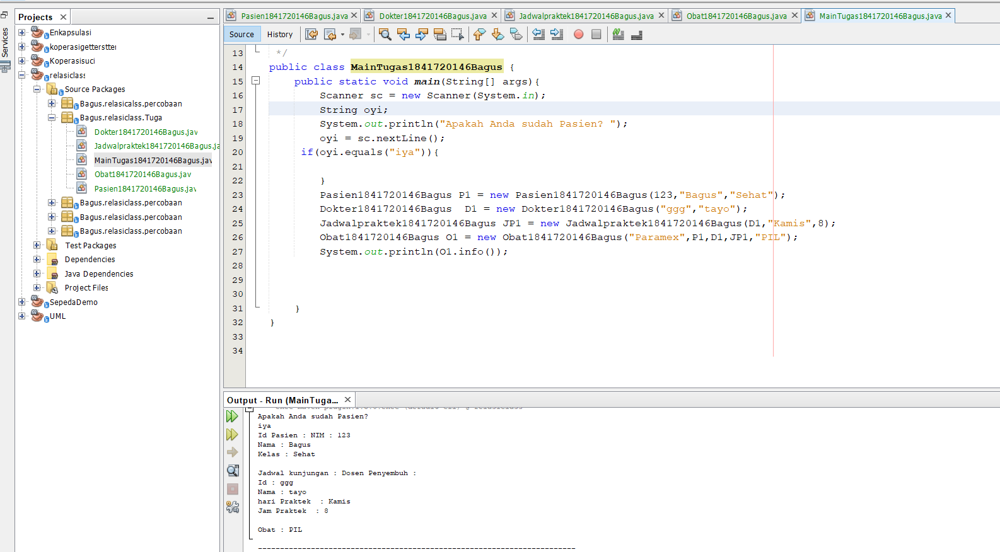

 [ini link ke kode program MainTugas1841720146Bagus](../../src/4_Relasi_Class/Tugas/MainTugas1841720146Bagus.java)

 

 
 

 
 

 
 

 
 

 
 

