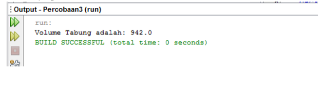
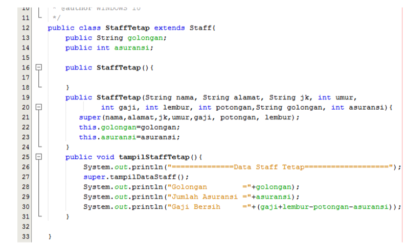
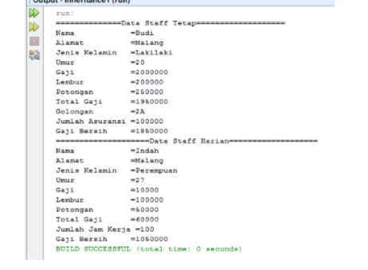
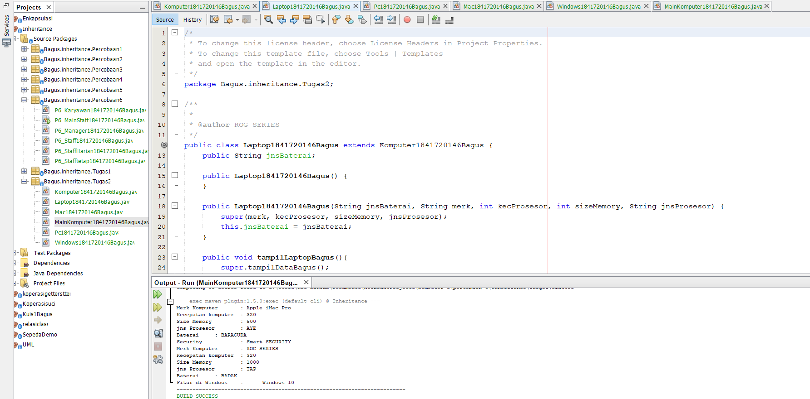

# Laporan Praktikum #6 - Inheritance (PEWARISAN)	
  

**JOBSHEET 6 - Inheritance (PEWARISAN)**

**1. KOMPETENSI**

**1.** Memahami	konsep dasar inheritance atau pewarisan.

**2.**	Mampu membuat suatu subclass dari suatu superclass tertentu.

**3.**	Mampu mengimplementasikan konsep single dan multilevel inheritance.
	
 **4.**	Mampu membuat objek dari suatu subclass dan melakukan pengaksesan     terhadap atribut dan method baik yang dimiliki sendiri atau turunan dari superclass nya.

 **2.	PENDAHULUAN**

    Inheritance atau pewarisan sifat merupakan suatu cara untuk menurunkan suatu class yang lebih umum menjadi suatu class yang lebih spesifik. Inheritance adalah salah satu ciri utama suatu bahasa program yang berorientasi pada objek. Inti dari pewarisan adalah sifat reusable dari konsep object oriented. Setiap subclass akan “mewarisi” sifat dari superclass selama bersifat protected ataupun public.

    Dalam inheritance terdapat dua istilah yang sering digunakan. Kelas yang menurunkan disebut kelas dasar (base class/super class), sedangkan kelas yang diturunkan disebut kelas turunan (derived class/sub class/child class) . Di dalam Java untuk mendeklarasikan suatu class sebagai subclass dilakukan dengan cara menambahkan kata kunci extends setelah deklarasi nama class, kemudian diikuti dengan nama parent class-­‐nya. Kata kunci extends tersebut memberitahu kompiler Java bahwa kita ingin melakukan perluasan class. Berikut adalah contoh deklarasi inheritance.

 

Contoh  diatas memberitahukan  kompiler Java bahwa kita ingin  meng-­‐extend class A  ke  class B. Dengan kata lain, class B adalah subclass (class turunan) dari class A, sedangkan class A adalah parent class dari class B.

Karakteristik pada super class akan dimiliki juga oleh subclassnya. Terdapat 3 bentuk pewarisan: single inheritance, multilevel inheritance, dan multiple inheritance. Namun yang akan dibahas pada jobsheet ini adalah single inheritance dan multilevel inheritance.

**1.**	Single Inheritance

Single inheritance adalah Suatu class yang hanya mempunyai satu parent class. Contoh:

 

Berdasarkan Gambar 1 dapat diketahui bahwa class B merupakan subclass yang mempunyai satu parent yaitu class A sehingga disebut single inheritance.

**2.**	Multilevel Inheritance
Multilevel inheritance adalah Suatu subclass bisa menjadi superclass bagi class yang lain. 

 

Berdasarkan Gambar 2 diatas dapat dilihat bahwa class B merupakan subclass dari class A, sehingga dalam hal ini class A adalah superclass dan class B adalah subclass. Kemudian class B yang awalmya merupakan subclass mempunyai subclass lagi yaitu class C sehingga class B menjadi superclass dari class C, begitu juga seterunya jika class C memilki subclass lagi.

Pada class diagram, pewarisan digambarkan dengan sebuah garis tegas, dengan segitiga di ujungnya. Class yang dekat pada segitiga merupakan superclass, sedangkan class yang jauh dari segitiga merupakan subclass. Untuk membentuk sebuah subclass, keyword “extends” digunakan (lihat contoh pada sesi “Implementasi Pewarisan”). Berikut ini adalah contoh class diagram dari pewarisan:

 

 Suatu  parent  class  dapat  tidak  mewariskan  sebagian  member-­‐nya  kepada  subclass-­‐nya. Sejauh mana suatu member dapat diwariskan ke class lain, ataupun suatu member dapat diakses dari class lain, sangat berhubungan dengan access control (kontrol pengaksesan). Di dalam java, kontrol pengaksesan dapat digambarkan dalam tabel berikut ini:

 

Kata kunci super dipakai untuk merujuk pada member dari parent class. Sebagaimana kata kunci this yang dipakai untuk merujuk pada member dari class itu sendiri. Format penulisannya adalah sebagai berikut:

**•	super.namaAtribut**

Merujuk/mengakses atribut dari parent class /superclass

**•	super.namaMethod()**

Merujuk/memanggil method dari parent class /superclass

**•	super()**

Merujuk / memanggil konstruktor parent class /superclass Hanya bisa digunakan dibaris pertama dalam kontruktor.

**•	super(parameter1, parameter2,dst)**

Merujuk / memanggil konstruktor berparamter dari superklas

Ketika mmebuat objek dari subclass, pada saat itu juga objek pada superclass juga akan terbentuk. Dengan katalain, ketika kontruktor subclass dijalankan untuk membuat objek, saat itu juga kontruktor superclass akan berjalan. Jadi di setiap konstruktor subclass, pada baris pertama konstruktor subclass tersebut akan dipanggil konstruktor superclass. Sebelum subclass menjalankan kontruktornya sendiri, subclass akan menjalankan kontruktor superclass terlebih dahulu.

**3.	PERCOBAAN 1 (extends)**

**A.	TAHAPAN PERCOBAAN**

1.	Buatlah sebuah class parent/superclass dengan nama ClassA.java

2.	Buatlah sebuah class anak/subclass dengan nama ClassB.java

3.	Buatlah class Percobaan1.java untuk menjalankan program diatas!

4.	Jalankan program diatas, kemudian amati apa yang terjadi!

**HASIL PERCOBAAN 1**

[ini link ke kode program P1_ClassA1841720146Bagus](../../src/6_Inheritance/percobaan1/P1_ClassA1841720146Bagus.java)

[ini link ke kode program P1_ClassB1841720146Bagus](../../src/6_Inheritance/percobaan1/P1_ClassA1841720146Bagus.java)

[ini link ke kode program P1_Mainclass1841720146Bagus](../../src/6_Inheritance/percobaan1/P1_Mainclass1841720146Bagus.java)

**B.	PERTANYAAN**

**1.**	Pada percobaan 1 diatas program yang dijalankan terjadi error, kemudian perbaiki sehingga program tersebut bisa dijalankan dan tidak error!

.....................................................................................................................................................

**2.**	Jelaskan apa penyebab program pada percobaan 1 ketika dijalankan terdapat error!
.....................................................................................................................................................

**Jawaban PERTANYAAN Percobaan 1**

**1.**

[ini link ke kode program P1_ClassB1841720146Bagus](../../src/6_Inheritance/percobaan1/P1_ClassA1841720146Bagus.java)

**2** karena tidak menggunakan extends sehingga Class A tidak terpanggil

**4.	PERCOBAAN 2 (Hak Akses)**

**A.	TAHAPAN PERCOBAAN**

1.	Buatlah sebuah class parent/superclass dengan nama ClassA.java

2.	Buatlah sebuah class anak/subclass dengan nama ClassB.java

3.	Buatlah class Percobaan2.java untuk menjalankan program diatas!

4.	Jalankan program diatas, kemudian amati apa yang terjadi!

**HASIL PERCOBAAN 2**

[ini link ke kode program P2_ClassA1841720146Bagus](../../src/6_Inheritance/percobaan2/P2_ClassA1841720146Bagus.java)

[ini link ke kode program P2_ClassB1841720146Bagus](../../src/6_Inheritance/percobaan2/P2_ClassB1841720146Bagus.java)

[ini link ke kode program P2_MainClass1841720146Bagus](../../src/6_Inheritance/percobaan2/P2_MainClass1841720146Bagus.java)

**B.	PERTANYAAN**

**1.**	Pada percobaan 2 diatas program yang dijalankan terjadi error, kemudian perbaiki sehingga program tersebut bisa dijalankan dan tidak error!

.....................................................................................................................................................

    
**2.**	Jelaskan apa penyebab program pada percobaan 1 ketika dijalankan terdapat error!

.....................................................................................................................................................

**Jawaban PERTANYAAN Percobaan 2**

**1.**

[ini link ke kode program P2_ClassA1841720146Bagus](../../src/6_Inheritance/percobaan2/P2_ClassA1841720146Bagus.java)

[ini link ke kode program P2_ClassB1841720146Bagus](../../src/6_Inheritance/percobaan2/P2_ClassB1841720146Bagus.java)

**2.** karena tidak memanggil public getX dan public getY Sehingga di Percobaan2 tidak bisa di panggil

**5.	PERCOBAAN 3 (Super)**

**A.	TAHAPAN PERCOBAAN**

1.	Buatlah sebuah class parent/superclass dengan nama Bangun.java

2.	Buatlah sebuah class anak/subclass dengan nama Tabung.java

3.	Buatlah class Percobaan3.java untuk menjalankan program diatas!

4.	Jalankan program diatas!

**HASIL PERCOBAAN 3**

[ini link ke kode program Bangun1841720146Bagus](../../src/6_Inheritance/percobaan3/Bangun1841720146Bagus.java)

[ini link ke kode program Tabung1841720146Bagus](../../src/6_Inheritance/percobaan3/Tabung1841720146Bagus.java)

[ini link ke kode program MainTabung1841720146Bagus](../../src/6_Inheritance/percobaan3/MainTabung1841720146Bagus.java)

**B.	PERTANYAAN**

**1.**	Jelaskan fungsi “super” pada potongan program berikut di class Tabung!

.....................................................................................................................................................

**2.**	Jelaskan fungsi “super” dan “this” pada potongan program berikut di class Tabung!

.....................................................................................................................................................

**3.**	Jelaskan mengapa pada class Tabung tidak dideklarasikan atribut “phi” dan “r” tetapi class tersebut dapat mengakses atribut tersebut!

.....................................................................................................................................................

**jawaban PERTANYAAN Percobaan 3**

1. Merujuk/mengakses atribut dari parent class /superclass

2. Merujuk / memanggil konstruktor berparamter dari superklas, Fungsinya untuk mengambil nilai dari kelas induk , sedangkan This untuk mempresentasikan object class itu sendiri 

3. karena sudah melakukan code public class Tabung1841720146Bagus extends Bangun1841720146Bagus

**6.	PERCOBAAN 4 (super contsructor)**

**A.	TAHAPAN PERCOBAAN**

1.	Buatlah tiga file dengan nama ClassA.java , ClassB.java , dan ClassC.java, seperti pada kode program dibawah ini!

ClassA.java

ClassB.java

ClassC.java

2.	Buatlah class Percobaan4.java untuk menjalankan program diatas!

3.	Jalankan program kemudian amati apa yang terjadi!

**Hasil Percobaan 4**

[ini link ke kode program P4_ClassA1841720146Bagus](../../src/6_Inheritance/percobaan4/P4_ClassA1841720146Bagus.java)

[ini link ke kode program P4_ClassB1841720146Bagus](../../src/6_Inheritance/percobaan4/P4_ClassB1841720146Bagus.java)

[ini link ke kode program P4_ClassC1841720146Bagus](../../src/6_Inheritance/percobaan4/P4_ClassC1841720146Bagus.java)

[ini link ke kode program P4_MainClass1841720146Bagus](../../src/6_Inheritance/percobaan4/P4_MainClass1841720146Bagus.java)

**B.	PERTANYAAN**

**1.**	Pada percobaan 4 sebutkan mana class yang termasuk superclass dan subclass, kemudian jelaskan alasannya!

.....................................................................................................................................................

**2.**	Ubahlah isi konstruktor default ClassC seperti berikut:

Tambahkan kata super() di baris Pertaman dalam konstruktor defaultnya. Coba jalankan kembali class Percobaan4 dan terlihat tidak ada perbedaan dari hasil outputnya!

**3.**	Ublah isi konstruktor default ClassC seperti berikut:

Ketika mengubah posisi super() dibaris kedua dalam kontruktor defaultnya dan terlihat ada error. Kemudian kembalikan super() kebaris pertama seperti sebelumnya, maka errornya akan hilang.
Perhatikan hasil keluaran ketika class Percobaan4 dijalankan. Kenapa bisa tampil output seperti berikut pada saat instansiasi objek test dari class ClassC

Jelaskan bagaimana urutan proses jalannya konstruktor saat objek test dibuat!

.....................................................................................................................................................

**4.**	Apakah fungsi super() pada potongan program dibawah ini di ClassC!

**Hasil Jawaban percobaan 4**

**1.** apabila superclass nya  class A maka subclass nya B dan apabila superclass nya B class B maka subclass nya C Kelas yang menurunkan disebut kelas dasar (base class/super class), sedangkan kelas yang diturunkan disebut kelas turunan (derived class/sub class/child class) . Di dalam Java untuk mendeklarasikan suatu class sebagai subclass dilakukan dengan cara menambahkan kata kunci extends setelah deklarasi nama class, kemudian diikuti dengan nama parent class-­‐nya. Kata kunci extends tersebut memberitahu kompiler Java bahwa kita ingin melakukan perluasan class. 

**2.** 

**3.** Urutan konstrakter di awal i dari ClassA (superclass) isi dari Classa di tampilkan kemudian ClassB yang mana Di mana kita tambahkan Extends untuk memanggil fungsi dari kelas lain isi dari ClassB di tampilkan , kemudian pada ClassC di ulangi seperti yang ada di ClassC dan isi dari ClassC di tampilkan atau di jalakankan . yang mana pada Percobaan4(main) di panggil

**4.** Merujuk/memanggil konstruktor parent class/superclass

**7.	PERCOBAAN 5**

**A.	TAHAPAN PERCOBAAN**

Perhatikan diagram class dibawah ini:

1.	Buatlah class Karyawan

2.	Buatlah class Manager

3.	Buatlah class Staff

4.	Buatlah class inheritance1

5.	Jalankan program, maka tampilanya adalah sebagai berikut:

**HASIL PERCOBAAN 5**

[ini link ke kode program P5_karyawan1841720146Bagus](../../src/6_Inheritance/percobaan5/P5_karyawan1841720146Bagus.java)

[ini link ke kode program P5_Manager1841720146Bagus](../../src/6_Inheritance/percobaan5/P5_Manager1841720146Bagus.java)

[ini link ke kode program P5_Staff1841720146Bagus](../../src/6_Inheritance/percobaan5/P5_Staff1841720146Bagus.java)

[ini link ke kode program MainKaryawan1841720146Bagus](../../src/6_Inheritance/percobaan5/MainKaryawan1841720146Bagus.java)

**B.	PERTANYAAN**

**1.**	Sebutkan class mana yang termasuk super class dan sub class dari percobaan 1 diatas!

.....................................................................................................................................................

**2.**	Kata kunci apakah yang digunakan untuk menurunkan suatu class ke class yang lain?

.....................................................................................................................................................

**3.**	Perhatikan kode program pada class Manager, atribut apa saja yang dimiliki oleh class tersebut? Sebutkan atribut mana saja yang diwarisi dari class Karyawan!

.....................................................................................................................................................

**4.**	Jelaskan kata kunci super pada potongan program dibawah ini yang terdapat pada class 

.....................................................................................................................................................

**5.**	Program pada percobaan 1 diatas termasuk dalam jenis inheritance apa? Jelaskan alasannya!

.....................................................................................................................................................

**Jawaban Pertanyaan Percobaan 5**

**1.**superclassnya karyawan dan memiliki dua subclass yaitu Staff dan manager

**2.** extends 

**3.** yang diwarisi dari class karyawan yaitu atribut String nama, String alamat, String jk, int umur, int gaji dan atribut tambahan yang dimiliki class manager adalah tunjangan.

**4.** super.gaji yaitu mewarisi dari class karyawan Merujuk/mengakses
atribut dari parent class /superclass

**5.** Multilevel Inheritance Suatu sub class yang menjadi parent class untuk class lainnya.
  

**8.	PERCOBAAN 6**

**A.	TAHAPAN PERCOBAAN**

1.	Perhatikan digra class dibawah ini

2.	Berdasarkan program yang sudah anda buat pada percobaan 1 sebelumnya tambahkan dua class yaitu class StaffTetap dan class StaffHarian. Kode Programnya adalah sebagai berikut

Class StaffTetap.java

Class StaffHarian.java

3.	Setelah membuat dua class diatas kemudian edit class inheritance1.java menjadi sebagai berikut:

4.	Jalankan program maka tampilanny adalah sebagai berikut:

**hasil Percobaan 6**

[ini link ke kode program P6_Karyawan1841720146Bagus](../../src/6_Inheritance/percobaan6/P6_Karyawan1841720146Bagus.java)

[ini link ke kode program P6_Manager1841720146Bagus](../../src/6_Inheritance/percobaan6/P6_Manager1841720146Bagus.java)

[ini link ke kode program P6_Staff1841720146Bagus](../../src/6_Inheritance/percobaan6/P6_Staff1841720146Bagus.java)

[ini link ke kode program P6_StaffHarian1841720146Bagus](../../src/6_Inheritance/percobaan6/P6_StaffHarian1841720146Bagus.java)

[ini link ke kode program P6_Stafftetap1841720146Bagus](../../src/6_Inheritance/percobaan6/P6_Stafftetap1841720146Bagus.java)

[ini link ke kode program P6_MainStaff1841720146Bagus](../../src/6_Inheritance/percobaan6/P6_MainStaff1841720146Bagus.java)

**B.	PERTANYAAN**

**1.**	Berdasarkan class diatas manakah yang termasuk single inheritance dan mana yang termasuk multilevel inheritance?

.....................................................................................................................................................

**2.**	Perhatikan kode program class StaffTetap dan StaffHarian, atribut apa saja yang dimiliki oleh class tersebut? Sebutkan atribut mana saja yang diwarisi dari class Staff!

.....................................................................................................................................................

**3.**	Apakah fungsi potongan program berikut pada class StaffHarian

.....................................................................................................................................................

**4.**	Apakah fungsi potongan program berikut pada class StaffHarian

.....................................................................................................................................................

**5.**	Perhatikan kode program dibawah ini yang terdapat pada class StaffTetap

Terlihat dipotongan program diatas atribut gaji, lembur dan potongan dapat diakses langsung. Kenapa hal ini bisa terjadi dan bagaimana class StaffTetap memiliki atribut gaji, lembur, dan potongan padahal dalam class tersebut tidak dideklarasikan atribut gaji, lembur, dan potongan?

.....................................................................................................................................................

**Jawaban Pertanyaan Percobaan 6**

**1.** Single Inheritance Pada Percobaan 1 ClassA (Class B mewakili Class B , Class Tabung mewakili Class Tabung)

**2.** Attribut Class StaffHarian = jumlah jam kerja yang mana attribut ini diwarisi oleh class karyawan (potongan)

Attribut Class StaffTetap = golongan , asuransi yang mana attribut ini diwarisi oleh class karyawan (lembur)

**3.** untuk memanggil nilai dari dari variabel yang ada di dalam class induk (super class)

**4.** Karena pada method tampilDatastaff(); menggunakan kata kunci super untuk mengambil nilai dari variable yang ada di jalam sub class

**5.** Karena pada class StaffTetap kita menggunakan extands untuk memanggil isi yang terdapat di dalam Class Staf yang mana isinya atribut gaji, lembur, dan potongan

**10.	TUGAS**

**1.** Buatlah sebuah program dengan konsep pewarisan seperti pada class diagram berikut ini. Kemudian buatlah instansiasi objek untuk menampilkan data pada class Mac, Windows dan Pc!.

**Hasil Tugas**

 [ini link ke kode program Komputer1841720146Bagus](../../src/6_Inheritance/Tugas/Komputer1841720146Bagus.java)

 

  [ini link ke kode program Laptop1841720146Bagus](../../src/6_Inheritance/Tugas/Laptop1841720146Bagus.java)

 

  [ini link ke kode program Pc1841720146Bagus](../../src/6_Inheritance/Tugas/Pc1841720146Bagus.java)

[ini link ke kode program Mac1841720146Bagus](../../src/6_Inheritance/Tugas/Mac1841720146Bagus.java)

[ini link ke kode program Windows1841720146Bagus](../../src/6_Inheritance/Tugas/Windows1841720146Bagus.java)

[ini link ke kode program MainKomputer1841720146Bagus](../../src/6_Inheritance/Tugas/MainKomputer1841720146Bagus.java)

## Kesimpulan

(Jadi kemsimpulan dari jobsheet 2 yaitu class dan object kita harus memahami deskripsi dari class dan object, implementasi dari class, implementasi dari attribute, implementasi dari method, implementasi dari proses instansiasi, implementasi dari try-catch, proses pemodelan class diagram menggunakan UML )

## Pernyataan Diri

Saya menyatakan isi tugas, kode program, dan laporan praktikum ini dibuat oleh saya sendiri. Saya tidak melakukan plagiasi, kecurangan, menyalin/menggandakan milik orang lain.

Jika saya melakukan plagiasi, kecurangan, atau melanggar hak kekayaan intelektual, saya siap untuk mendapat sanksi atau hukuman sesuai peraturan perundang-undangan yang berlaku.

Ttd,

***(Bagus Satria Putra)***

