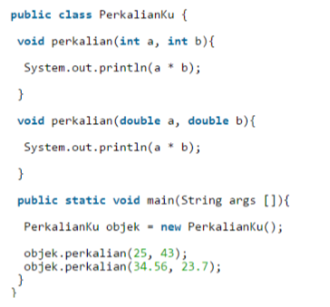
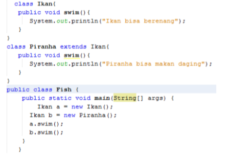
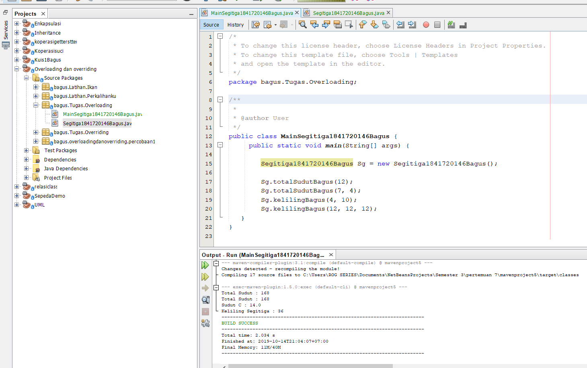

# Laporan Praktikum #7 - OVERLOADING DAN OVERRIDING	
  

**JOBSHEET 7 - OVERLOADING DAN OVERRIDING**

**1. Kompetensi** 

Setelah menempuh pokok bahasan ini, mahasiswa mampu : 

a. Memahami konsep overloading dan overriding, 

b. Memahami perbedaan overloading dan overriding, 

c. Ketepatan dalam mengidentifikasi method overriding dan overloading 

d. Ketepatan dalam mempraktekkan instruksi pada jobsheet 

e. Mengimplementasikan method overloading dan overriding. 

**2. Pendahuluan**  

**2.1 Overloading**   

adalah menuliskan kembali method dengan nama yang sama pada suatu class. Tujuannya dapat memudahkan penggunaan/pemanggilan method dengan fungsionalitas yang mirip. Untuk aturan pendeklarasian method Overloading sebagai berikut:

 **a.**  Nama method harus sama. 
 
 **b.**  Daftar parameter harus berbeda. 
 
 **c.**  Return type boleh sama, juga boleh berbeda. 
 Ada beberapa daftar parameter pada overloading dapat dilihat sebagai berikut: 

 **d.**  Perbedaan daftar parameter bukan hanya terjadi pada perbedaan banyaknya parameter, tetapi juga urutan darai parameter tersebut. 

 **e.**  Misalnya saja dua buah parameter berikut ini: 
 
 • Function_member (int x, string n) 
 
 • Function_member (String n, int x) 

 **f.**  Dua parameter tersebut juga di anggap berbeda daftar parameternya. 

 **g.**  Daftar parameter tidak terkait dengan penamaan variabel yang ada dalam parameter. 

 **h.**  Misalnya saja 2 daftar parameter berikut : 
 
 • function_member(int x) 
 
 • function_member(int y) 

 **i.** Dua daftar parameter diatas dianggap sama karena yang berbeda hanya penamaan variable parameternya saja.

 Overloading juga bisa terjadi antara parent class dengan subclass-nya jika memenuhi ketiga syarat overload. Ada beberapa aturan overloading yaitu: 

 • Primitive widening conversion didahulukan dalam overloading dibandingkan boxing dan var args.  

 • Kita tidak dapat melakukan proses widening dari tipe wrapper ke tipe wrapper lainnya (mengubah Integer ke Long). 

 • Kita tidak dapat melakukan proses widening dilanjutkan boxing (dari int menjadi Long) 

 • Kita dapat melakukan boxing dilanjutkan dengan widening (int dapat menjadi Object melalui Integer)

 •Kita dapat menggabungkan var args dengan salah satu yaitu widening atau boxing 

**2.2 Overriding** 

adalah Sublass yang berusaha memodifkasi tingkah laku yang diwarisi dari superclass. Tujuannya subclass dapat memiliki tingkah laku yang lebih spesifik sehingga dapat dilakukan dengan cara mendeklarasikan kembali method milik parent class di subclass. Deklarasi method pada subclass harus sama dengan yang terdapat di super class. Kesamaan pada: 

• Nama 

• Return type (untuk return type : class A atau merupakan subclass dari class A) 

• Daftar parameter (jumlah, tipe dan urutan) 

Sehingga method pada parent class disebut overridden method dan method pada subclass disebut overriding method. Ada beberapa aturan method didalam overriding: 

• Mode akses overriding method harus sama atau lebih luas dari pada overridden method. 

• Subclass hanya boleh meng-override method superclass satu kali saja, tidak boleh ada lebih dari satu method pada kelas yang sama persis.

• Overriding method tidak boleh throw checked exceptions yang tidak dideklarasikan oleh overridden method. 

**3. Praktikum**  

**3.1 Percobaan 1**  

Untuk kasus contoh berikut ini, terdapat tiga kelas, yaitu Karyawan, Manager, dan Staff. Class Karyawan merupakan superclass dari Manager dan Staff dimana subclass Manager dan Staff memiliki method untuk menghitung gaji yang berbeda. 

**3.2 Karyawan**

**3.3 Staff**

**3.4 Manager**

**3.5 Utama**

**Hasil Dari Percobaan 1** 

[ini link ke kode program Karyawan1841720146Bagus](../../src/7_Overriding_dan_Overloading/percobaan1/Karyawan1841720146Bagus.java)

[ini link ke kode program Manager1841720146Bagus](../../src/7_Overriding_dan_Overloading/percobaan1/Manager1841720146Bagus.java)

[ini link ke kode program Staff1841720146Bagus](../../src/7_Overriding_dan_Overloading/percobaan1/Staff1841720146Bagus.java)

[ini link ke kode program utamaMain1841720146Bagus](../../src/7_Overriding_dan_Overloading/percobaan1/utamaMain1841720146Bagus.java)

**4.Latihan**

**Pertanyaan**

**4.1** Dari source coding diatas terletak dimanakah overloading? 

________________________________________________________

**4.2** Jika terdapat overloading ada berapa jumlah parameter yang berbeda? 

________________________________________________________

**4.3** Dari source coding diatas terletak dimanakah overloading? 

________________________________________________________

**4.4** Jika terdapat overloading ada berapa jumlah parameter yang berbeda? 

________________________________________________________

**4.5** Dari source coding diatas terletak dimanakah overriding? 

________________________________________________________

**4.6** Jika terdapat overriding ada berapa jumlah parameter yang berbeda? 

________________________________________________________

**Jawaban**

**Hasil Perkalianku**

[ini link ke kode program Perkalianku1841720146Bagus](../../src/7_Overriding_dan_Overloading/perkalihanku/Perkalianku1841720146Bagus.java)

[ini link ke kode program PerkaliankuMain1841720146Bagus](../../src/7_Overriding_dan_Overloading/perkalihanku/PerkaliankuMain1841720146Bagus.java)

**4.1** void perkalian1Bagus dan void perkalian2Bagus

**4.2** ada dua void perkalian1Bagus(int a, int b){ dan void perkalian2Bagus(int a,int b,int c){

**Hasil Perkalianku New**

[ini link ke kode program Perkaliankunew1841720146bagus](../../src/7_Overriding_dan_Overloading/perkalihanku/Perkaliankunew1841720146bagus.java)

[ini link ke kode program PerkaliankuMainnew1841720146Bagus](../../src/7_Overriding_dan_Overloading/perkalihanku/PerkaliankuMainnew1841720146Bagus.java)

**4.3** perkalian1Bagus dan void perkalian2Bagus

**4.4** void perkalian1(int a, int b){ dan void perkalian2(double a,double b){

**Hasil Ikan**

[ini link ke kode program Ikan1841720146Bagus](../../src/7_Overriding_dan_Overloading/Ikan/Ikan1841720146Bagus.java)

[ini link ke kode program Piranha1841720146Bagus](../../src/7_Overriding_dan_Overloading/Ikan/Piranha1841720146Bagus.java)

[ini link ke kode program Fish1841720146Bagus](../../src/7_Overriding_dan_Overloading/Ikan/Fish1841720146Bagus.java)

**4.5** di class ikan dan class Piranha

**4.6**
       public class Ikan1841720146Bagus {

       public void swimBagus(){

        System.out.println("Ikan bisa berenang");

        }

       }

     public class Piranha1841720146Bagus extends Ikan1841720146Bagus{
     public void swimBagus(){
        System.out.println("Piranha bisa berenang");
      }
     }

**5. Tugas** 

**5.1 Overloading** 

Implementasikan konsep overloading pada class diagram dibawah ini : 

**5.2 Overriding**  
Implementasikan class diagram dibawah ini dengan menggunakan teknik dynamic method dispatch : 

**hasil 5.1 Overloading**

[ini link ke kode program Segitiga1841720146Bagus](../../src/7_Overriding_dan_Overloading/Overloading/Segitiga1841720146Bagus.java)

[ini link ke kode program MainSegitiga1841720146Bagus](../../src/7_Overriding_dan_Overloading/Overloading/MainSegitiga1841720146Bagus.java)

**hasil 5.2 Overriding**  

[ini link ke kode program Manusia1841720146Bagus](../../src/7_Overriding_dan_Overloading/Overriding/Manusia1841720146Bagus.java)

[ini link ke kode program Dosen1841720146Bagus](../../src/7_Overriding_dan_Overloading/Overriding/Dosen1841720146Bagus.java)

[ini link ke kode program Mahasiswa1841720146Bagus](../../src/7_Overriding_dan_Overloading/Overriding/Mahasiswa1841720146Bagus.java)

[ini link ke kode program ManusiaMain1841720146Bagus](../../src/7_Overriding_dan_Overloading/Overriding/ManusiaMain1841720146Bagus.java)

## Pernyataan Diri

Saya menyatakan isi tugas, kode program, dan laporan praktikum ini dibuat oleh saya sendiri. Saya tidak melakukan plagiasi, kecurangan, menyalin/menggandakan milik orang lain.

Jika saya melakukan plagiasi, kecurangan, atau melanggar hak kekayaan intelektual, saya siap untuk mendapat sanksi atau hukuman sesuai peraturan perundang-undangan yang berlaku.

Ttd,

***(Bagus Satria Putra)***

